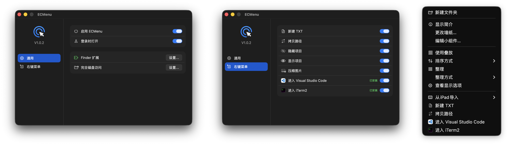

# ECMenu

<p align="center">
  
</p>

ECMenu 是一个 macOS Finder 的右键增强工具。

项目保持小而美，只收录常用功能，并尽可能考虑到使用时的各处细节，不会变成有一堆杂七杂八功能的工具箱。

项目注重代码结构和类型安全，开发者可以根据自己的需求自定义添加、修改、或移除菜单功能。

<p align="center">
  
</p>

## 功能

| 命令 | 行为 |
|---|---|
| `新建 TXT` | 在点击位置新建空白 TXT 文件 |
| `拷贝路径` | 将完整路径复制到剪贴板 |
| `隐藏项目` / `显示项目` | 在 Finder 中隐藏选中的项目，或让它们重新显示 |
| `压缩图片` | 将所选图片转换为 JPG，可设置缩小后的目标宽度和画质 |
| `进入 Visual Studio Code` | 在 Visual Studio Code 中打开文件或目录 |
| `进入 iTerm2` | 在 iTerm2 中打开目录 |

命令只可能创建新文件，不会删除或改写原文件内容。

菜单只显示当前能执行的命令。例如，没有选中图片时，不会出现 `压缩图片`；Visual Studio Code 或 iTerm2 没有安装时，不会出现对应的 `进入...`。

## 系统要求

- macOS 26.0 或更高版本。
- `进入 Visual Studio Code` 和 `进入 iTerm2` 分别需要安装对应应用。

## 安装

1. 从 GitHub Releases 下载最新的安装包，解压后把 `ECMenu.app` 移入 `/Applications`。
2. 打开 ECMenu。如果 macOS 阻止运行，请到“系统设置”的“隐私与安全性”中选择“仍要打开”（这是因为发布包使用免费的 Apple Development 签名，未经 Apple 公证；如需公证，需加入 [Apple Developer Program](https://developer.apple.com/cn/help/account/membership/enrolling-in-the-app/)，中国大陆个人会员目前为每年 ¥688）。
3. 在“通用”页面找到“Finder 扩展”，点击“设置...”进入系统设置界面并启用。
4. 如果希望登录后直接使用 Finder 命令，再开启“登录时打开”。

ECMenu 需要在后台运行，菜单命令才能执行。关闭配置窗口或按 `Command-Q` 只会隐藏设置界面，不会退出 ECMenu。没有开启“登录时打开”时，每次重新登录后要先打开一次应用。

## 权限与隐私

ECMenu 涉及两个权限：“Finder 扩展（文件提供程序）”、以及“完全磁盘访问”。

- “Finder 扩展”必须启用，否则右键菜单不会出现。
- “完全磁盘访问”则非必须启用。只是，在处理受 macOS 保护的位置时，会有弹窗提示授权访问。如果不希望被弹窗打扰，可以在“通用”界面找到“完全磁盘访问”，点击“设置...”进入系统设置界面授予这项权限。首次授权可能找不到 ECMenu，需要手动添加到权限列表。

## 源码构建

从源码运行需要 Xcode、macOS 26 SDK 和有效的 Apple Development 签名身份。工程当前带有维护者的 Personal Team 配置；换用自己的 Developer Team 时，需要一起替换 Team、主应用与 Finder Extension 的 Bundle ID 和 App Group，不能只改其中一项。具体约束见[构建身份](spec/Technical/Delivery/BuildIdentity.md)。

常用入口：

```bash
./scripts/run-debug.sh
./scripts/test.sh
./scripts/test-integration.sh
./scripts/build-release.sh
```

开发脚本的产物位置与完整说明见[开发脚本](scripts/Main.md)，产品行为与技术边界见[项目规格](spec/Main.md)。

## 许可证

本项目以 [MIT License](LICENSE) 发布。
