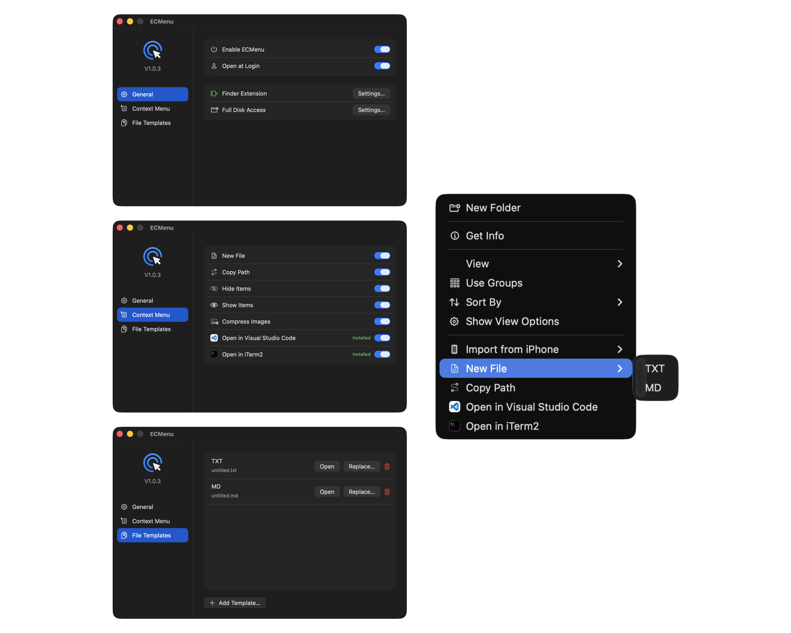

<h1 align="center">ECMenu</h1>

<p align="center">
  <strong>English</strong> ·
  <a href="README.zh-Hans.md">简体中文</a>
</p>

<p align="center">
  
</p>

ECMenu enhances Finder’s context menu on macOS.

ECMenu is intentionally small and focused. It provides a concise set of frequently used commands and pays attention to the details of everyday use instead of becoming an all-purpose toolbox.

The codebase prioritizes clear structure and type safety, so developers can add, change, or remove menu commands for their own needs.

<p align="center">
  
</p>

## Features

| Command | Behavior |
|---|---|
| `New TXT File` | Create an empty TXT file at the clicked location |
| `Copy Path` | Copy the full path to the clipboard |
| `Hide Items` / `Show Items` | Hide selected items in Finder, or make them visible again |
| `Compress Images` | Convert selected images to JPG with a configurable target width and quality |
| `Open in Visual Studio Code` | Open a file or directory in Visual Studio Code |
| `Open in iTerm2` | Open a directory in iTerm2 |

Commands may create new files, but never delete or overwrite the contents of an original file.

Only commands that apply to the current context are shown. For example, `Compress Images` is absent when no image is selected; the Visual Studio Code and iTerm2 commands are absent when their corresponding applications are not installed.

## System Requirements

- macOS 26.0 or later.
- `Open in Visual Studio Code` and `Open in iTerm2` require their corresponding applications.

## Installation

1. Download the latest package from GitHub Releases, extract it, and move `ECMenu.app` to `/Applications`.
2. Open ECMenu. If macOS blocks it, open System Settings → Privacy & Security and choose “Open Anyway” (the package uses free Apple Development signing and is not notarized; notarization requires an [Apple Developer Program](https://developer.apple.com/help/account/membership/enrolling-in-the-app/) membership, currently ¥688 per year for individuals in mainland China).
3. On the General page, find Finder Extension and choose “Settings…” to open System Settings and enable it.
4. Enable Open at Login if Finder commands should be available immediately after signing in.

ECMenu must keep running in the background for its menu commands to work. Closing the settings window or pressing `Command-Q` only hides the settings interface; it does not quit ECMenu. Without Open at Login, open the application once after each new login.

## Permissions and Privacy

ECMenu uses two system permissions: Finder Extension (File Providers) and Full Disk Access.

- Finder Extension is required; without it, the context menu commands do not appear.
- Full Disk Access is optional. When ECMenu operates on a location protected by macOS, Finder may display a prompt requesting access. To avoid these prompts, find Full Disk Access on the General page, choose “Settings…”, and grant the permission in System Settings. ECMenu may not appear in the list during the first authorization and may need to be added manually.

## Localization

English is the source language, with a Simplified Chinese translation. The application and Finder menu follow the macOS language selection.

## Building from Source

Building from source requires Xcode, the macOS 26 SDK, and a valid Apple Development signing identity. The project currently contains the maintainer's Personal Team configuration. When using another Developer Team, replace the Team, the bundle identifiers of both the main application and Finder Extension, and the App Group together; changing only one of them is not sufficient. See [Build Identity](spec/Technical/Delivery/BuildIdentity.md) for the complete constraints.

Common entry points:

```bash
./scripts/run-debug.sh
./scripts/test.sh
./scripts/test-integration.sh
./scripts/build-release.sh
```

See [Development Scripts](scripts/Main.md) for artifact locations and complete usage, and [Project Specifications](spec/Main.md) for product behavior and technical boundaries.

## License

This project is released under the [MIT License](LICENSE).
