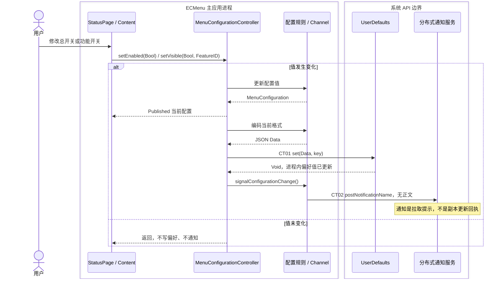
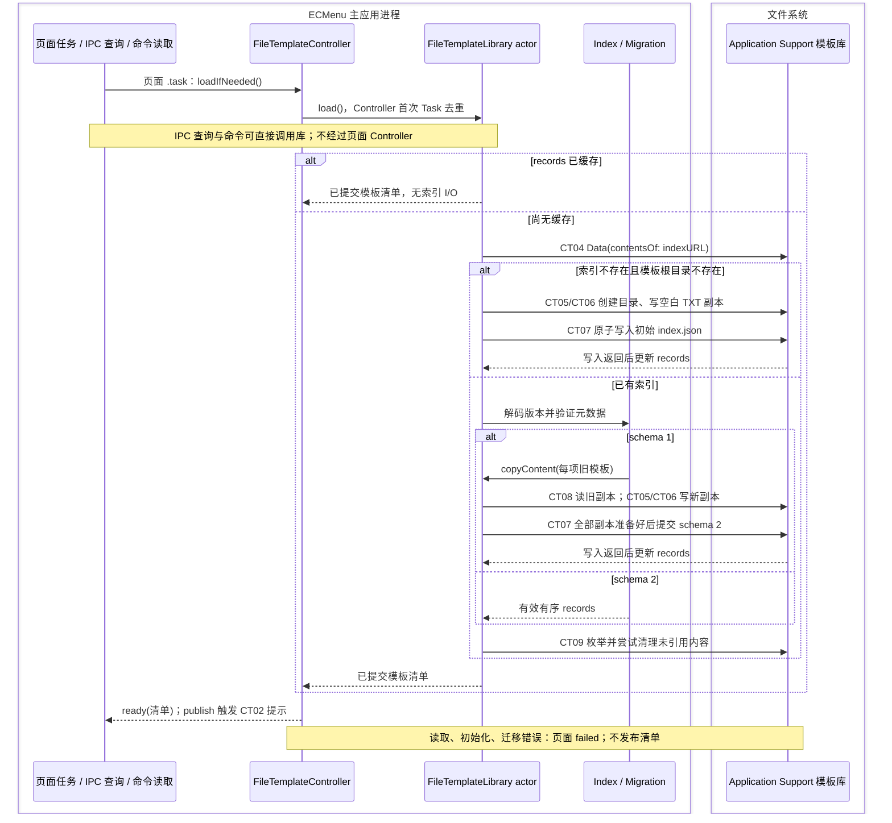
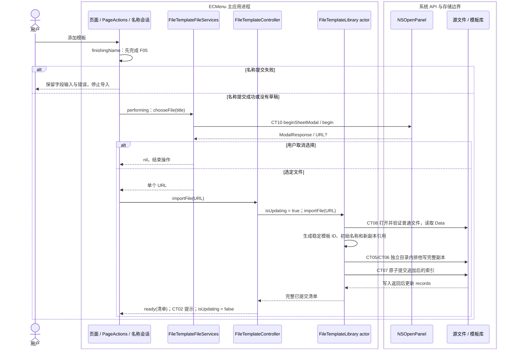
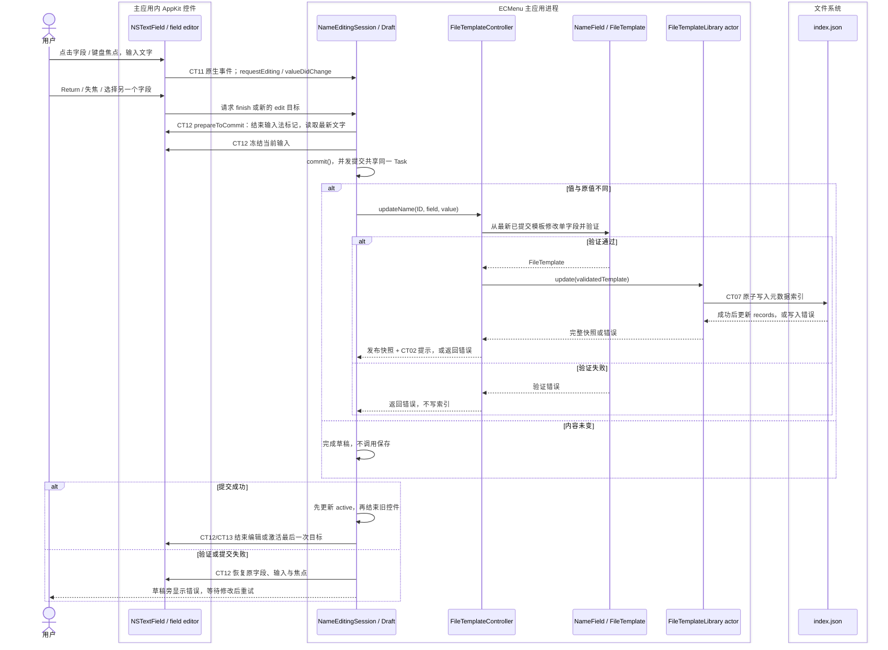
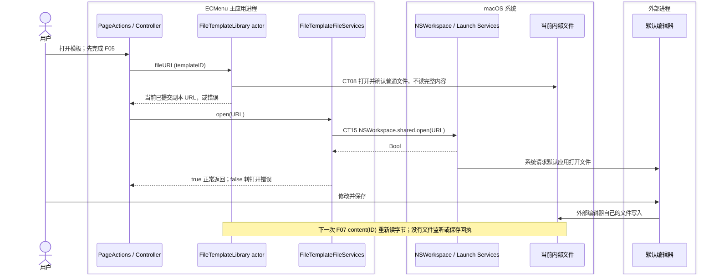
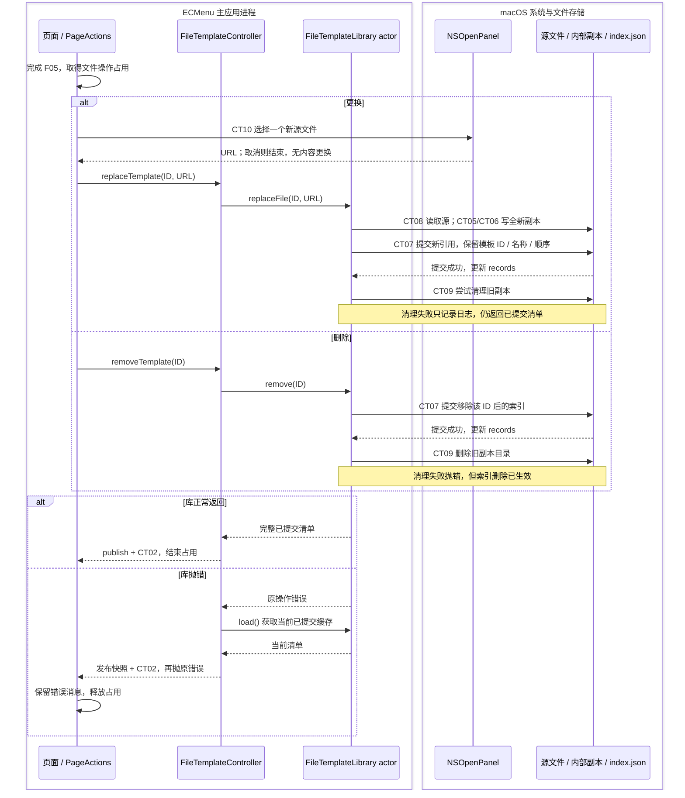

# 当前流程：配置与模板管理

本页对应 [F03–F06](Main.md#完整功能索引)。业务模块及 AppKit / Foundation 对象都在 ECMenu 主应用进程内；图中另列系统 API、存储和外部编辑器，便于识别副作用边界。默认编辑器是独立应用进程。以下结论来自源码与测试定义，本轮未运行应用或测试；官方契约、项目观察与推断的区别见 [API 证据](../APIContracts.md)。

## 状态、身份与完成点

| 数据 / 状态 | 所有者 | 生命周期与事实来源 |
|---|---|---|
| 菜单配置 | `MenuConfigurationController` | 进程级；从主应用 UserDefaults 恢复，设置页观察当前值。隐藏功能保存为稀疏 ID 集合，总开关不改动这个集合 |
| 模板清单、内容引用 | `FileTemplateLibrary` actor | 进程级；首次从索引读取，之后保存已提交 `records`。索引写入成功后才替换缓存；每个库方法内部的同步文件 I/O 串行执行 |
| 模板页快照、加载错误、写入占用 | `FileTemplateController` | 主应用持有；`.loading / .ready([FileTemplate]) / .failed(String)` 为库事实的呈现结果，`isUpdating` 约束一次修改 |
| 名称编辑草稿与交接目标 | `FileTemplateNameEditingSession`、`FileTemplateNameDraft` | `StatusPageContent` 的 `StateObject` 随窗口内容保留；一次只编辑一个模板的一个字段。原生 field editor 持有实际输入与选区 |
| 文件操作占用和错误 | `FileTemplatePageActions` | 随窗口内容保留；`idle → finishingName → performing → idle`。切页不释放未完成操作；错误等待页面呈现并由用户关闭 |
| 外部编辑内容 | 当前索引指向的内部副本 | 默认编辑器保存后改变文件字节；ECMenu 不监听编辑会话，每次新建文件重新读取 |

模板 ID、菜单显示名、默认输出文件名、内部副本 ID 和内部文件名承担不同职责。修改名称保持模板 ID 与文件引用；更换内容只换文件引用；删除按模板 ID 定位。存储格式、路径、版本与备份要求沿用[模板持久化技术契约](../../../Technical/Features/NewFile.md#模板库持久化)。

## F03a：修改菜单开关并发出更新提示

| 模块 | 输入 → 输出 / 失败 | 外部 API 与边界 |
|---|---|---|
| `StatusPage / StatusPageContent` | 当前配置、系统事实、用户 Bool → 类型化 setter 调用 | SwiftUI `Binding` / 观察发布值；此路径无存储 I/O。总开关受 Extension 启用状态约束；功能行还按配置及各功能系统可用性派生可编辑性 |
| `MenuConfigurationController` | setter 意图 → 当前配置更新、偏好写入、提示；初始化缺少或无法解码时使用 `.standard`，解码错误记日志 | **CT01** `UserDefaults.standard.data(forKey:)` 返回 `Data?`；`set(_:forKey:)` 返回 Void。立即更新内存、异步写盘，无同步持久化成功回执；`Logger.error/info` 输出诊断 |
| `MenuConfiguration` 与编解码 | 有效配置 ↔ 当前版本 JSON；缺字段、未知版本抛解码错误 | `JSONEncoder/JSONDecoder` 为内存转换，无外部 I/O。总开关和功能可见性为纯规则 |
| `MenuConfigurationChannel` 通知部分 | 稳定通知名、nil object/userInfo → 无正文提示 | **CT02** `DistributedNotificationCenter.default().postNotificationName(... deliverImmediately: true)`，返回 Void；不提供可靠到达或远端完成确认 |

设置页即时观察主应用配置；Extension 成功拉取新快照后，后续菜单构建才使用新值。通知可能延迟或丢失，因此本调用结束不表示 Finder 已更新。后续链路见 [F03b：菜单副本同步](MenuAndIPC.md)，现有偏好和副本契约见[菜单配置](../../../Technical/Runtime/MenuConfiguration.md)。

源码：[设置接线](../../../../ECMenu/Settings/StatusPage/StatusPage.swift)、[配置所有者](../../../../ECMenu/MenuConfiguration/MenuConfigurationController.swift)、[配置值与通知 Channel](../../../../ECMenuShared/MenuConfiguration/MenuConfiguration.swift)。

## F04：模板加载、首次初始化、迁移与导入

### 加载与恢复

图中展示成功路径；重要失败分支如下。

- 只有“索引缺失且根目录不存在”进入初始化，建立空内容的 `TXT / untitled.txt` 模板。有效空清单保持为空；已有根目录但索引缺失、损坏、版本不支持或权限错误，均进入读取失败。
- schema 1 迁移保留模板身份、名称、顺序和内容。所有新副本写好后再提交 schema 2；提交前失败保留旧索引和旧内容，准备中产生的孤儿由后续成功恢复索引后的清理处理。
- 首次初始化创建目录或写副本之后，若索引提交失败，可能留下已有根目录但没有有效索引。后续普通重试仍按上述读取规则处理，不能保证自动恢复初始化。
- 成功读取索引不预读所有模板内容；缺失内容可到“打开 / 更换来源读取 / 新建文件”时才暴露。孤儿清理失败只记录日志，不把有效索引变成读取失败。
- `loadIfNeeded()` 保留同一个首次任务，即使首次失败，后续调用也只等待该已结束任务；显式“重试”才调用 `reload()`。库已经有缓存时，`reload()` 仍返回缓存，不是重新扫描磁盘或重试孤儿清理。
- IPC 查询直接调用同一个 actor，并将成功清单投影为 `id + displayName`；库读取失败时生成 `.unavailable`，当前菜单开关仍可同步。该读取不更新页面 Controller 状态，也不因直接 `load()` 自动发模板变更通知。

| 模块 | 输入 → 输出 / 失败 | 外部 API 与边界 |
|---|---|---|
| 页面与 `FileTemplateController` | 初次加载 / 显式重试 → loading、ready 或 failed；成功 `publish` 调用 `didChange` | SwiftUI `.task`、Swift 并发 `Task` 负责调度；Combine `@Published` 通知呈现。无直接文件 I/O；`AppDelegate` 注入 CT02 通知闭包 |
| 库位置解析与索引读取 | 产品 signing identifier → 库 URL；索引 URL → Data 或 `.readIndex` 错误 | **CT03** `URL.applicationSupportDirectory` 获取基址，URL 拼接无 I/O；**CT04** `Data(contentsOf:)` 读取索引、`FileManager.fileExists(atPath:)` 区分缺失根目录 |
| `FileTemplateIndex / FileTemplate / Migration` | JSON Data、复制内容闭包 → 有效 records / 版本与输入错误 | `JSONDecoder` 进行内存转换；规则自身无外部 I/O。迁移通过注入闭包请求库复制旧内容，不自行访问文件系统；当前索引校验模板 ID、副本 ID 各自唯一 |
| 库首次初始化 / 迁移副本准备 | 空 Data 或旧文件字节、内部文件名 → 新文件引用；目录或内容错误 | CT05、CT06、CT08，见下方存储 API 表；初始模板和导入身份用 `UUID()` 生成，本身无文件 I/O |
| 库索引提交与清理 | 完整 records → 写入成功后缓存；清理产生独立日志 | CT07、CT09，见下表。JSON 编码只包含已验证值，当前代码将编码失败视为实现错误，不作用户输入失败分支 |
| IPC 快照组装 | 当前配置 + 库读取结果 → 完整菜单快照 | 此模块通过库取得数据，无直接文件 I/O；投影是纯内存转换，socket API 见 [MenuAndIPC](MenuAndIPC.md) |

### 选择并导入普通文件

选择器返回路径只是输入；库通过实际打开的 descriptor 判断普通文件，不把面板筛选当作内容验证。符号链接、目录、包目录和特殊文件被拒绝。源文件只读取，导入成功后独立副本不依赖源路径继续存在。

导入时显示名优先取大写扩展名，无扩展名取源文件名；若已存在同名则从 `2` 起取首个可用后缀。默认输出文件名为 `untitled.<原扩展名>` 或 `untitled`。人工名称随后允许重复。副本保留导入文件名，模板追加到原清单末尾。

| 模块 | 输入 → 输出 / 失败 | 外部 API 与边界 |
|---|---|---|
| `FileTemplatePageActions` | 文件操作闭包、名称会话 → 先提交名称再执行；重入请求忽略，失败保存本地化消息 | `Task` 调度与 `@Published` 呈现，无直接文件 I/O。选择取消也正常释放占用；取消选择不会撤回此前已提交的名称 |
| `FileTemplateFileServices` | 面板标题、当前 key window → 一个 URL 或 nil | **CT10** `NSOpenPanel.beginSheetModal(for:)`，无 key window 时 `begin`；completion 返回 `ModalResponse`，`.OK` 读取 `panel.url`，其他响应返回 nil。只允许单文件，禁止选目录，包按目录浏览；`.OK` 无 URL 是实现不变量错误 |
| `FileTemplateController` | URL → 成功发布整份快照；异常时刷新库快照后重新抛原错误 | 无直接文件 I/O；`perform` 用 `isUpdating` 和已有清单前置条件约束调用，`defer` 释放占用。正常 UI 入口由 PageActions 与名称会话保证串行 |
| 库导入规则 | 源 URL 名称、已有模板 → 验证后的模板与顺序 | 字符串、集合和 URL 名称操作为纯规则，无外部 I/O；输入验证抛 `FileTemplateValidationError` |
| 库内容准备与提交 | 源文件 → 独立内容引用 → 追加后的索引与快照 | CT05–CT09。提交失败不更新缓存，并尝试清理未提交的新目录；清理失败仅日志，原修改错误继续上抛 |

F04 源码：[库与提交实现](../../../../ECMenu/FileTemplates/FileTemplateLibrary.swift)、[索引](../../../../ECMenu/FileTemplates/FileTemplateIndex.swift)、[迁移](../../../../ECMenu/FileTemplates/FileTemplateIndexMigration.swift)、[页面 Controller](../../../../ECMenu/FileTemplates/FileTemplateController.swift)、[导入面板接线](../../../../ECMenu/Settings/StatusPage/StatusPage.swift)、[文件系统服务](../../../../ECMenu/FileTemplates/FileTemplateFileServices.swift)、[IPC 投影](../../../../ECMenu/IPC/ApplicationIPCServer.swift)。

### F04–F06 共用的文件系统 API

| 编号 / 所有者 | 实际 API 与输入 | 输出、当前错误处理与完成层次 |
|---|---|---|
| **CT05** 库目录准备 | `FileManager.createDirectory(at:withIntermediateDirectories:)`，Files 根目录及全新副本目录 URL | Void / Error；映射 `.prepareDirectory`，副本目录不允许中间目录自动创建 |
| **CT06** 库内容写入 | `Data.write(to:options: .withoutOverwriting)`，完整 Data、新副本 URL | Void / Error；失败尝试清理副本目录，再抛 `.saveContent`。该写入完成不代表模板已进入索引 |
| **CT07** 库索引提交 | `JSONEncoder.encode` 后 `Data.write(to:options: .atomic)`，完整当前索引和 index URL | 写入返回后才替换 `records`；失败抛 `.saveIndex`。这是索引替换完成点，不把它扩展为断电后物理持久性保证 |
| **CT08** 库普通文件验证 / 内容读取 | `Darwin.open(path, O_RDONLY \| O_NOFOLLOW \| O_NONBLOCK)`、`fstat(fd)`；需要字节时 `FileHandle.readToEnd()` | fd / errno、stat 结果、Data? / Error；非文件 URL、最终路径为符号链接或非普通对象为 `.unsupportedFile`；系统错误为 `.readContent`。`readToEnd()` 的 nil 解释为空 Data；`defer` 关闭 handle，关闭错误不单独反馈 |
| **CT09** 库删除 / 孤儿清理 | `FileManager.removeItem(at:)`、恢复索引后 `contentsOfDirectory(at:includingPropertiesForKeys:)` | Void 或 URL 列表 / Error。缺失对象视为清理完成；删除操作的非缺失错误抛 `.removeContent`，维护式清理则记 `Logger.error` 后继续 |

CT06 与 CT07 使用不同写入选项：一个创建全新内容，一个替换索引；不合并为一次文件系统事务。平台写入契约见 [API 证据](../APIContracts.md)，路径与版本细节见[既有技术文档](../../../Technical/Features/NewFile.md#模板库持久化)。

## F05：修改显示名或默认文件名

编辑草稿只拥有一个字段；另一个名称从 Controller 的最新已提交模板读取。字段验证在库写入之前发生，允许重复名称，拒绝空白显示名、空白或路径形式的默认文件名。元数据提交保持模板 ID、列表顺序、内容引用和内部文件名不变。

保存期间后来的目标请求覆盖前一个待交接目标，共享同一次草稿提交；旧请求不再完成焦点交接。失败保留原草稿并恢复输入，不进入下一字段或执行文件操作。Controller 的操作错误恢复直接 `refreshSnapshot()`，不先切成 loading，已有列表与原生控件身份得以保留；再次发布的快照也可能与之前相同。

| 入口 / 分支 | 当前控制流与取消语义 |
|---|---|
| Return、原生失焦、背景点击 | 请求完成当前编辑；失败仍保留草稿。背景只接收未被前景控件命中的点击 |
| 点击另一名称 / 保存期间改变目标 | 旧字段先提交，最后一次目标获准编辑；控件身份由模板 ID + 字段识别 |
| Tab / Shift-Tab | 提交成功后调用窗口 key-view 导航；失败不移动 |
| Escape | 没有交接中的任务时取消草稿、恢复原值，不写索引；已经处于交接时忽略取消，不撤回正在保存的操作 |
| 点击另一设置分类 | `selectPane` 先等 `finishEditing()`，失败保持当前页；没有草稿直接切页 |
| 页面消失 / 应用失去 active | 发起完成编辑任务；这是提交触发，不是同步阻止窗口或应用状态变化的回执 |
| 打开 / 导入 / 更换 / 删除 | PageActions 先结束名称编辑。失败时后续文件操作不运行；成功后文件操作占用跨切页保留 |

| 模块 | 输入 → 输出 / 失败 | 外部 API 与边界 |
|---|---|---|
| 原生字段与 Coordinator | AppKit 鼠标、焦点、编辑通知和命令 → 会话请求；会话批准 → 字符串、可编辑性和焦点 | **CT11** `NSTextFieldDelegate` 的 begin/change/end 和 `doCommandBy`，`mouseDown` / `becomeFirstResponder`；**CT12** `currentEditor()`、`NSTextView.hasMarkedText/unmarkText`、`selectText`、`setSelectedRange`、`NSWindow.makeFirstResponder`；**CT13** `selectKeyView(following:/preceding:)`。字段不访问模板文件 |
| `FileTemplateNameEditingSession` | control 协议、保存闭包、目标请求 → 唯一 active 草稿 / Bool 交接结果 | 调用注入的 control 和保存接口，自身无 AppKit 或文件 I/O；Task、对象身份和状态机协调最后目标、重入和失败恢复 |
| `FileTemplateNameDraft` | 原值、输入、保存闭包 → Bool、errorMessage、idle/saving/saved | 无直接外部 I/O；未变值不保存，重复 commit 共用任务，失败回到 idle 可修正重试 |
| `FileTemplateNameField / FileTemplate` | 最新模板、字段与 String → 合法模板或验证错误 | 纯规则，无外部 I/O；解码同样通过验证构造 |
| Controller 与库 | 单字段有效更新 → 已提交完整快照；模板 ID 不存在或写索引失败 | Controller 无直接存储 API；库使用 CT07，成功 publish 通过 CT02 提示，错误刷新已提交快照再返回原错误 |
| `StatusPageContent / FileTemplatesPage` | 切页、后台通知、onDisappear → 提交任务或页签更新 | **CT14** `NotificationCenter.default.publisher(for: NSApplication.didResignActiveNotification)`、SwiftUI `onDisappear`；选中页由 `@AppStorage` 保存，沿用 CT01 的偏好写入语义 |

原生通知顺序与输入法/焦点行为涉及 AppKit，以上描述是当前协调方式。已有 macOS 26.6.2、Xcode 26.6 的项目观察与证据限制见[名称编辑的原生焦点边界](../../../Technical/Features/NewFile.md#名称编辑的原生焦点边界)，不能从时序图推出所有系统版本均提供同样的通知顺序。

源码：[编辑会话](../../../../ECMenu/Settings/StatusPage/FileTemplateNameEditingSession.swift)、[草稿与单字段更新](../../../../ECMenu/FileTemplates/FileTemplateNameDraft.swift)、[原生字段适配](../../../../ECMenu/Settings/StatusPage/FileTemplateNameTextField.swift)、[有效模板值](../../../../ECMenuShared/FileTemplates/FileTemplate.swift)、[页面切换与 active 通知](../../../../ECMenu/Settings/StatusPage/StatusPage.swift)。

## F06：打开、更换、删除与读取重试

### 打开内部副本，并在外部编辑

| 模块 | 输入 → 输出 / 失败 | 外部 API 与边界 |
|---|---|---|
| PageActions / Controller | 模板 ID → 打开请求完成或错误消息 | 先完成名称编辑；库文件 URL 查询和打开不经过 `perform`，不设置 Controller 的 `isUpdating`，仍受 PageActions 操作占用控制 |
| 库 | ID → 当前内部 URL；不存在或不是普通文件则错误 | CT08 仅验证实际打开对象，随即关闭 handle；不读取完整 Data。返回 URL 到系统再次打开之间不构成锁定文件的事务 |
| `FileTemplateFileServices` | URL → Void / `couldNotOpen` | **CT15** 同步 `NSWorkspace.shared.open(URL)` 返回 Bool；当前只将 false 转本地化错误。此 API 与其他命令中带应用 URL 和 completion 的变体不同 |
| 默认编辑器 | 内部副本 URL → 用户编辑后的文件字节 | 由外部应用实现，ECMenu 没有其保存 API、事务或完成回执；打开成功不等同于外部界面已经展示或编辑已保存 |

外部保存作用于已打开 URL。模板更换后，旧编辑器再保存旧 URL，不会改变新索引指向的副本；外部写入与库读取重叠时，项目不保证事务快照。后续执行见 [F07 新建文件](NewFile.md)。

### 更换或删除：索引提交与副本清理分开

图中“更换”的读取、写新副本或索引提交失败时直接进入错误分支，不执行提交后的旧副本清理；若新副本已经生成但索引提交失败，尝试清理未提交副本。删除在索引提交前失败时保留原清单，提交后清理失败时模板已从清单消失。当前错误通过 `FileTemplatePageActions.errorMessage` 交给 SwiftUI alert；没有整体模板操作撤销，也没有开始文件 I/O 后的用户取消入口。

| 模块 | 输入 → 输出 / 失败 | 外部 API 与边界 |
|---|---|---|
| 页面 / PageActions | 更换或删除意图 → 名称完成后执行；操作错误 → alert | `Task`、SwiftUI `.alert`；没有直接文件 I/O。300 ms 延迟进度只在 `actions.isPerforming && isUpdating` 时显示，视图消失取消的是指示器延迟任务，不是库写入 |
| 更换选择器 | 标题 → URL? | CT10；取消不开始更换，已经提交的名称不回滚 |
| Controller | 操作闭包 → 发布快照 / 重新抛原错误 | 无直接文件 I/O；错误时刷新库已提交事实，防止把已删除状态显示回旧行；操作结束 `defer` 清除 `isUpdating` |
| 库更换 | ID + 源 URL → 完整清单；保留模板元数据，仅更新文件引用 | CT05–CT08 准备和提交，CT09 维护旧副本。成功后的清理失败仅日志，不成为可重试的更换提交错误 |
| 库删除 | ID → 删除后的完整清单，或提交/清理错误 | CT07 先提交、CT09 后清理；缺失内容视为已清理，其他清理错误仍返回给用户 |
| 变更发布 | 成功或错误恢复取得的清单 → 通知提示 | Controller 的 `publish` 每次调用注入 `didChange`；生产接线为 CT02。通知不携带清单，也不区分字段修改、内容更换或相同快照重发 |

### 显式读取重试

加载错误页面的 Retry 按钮调用 `Task { await reload() }`，Controller 先进入 loading，再向库调用 `load()`；成功发布 ready 和 CT02，失败保持新的 failed 消息。没有自动修复、迁移回滚或周期重试。库无缓存时重新读索引，故修复损坏索引后可以恢复；有缓存时直接取缓存，不检测外部对索引的修改。输入/输出和 API 沿用 F04 的 CT04–CT09。

源码：[操作会话](../../../../ECMenu/Settings/StatusPage/FileTemplatePageActions.swift)、[页面动作、重试与错误呈现](../../../../ECMenu/Settings/StatusPage/FileTemplatesPage.swift)、[Controller](../../../../ECMenu/FileTemplates/FileTemplateController.swift)、[库](../../../../ECMenu/FileTemplates/FileTemplateLibrary.swift)、[文件选择和打开](../../../../ECMenu/FileTemplates/FileTemplateFileServices.swift)、[类型化存储错误](../../../../ECMenu/FileTemplates/FileTemplateLibraryError.swift)、[通知接线](../../../../ECMenu/App/AppDelegate.swift)。

## 现有验证定义与重构边界

| 证据 | 当前覆盖的判断 |
|---|---|
| [MenuConfigurationTests](../../../../Tests/ECMenuTests/MenuConfiguration/MenuConfigurationTests.swift) | 总开关保留功能隐藏集合、默认可见性、当前格式往返、非法版本和缺字段 |
| [FileTemplateLibraryTests](../../../../Tests/ECMenuTests/FileTemplates/FileTemplateLibraryTests.swift) | 一次初始化、有效空库、二进制独立副本、自动命名、普通文件验证、索引损坏、缺失内容、已有根目录缺索引、缓存与孤儿清理、提交失败、删除后清理失败 |
| [FileTemplateMigrationTests](../../../../Tests/ECMenuTests/FileTemplates/FileTemplateMigrationTests.swift) | schema 1 身份/名称/顺序/字节保留、空库迁移、内容缺失和提交失败保持旧数据、修复后重试、当前引用合法性 |
| [FileTemplateReplacementTests](../../../../Tests/ECMenuTests/FileTemplates/FileTemplateReplacementTests.swift) | 新副本独立身份、外部保存后读新字节、旧 URL 晚保存不影响更换、提交失败保持原状态、旧副本清理失败仍成功、打开前验证 |
| [FileTemplateControllerTests](../../../../Tests/ECMenuTests/Settings/StatusPage/FileTemplateControllerTests.swift)、[NameUpdateTests](../../../../Tests/ECMenuTests/Settings/StatusPage/FileTemplateNameUpdateTests.swift) | 首次加载共享任务、失败后显式重试、错误恢复不经过 loading、按 ID 更新、单字段保留另一最新值、验证失败不发布 |
| [NameDraftTests](../../../../Tests/ECMenuTests/Settings/StatusPage/FileTemplateNameDraftTests.swift)、[NameEditingSessionTests](../../../../Tests/ECMenuTests/Settings/StatusPage/FileTemplateNameEditingSessionTests.swift) | 并发提交只保存一次、未变值不写、最后目标、最新 field-editor 值、失败恢复、取消 |
| [FileTemplatesPageTests](../../../../Tests/ECMenuTests/Settings/StatusPage/FileTemplatesPageTests.swift) | 隐藏原生窗口内的字段身份、鼠标/键盘焦点、异步交接、按钮重入、跨页面重建的操作占用、背景点击、失败阻止文件操作 |

以上是测试源码表达的覆盖，不是本轮通过报告。UserDefaults 的实际落盘、分布式通知到达、默认编辑器呈现、真实输入法以及窗口/系统版本的焦点行为仍需相应平台验收。结构上应保持模板管理的视图、编辑会话、应用操作、存储与外部打开适配在同一业务能力下；提交结果与清理反馈、菜单投影与发布责任的调整见[结构评估](../Assessment.md)和[目标架构](../Target/Main.md)。
