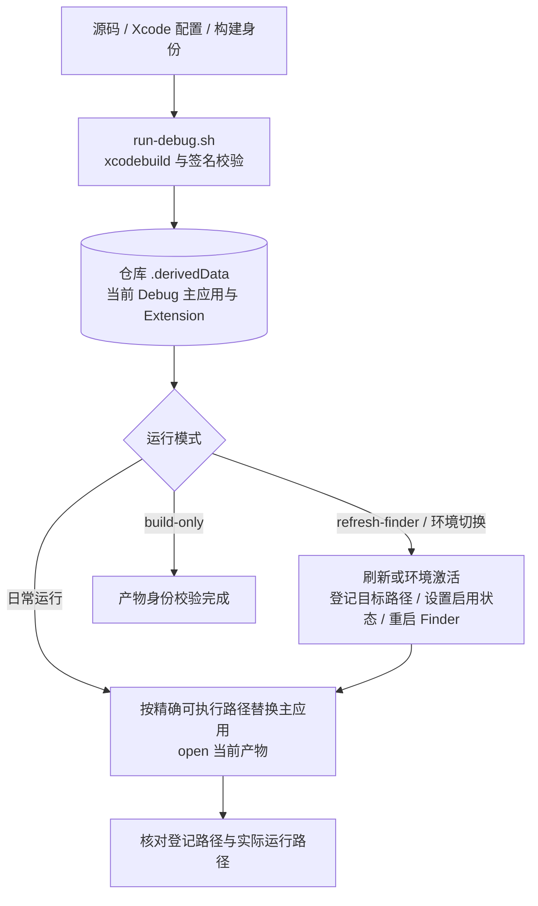
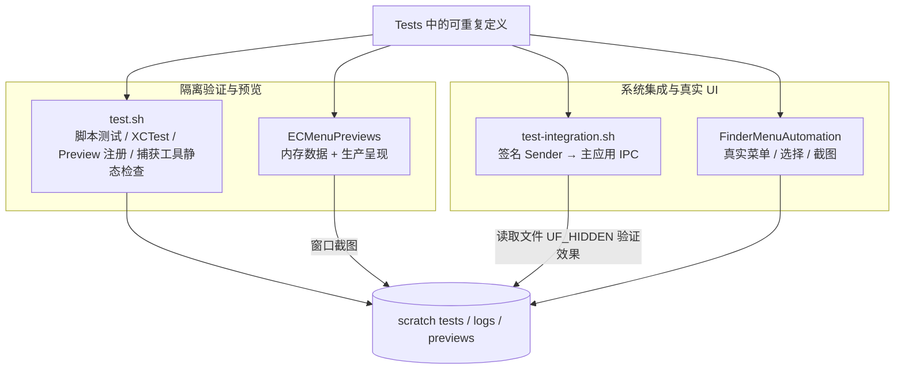
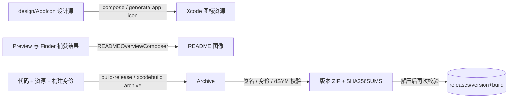

# D01–D03 · 开发、验证与交付边界

开发工具与产品运行流程分开。此页按可独立理解的流水线概括 `scripts/`、专用测试宿主、预览和资源生成；完整参数与操作约束以 [scripts/Main.md](../../../../scripts/Main.md) 为准。本轮没有运行这些系统修改流程。

## D01 · 构建、启动与环境切换

| 模块 | 输入 | 外部 API / CLI | 输出 / 失败 |
|---|---|---|---|
| 构建与产品定位 | project、scheme、configuration、destination | `xcodebuild`、`plutil`、`codesign` | 签名产物及解析后的路径/身份；非零退出或身份不符终止 |
| 精确进程生命周期 | 产物可执行路径、当前 PID | 进程查询、`kill`、`open` | 旧路径进程结束、当前产物运行；超时失败 |
| Finder 环境 | 目标 Extension 路径、Debug/Release 身份 | `pluginkit`、Launch Services `lsregister`、用户级 `launchctl` | 登记/启用/运行分别核对；环境切换失败恢复原启用状态，已完成构建和登记不回滚 |
| 图标刷新 | 当前 Debug 应用及缓存 | `lsregister`、IconServices/Dock 进程刷新 | 请求系统重新读取图标；不是产品业务接口 |

`--no-build` 使用已存在产物并重新核对身份；它与 `--build-only` 互斥。Debug 与 Release 数据及 IPC 身份隔离，两个 Finder Extension 的启用状态由环境脚本协调。

## D02 · 测试、预览与真实界面捕获

| 模块 | 输入 | 外部 API / CLI | 输出 / 失败 |
|---|---|---|---|
| 测试编排 | 测试定义、签名环境、GUI 会话 | `xcodebuild test`、`xcrun swiftc`、Python、`xcresulttool` | `.xcresult`、日志、各检查退出码；`test.sh` 不包含另一个集成脚本的执行 |
| IPC 集成 | 当前 Debug 产物、签名 Sender、仓库内普通文件 fixture | 当前 socket/Security API；Python `os.stat(..., follow_symlinks=False)` | 配置查询成功；单次隐藏命令后检查 `UF_HIDDEN`，超时失败；不驱动 Finder 菜单 |
| Preview | 固定 Case、内存状态、语言参数 | 独立 SwiftUI/AppKit 宿主；`screencapture -l` 按窗口编号截图，见 [Preview 技术边界](../../../Technical/PreviewTarget.md) | 可交互窗口或 PNG；复用产品视图，不写用户设置和业务输出 |
| Finder 菜单捕获 | 场景/语言、fixture、真实 Finder | Accessibility `AXUIElementCopyAttributeValue/PerformAction`、`CGEvent` 输入、`SCShareableContent` / `SCScreenshotManager.captureScreenshot`、ImageIO PNG 编码；`defaults` 语言事务 | 真实菜单图像及期望校验；权限、菜单身份、语言或窗口条件不满足则失败 |
| 用户环境保护 | 自动化前的焦点与 Finder 窗口集合 | AppKit `NSRunningApplication` / `activate`、CoreGraphics `CGWindowListCopyWindowInfo` | 尽量恢复同一应用焦点；前后窗口集合不同导致检查失败；不以自动关窗隐藏差异 |

这里的系统 API 属于开发宿主，不进入产品权限或命令执行链。具体捕获/窗口读取方法与验证版本分别见 [Finder 菜单捕获](../../../Technical/FinderMenuCapture.md)、[窗口保持](../../../Technical/FinderWindowPreservation.md)、[焦点恢复](../../../Technical/UserFocusRestoration.md)；工具的输入模拟和截图权限不能转化为产品对这些权限的依赖。

## D03 · 图标、README 图像与正式发布

| 模块 | 输入 | 外部 API / CLI | 输出 / 失败 |
|---|---|---|---|
| 图标资源生成 | SVG、Icon Composer JSON 模板 | `xmllint`、`jq`、Icon Composer `ictool --export-image`、文件差异比较；[图标源说明](../../../../design/AppIcon/Main.md) | 正式资源；`--check` 比较一致性并以退出码反馈，不同步产品文件 |
| README 合成 | 已验证的设置页和 Finder 图片 | `READMEOverviewComposer` 的 CoreGraphics / ImageIO | 合成后的中英文图像；全部成功后才更新 README 图片 |
| 发布编排 | version/build、签名配置、项目 | `xcodebuild archive`、`codesign`、打包/解压、校验和工具 | Archive、ZIP、校验和；拒绝静默覆盖已有非空版本目录 |

正式交付路径、签名限制和身份值以[交付文档](../../../Technical/Delivery/Main.md)为准。当前发布脚本不执行网络发布。产品源、测试定义和持久文档都不依赖 scratch 产物；共享 Derived Data 或 Finder 登记状态的脚本必须顺序执行。

## 本轮重构对工具的影响

工具职责大多已经独立。后续目录变更需同步 Xcode membership、预览生产源选择、源码路径检查和捕获注册表引用；无需把开发工具与产品 Feature 合并，也不把它们的 UI 驱动带入产品。
