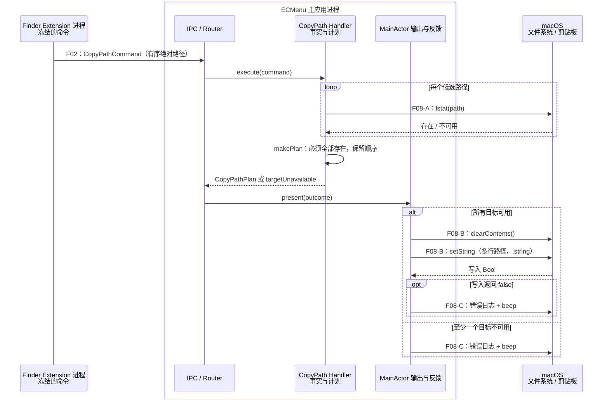
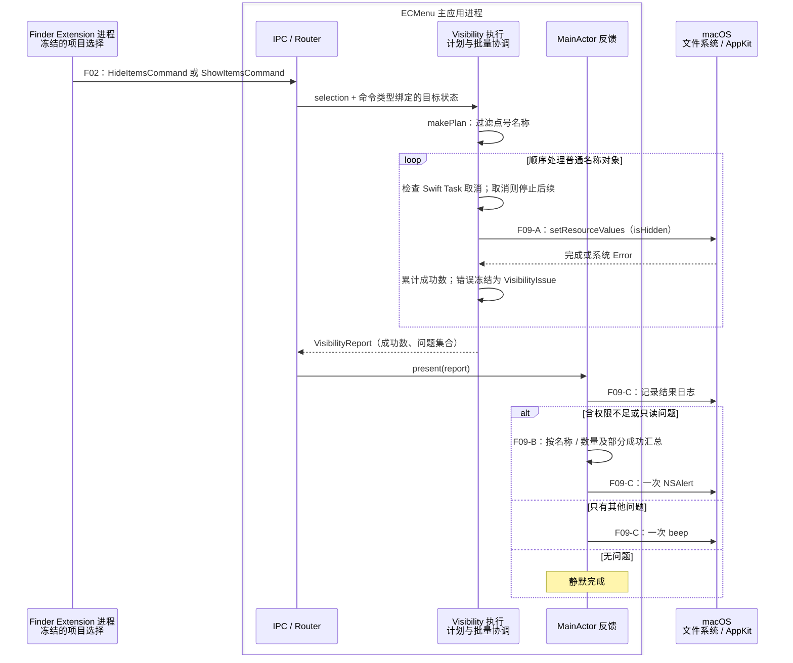
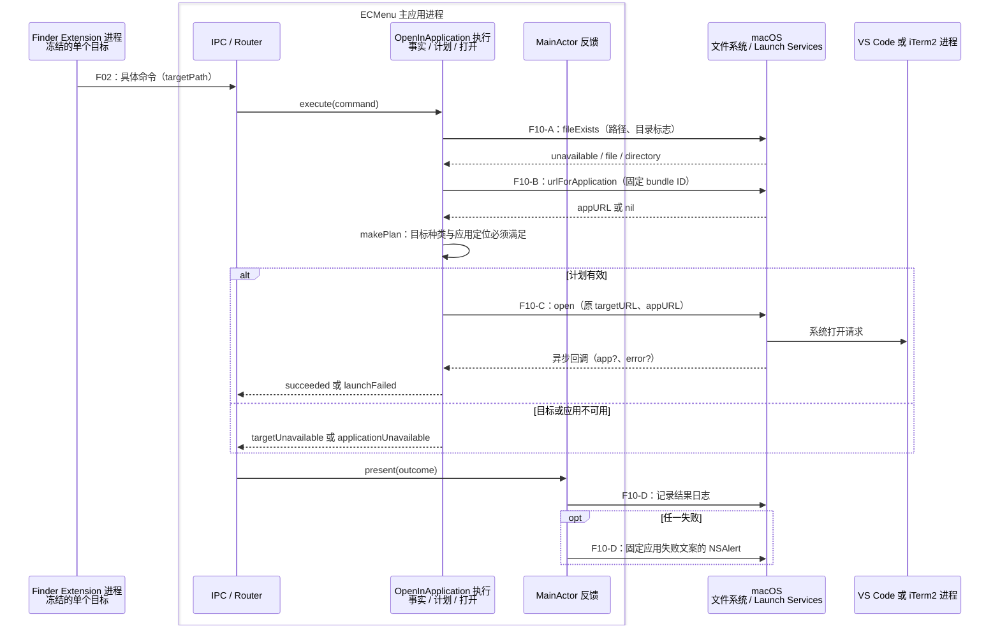

# 文件命令：拷贝路径、可见性与外部应用

本页记录当前源码的控制流。菜单形成、命令冻结和跨进程投递共用 [F01–F02](MenuAndIPC.md)，主应用的路由与任务生命周期共用 [F12](ImageCompression.md#f12-共享执行进度取消与反馈)。图中的主应用模块表示已有职责，并不表示它们已经各自位于独立文件。API 证据的分级与阅读方式见 [API 契约](../APIContracts.md)。

## F08 拷贝路径

输入是非空、有序的 `CopyPathCommand.paths`。Extension 已将背景、选中项目或侧边栏解释成绝对路径集合；主应用不再读取 Finder 当前选择。

| 模块 / API 编号 | 输入 | 输出 | 外部 API 与失败语义 |
|---|---|---|---|
| 路径事实读取 · F08-A | 每个 `AbsoluteFilePath` | 检查时点存在的 URL 集合 | Darwin `lstat(path, &stat)`；返回 `0` 为存在，其余返回值统一视为不可用，当前不保留 `errno` |
| 纯计划 | 有序命令路径、存在集合 | `Result<CopyPathPlan, CopyPathFailure>`；正文为路径逐行连接 | 无外部 I/O；Foundation URL 标准化和字符串变换。任一路径失效则整组失败 |
| 剪贴板输出 · F08-B | 计划中的一份多行 POSIX 路径字符串 | 系统通用剪贴板的一项 `.string` 表示 | AppKit `NSPasteboard.general.clearContents()` 后 `setString(_:forType:)`；`clearContents` 的计数返回值被忽略，写入的 `false` 触发失败反馈 |
| 结果反馈 · F08-C | 写入结果或目标不可用、本地 requestID | 成功静默；失败日志及一次系统提示音 | OSLog `Logger`、AppKit `NSSound.beep()`；不显示业务警告窗口 |

`lstat` 检查链接目录项本身，断开的符号链接仍可拷贝。路径不加 `file://`，不做 shell 转义，不自行排序，最后一行不附加换行。

这里的 `Outcome` 是剪贴板写入前的计划结果；实际写入在 `present` 内发生。检查路径、清空剪贴板与写入字符串是三个不同的时点。清空后写入失败不恢复旧内容。Apple 将 `setString` 的 `false` 定义为剪贴板所有权发生变化，并另列出通信异常；当前代码处理的是 Bool 失败出口。[Apple：setString](https://developer.apple.com/documentation/appkit/nspasteboard/setstring%28_%3Afortype%3A%29?language=objc)

源码入口：[CopyPathCommand](../../../../ECMenuShared/ContextCommands/Features/CopyPath/CopyPathCommand.swift)、[CopyPathHandler](../../../../ECMenu/ContextCommands/Features/CopyPath/CopyPathHandler.swift) 中的 `execute`、`makePlan`、`present`。稳定边界见[拷贝路径技术决策](../../../Technical/Features/CopyPath.md)。

## F09 隐藏项目 / 显示项目

两个命令分别绑定 `.hide` 与 `.show`，共用一条执行管线。负载只表达非空 `FinderItemSelection`；背景和侧边栏不会形成这两个命令。菜单出现条件属于 [F01](MenuAndIPC.md)，实际写入以执行时系统结果为准。

| 模块 / API 编号 | 输入 | 输出 | 外部 API 与失败语义 |
|---|---|---|---|
| 命令与纯计划 | 非空选择、类型绑定的 hide / show | 保持选择顺序、去除点号名称的 `VisibilityPlan` | 无外部 I/O；Foundation URL 名称读取。点号名称不进入属性写入、不计成功 |
| 批量属性写入 · F09-A | 单个原 URL、目标隐藏状态 | 成功计数或 `VisibilityIssue(itemURL, systemError)` | Foundation `URL.setResourceValues`，写入 `URLResourceValues.isHidden`；throws 被立即冻结。每项开始检查 `Task.isCancelled` |
| 错误分类及文案 · F09-B | 报告、操作类型、Locale | 可选 `CommandAlertContent` | 无外部 I/O；`SystemErrorSnapshot` 的 Cocoa/POSIX 错误码分类，名称或数量由失败对象派生，本地化字符串由 Bundle 解析 |
| 结果反馈 · F09-C | 报告及可选警告内容 | 日志、一次警告或一次提示音 | OSLog、AppKit `NSAlert` / `NSSound.beep()`；含可弹窗错误时不再额外 beep |

批量执行不递归修改目录内容，不重命名对象，不回滚已经成功的属性写入。真实写入之前不预检权限；权限或卷状态可以在菜单展示后变化。无用户进度与取消按钮，Swift Task 取消仅在项目边界被读取。

Apple 明确说明，以 `.` 开头的名称不能通过把 `isHidden` 设为 `false` 显示。[Apple：isHidden](https://developer.apple.com/documentation/foundation/urlresourcevalues/ishidden?changes=l__4_8) 设置符号链接 URL 的隐藏属性只修改链接目录项、不修改目标，是现有项目测试覆盖的观察，证据范围见[可见性技术决策](../../../Technical/Features/Visibility.md)。

源码入口：[VisibilityCommands](../../../../ECMenuShared/ContextCommands/Features/Visibility/VisibilityCommands.swift)、[VisibilityHandlers](../../../../ECMenu/ContextCommands/Features/Visibility/VisibilityHandlers.swift) 中的 `VisibilityExecution`、`VisibilityAlertContent`、`VisibilityFeedback`；共用错误分类见 [SystemError](../../../../ECMenu/ContextCommands/SystemError.swift)。

## F10 在 VS Code / iTerm2 中打开

每个命令仅携带一个 `targetPath`。固定应用依赖与目标约束由命令类型声明：VS Code 接受文件或目录，iTerm2 要求目录。共享声明同时贡献菜单身份、名称、应用依赖和图标来源。

| 模块 / API 编号 | 输入 | 输出 | 外部 API 与失败语义 |
|---|---|---|---|
| 目标事实 · F10-A | 原始绝对路径 | `OpenInApplicationTargetState` 三态 | Foundation `FileManager.fileExists(atPath:isDirectory:)`；跟随链接读取存在与目录事实，返回 false 时归为 unavailable |
| 应用定位 · F10-B | 固定 bundle ID | 应用 bundle URL? | AppKit `NSWorkspace.urlForApplication(withBundleIdentifier:)`；nil 表示无法定位。当前实现跳回 MainActor 查询 |
| 纯计划 | command、目标事实、appURL? | `OpenInApplicationPlan` 或类型化失败 | 无外部 I/O；目标先满足类型约束，再要求 appURL 存在；传递原目标 URL |
| 打开适配 · F10-C | `[targetURL]`、appURL、默认 `OpenConfiguration` | `OpenInApplicationOutcome` | AppKit `NSWorkspace.open(_:withApplicationAt:configuration:completionHandler:)`；用 continuation 等待回调，error 被捕获为 launchFailed。当前不消费返回的 app 对象 |
| 反馈 · F10-D | Outcome、固定应用名、本地 requestID | 成功静默；所有失败均固定文案警告 | OSLog、通用 `NSAlert`；完整路径和系统细节保留在本地诊断 |

跟随符号链接只用于判断最终对象种类，交给外部应用的仍是用户选中的原始路径。package 按文件系统目录处理。应用和目标在菜单后消失均有执行期失败出口；系统调用不使用 shell、CLI 或 `PATH`。

Apple 的打开 API 允许任意线程调用，并在并发队列调用 completion；源码选择在 MainActor 发起调用是当前项目实现边界。成功回调表明系统打开请求成功，不等于外部应用已完成项目加载。[Apple：open](https://developer.apple.com/documentation/appkit/nsworkspace/open%28_%3Awithapplicationat%3Aconfiguration%3Acompletionhandler%3A%29?changes=la_4_8%2Cla_4_8&language=objc%2Cobjc)

源码入口：[OpenInApplicationCommands](../../../../ECMenuShared/ContextCommands/Features/OpenInApplication/OpenInApplicationCommands.swift)、[OpenInApplicationHandlers](../../../../ECMenu/ContextCommands/Features/OpenInApplication/OpenInApplicationHandlers.swift) 中的 `readTargetFacts`、`makePlan`、`launch` 和 `OpenInApplicationFeedback`。外部应用版本带来的验收限制见[进入外部应用技术决策](../../../Technical/Features/OpenInApplications.md)。

## 状态、并发与现有验证

这三项能力不持有跨请求业务缓存。每次命令拥有自己的输入、计划和结果，Router 管理请求 Task；文件属性、剪贴板和外部应用状态由 macOS 或对应进程拥有。多个请求之间没有跨功能全局串行队列。权限与路径检查只代表检查时点，不冻结外部系统状态。

本轮审阅了以下测试定义，未执行测试；表中覆盖是已有测试断言的范围。

| 流程 | 测试定义 | 已覆盖 | 尚未由这些测试证明 |
|---|---|---|---|
| F08 | [CopyPathTests](../../../../Tests/ECMenuTests/ContextCommands/Features/CopyPath/CopyPathTests.swift) | 选择顺序、多行文本、失效多选整体失败、真实断链 | 系统通用剪贴板实际写入及所有权竞争、提示音 |
| F09 | [VisibilityTests](../../../../Tests/ECMenuTests/ContextCommands/Features/Visibility/VisibilityTests.swift) | 点号过滤、真实文件/目录/链接属性、非递归、错误分类 | 各类真实拒绝访问和只读卷、并发相反操作 |
| F10 | [OpenInApplicationTests](../../../../Tests/ECMenuTests/ContextCommands/Features/OpenInApplication/OpenInApplicationTests.swift) | 纯计划中的目标种类、消失目标、缺失应用 | 实际 Launch Services 回调、VS Code 项目加载、iTerm2 工作目录 |
| 反馈 | [CommandAlertContentTests](../../../../Tests/ECMenuTests/ContextCommands/Presentation/CommandAlertContentTests.swift)、[SystemErrorTests](../../../../Tests/ECMenuTests/ContextCommands/SystemErrorTests.swift) | 错误分类、统一标题、名称/数量、全部/部分失败和固定应用文案 | 真实模态警告的窗口焦点与交互 |
