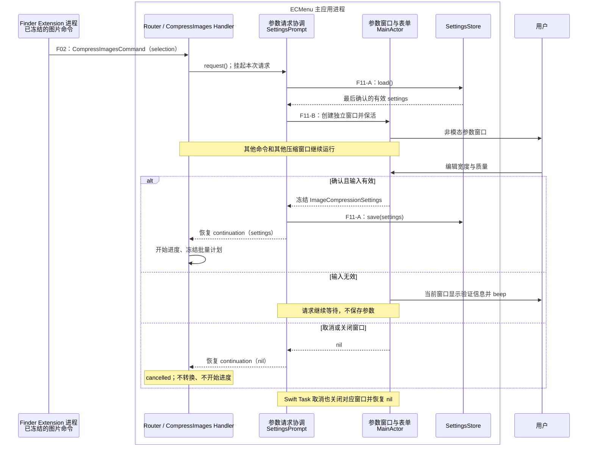
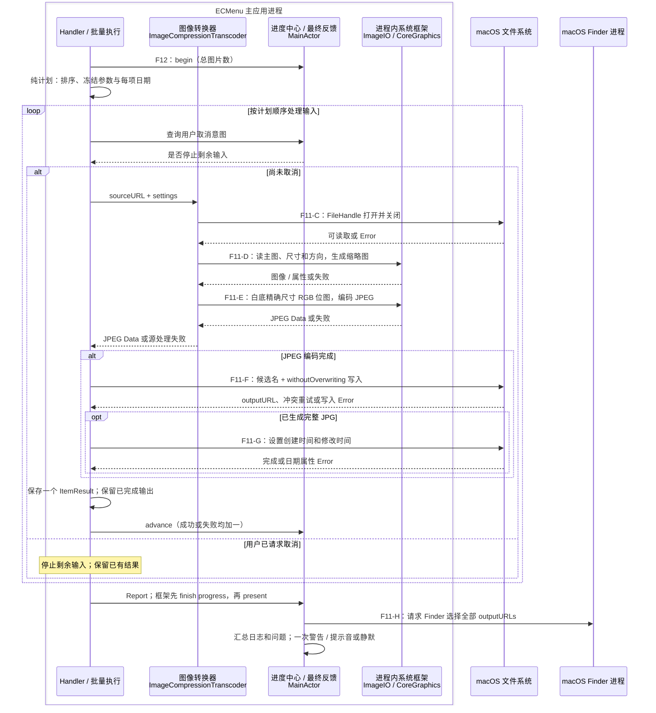
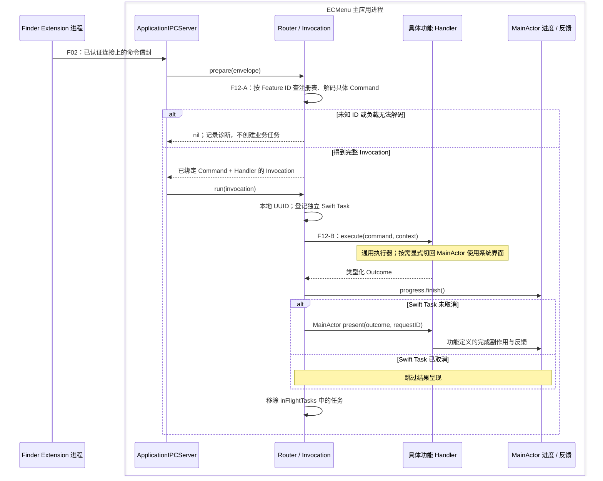
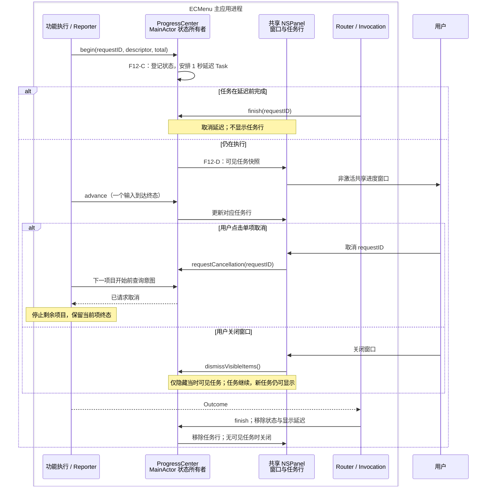

# 图片压缩与共享执行流程

本页记录当前源码中的 F11 压缩图片，以及所有命令共用的 F12 路由、任务、进度和反馈。菜单构造与单向 IPC 投递见 [F01–F02](MenuAndIPC.md)，证据分级见 [API 契约](../APIContracts.md)。图中的主应用模块表达现有职责；API 编号对应图后的输入、输出及失败表。

## F11 压缩图片

输入是 `CompressImagesCommand.selection` 中的非空图片集合。Extension 根据文件类型能力决定菜单是否出现，主应用执行时才实际解码；这两种检查不能互相替代。每次请求冻结自己的输入集合，参数等待期间不会重新读取 Finder 当前选择。

### 参数窗口、确认与持久化

| 模块 / API 编号 | 输入 | 输出 | 外部 API 与失败语义 |
|---|---|---|---|
| 设置领域规则 | 宽度 Int、质量 Int | 有效 `ImageCompressionSettings?` | 无外部 I/O；宽度必须大于 0，质量为 `0...10`。ImageIO 质量从整数质量除以 10 派生 |
| 设置存储 · F11-A | 两个稳定偏好键、确认的设置 | `load` 返回有效设置；`save` 无返回值 | Foundation `UserDefaults.object(forKey:)`、`set(_:forKey:)`；读取时缺失或无效的两个字段各自使用默认值，写入 API 不提供已落盘回执 |
| 参数请求协调 | Store、窗口呈现回调、调用 Task | 异步 settings 或 nil | Swift `withCheckedContinuation`、`withTaskCancellationHandler`；每个 promptID 独立保活 controller，完成后移除，Task 取消转成对应窗口 dismiss |
| 窗口与表单 · F11-B | 初始 settings、用户文本/滑块输入 | 有效设置或 nil；非法输入保持窗口等待 | AppKit `NSWindow` / `NSWindowController`、`NSTextField` / `NSSlider`、`Formatter` / `NumberFormatter`、`NSApp.activate`、`makeKeyAndOrderFront`；确认前局部验证，失败提示并 `NSSound.beep()` |

默认宽度为 1440，质量为 8。参数草稿归各自窗口；最后确认参数归 Store 背后的主应用 UserDefaults。多个窗口各自读取打开时的设置，后确认者写入下一次默认值，已打开窗口不会随存储变化重新覆盖草稿。取消或关闭不保存。Controller 先清除自己的 completion，再恢复调用者，避免关闭事件重复完成请求。

源码：[CompressImagesHandler](../../../../ECMenu/ContextCommands/Features/ImageCompression/CompressImagesHandler.swift) 的 `execute`；[ImageCompressionSettings](../../../../ECMenu/ContextCommands/Features/ImageCompression/ImageCompressionSettings.swift) 的领域设置与 Store；[ImageCompressionSettingsWindow](../../../../ECMenu/ContextCommands/Features/ImageCompression/ImageCompressionSettingsWindow.swift) 的 Prompt、WindowController 和 FormView。

### 批量执行与单项终态

图把单项转换作为内聚模块：任一阶段失败直接形成该项失败结果，后续依赖该阶段的 API 不再调用；外层仍处理下一输入。取消检查在下一输入开始之前，编码和写入中的当前项完整到达终态。

| 模块 / API 编号 | 输入 | 输出 | 外部 API 与失败语义 |
|---|---|---|---|
| 纯批量计划 | 图片 URLs、有效 settings、基准 Date | 有序 `ImageCompressionItemPlan(sourceURL, outputDate)` | 无外部 I/O；Foundation `localizedStandardCompare` 按文件名、同名时按完整路径排序，每项时间为基准加输入索引秒 |
| 批量协调 | Plan、可选 ProgressReporter | `ImageCompressionReport(items, wasCancelled)` | Swift Task 取消状态、actor 调用及 `autoreleasepool`；批内顺序，单项结束释放临时图像对象，不设置批间全局串行队列 |
| 源访问 · F11-C | sourceURL | 成功打开并关闭，或 source/decode 阶段错误 | Foundation `FileHandle(forReadingFrom:)`、`close()`；throws 被冻结为系统错误快照，以区分源读取失败与后续无效容器 |
| 图像读取 · F11-D | URL、source、主图索引、thumbnail 选项 | 属性和方向修正后的 `CGImage` | ImageIO `CGImageSourceCreateWithURL`、`GetCount`、`GetPrimaryImageIndex`、`CopyPropertiesAtIndex`、`CreateThumbnailAtIndex`；nil、无图像、无有效尺寸映射为明确 decode 阶段错误 |
| 位图与 JPEG 编码 · F11-E | 缩略图、目标宽高、质量 | 内存中的独立 JPEG Data | CoreGraphics `CGColorSpace`、`CGContext`、fill/draw/makeImage；ImageIO `CGImageDestinationCreateWithData`、`AddImage`、`Finalize`；nil 或 finalize false 形成 encode 阶段错误 |
| 输出名称规则 | 源同级首选 `.jpg` URL | 惰性候选 URL 序列 | 无外部 I/O；`FileCollisionNaming` 产生原名、`_copy`、`_copy2` 等候选，不先检查文件存在 |
| 输出写入 · F11-F | 已编码 Data、候选 URL | 新 outputURL 或 destination 失败 | Foundation `Data.write(to:options: .withoutOverwriting)`；只有 `fileWriteFileExists` 继续候选，其他错误保存源图片和目标目录两个身份 |
| 日期属性 · F11-G | 新 outputURL、预定 Date | Output，必要时带 `fileDateError` | Foundation `FileManager.setAttributes` 写 creationDate / modificationDate；失败保留已经生成的 JPG，不回滚 |
| 纯结果与文案 | 逐项结果、Locale | outputURLs、失败分组、可选警告内容 | 无外部 I/O；集合与错误类别按需派生。源权限、目录权限、日期属性问题分别汇总 |
| 最终反馈 · F11-H | Report、本地 requestID | 选择请求、日志、一次警告或提示音 | AppKit `NSWorkspace.activateFileViewerSelecting([URL])` 仅在输出非空时调用，没有选择完成回执；NSAlert / NSSound / OSLog 使用 F12 的反馈出口 |

### 结果、取消与系统边界

单项结果是 `failed(Failure)` 或 `output(Output)`，不会同时表达无输出失败与成功输出。Output 可以携带日期错误，准确表达“JPG 已生成，但属性未完成”。Report 只保存逐项结果和用户取消标志，成功 URL、问题集合由它派生。

用户确认时取得统一基准时间，计划按输入排序索引分配日期；某项失败不改变后续输入预定的时间位置。图片按视觉方向计算最大宽度，小图不放大；透明区先合成白底，再将新位图编码为一帧 JPG，源属性字典不传入 destination。

主图索引 API 的官方语义是 HEIF 主图，其他格式返回 0；源码还将超出实际 count 的索引回到 0。方向变换由 ImageIO thumbnail 选项承担，EXIF 5...8 的视觉宽高交换参与尺寸计算。[Apple：主图索引](https://developer.apple.com/documentation/imageio/cgimagesourcegetprimaryimageindex%28_%3A%29)、[Apple：thumbnail transform](https://developer.apple.com/documentation/imageio/kcgimagesourcecreatethumbnailwithtransform?changes=__5)

每项先在内存中完成编码，再尝试最终路径。`withoutOverwriting` 保证目标已存在时返回失败；编码、写入和日期设置仍是不同阶段，不构成一个整体事务。[Apple：WritingOptions](https://developer.apple.com/documentation/foundation/nsdata/writingoptions?changes=_6_7_8_8)

进度按钮的协作取消使 `wasCancelled` 为 true，保留并选择已经生成的图片，既有问题继续汇总。Swift Task 取消是另一条生命周期路径：执行器在项目边界停止，Invocation 清理进度后跳过整个 `present`。进程被终止不承诺取消清理。

源码：[ImageCompressionExecution](../../../../ECMenu/ContextCommands/Features/ImageCompression/ImageCompressionExecution.swift)、[ImageCompressionTranscoder](../../../../ECMenu/ContextCommands/Features/ImageCompression/ImageCompressionTranscoder.swift)、[ImageCompressionResults](../../../../ECMenu/ContextCommands/Features/ImageCompression/ImageCompressionResults.swift)、[ImageCompressionFeedback](../../../../ECMenu/ContextCommands/Features/ImageCompression/ImageCompressionFeedback.swift)、[FileNaming](../../../../ECMenu/ContextCommands/FileNaming.swift)。已有平台观察及证据限制见[图片压缩技术决策](../../../Technical/Features/ImageCompression.md)。

## F12 共享执行、进度、取消与反馈

### 类型恢复与任务生命周期

每个请求的 UUID 是主应用本地执行身份，关联任务、进度和日志，不是跨进程请求编号。IPC 是单向投递，详情见 [F02](MenuAndIPC.md)；Extension 不等待图中的业务 Outcome。注册重复属于组合错误，以 precondition 暴露；认证后的未知 ID 或坏负载是输入失败，日志后丢弃。

`execute → Outcome → present` 是当前框架约束。`present` 同时包含界面与部分主线程输出副作用，例如 [F08 的实际剪贴板写入](FileCommands.md#f08-拷贝路径)。因此不能把这条边界标为所有功能都已完成业务工作后的纯视觉渲染。

### 进度、关闭窗口与协作取消

当前只有主动 `begin` 的功能产生进度，压缩图片在参数确认后调用它。多个任务共用一个窗口，取消按钮只针对一个 requestID；关闭窗口不执行取消。用户取消意图不调用 Router Task 的 `cancel()`。Router 释放则对仍持有的 Swift Task 发起取消，这是不同的生命周期事件。

| 模块 / API 编号 | 输入 | 输出 | 外部 API 与失败语义 |
|---|---|---|---|
| 注册与类型恢复 · F12-A | Feature ID、payload Data、不可变 Handler 注册表 | 完整 Invocation 或 nil | Foundation Codable / JSONDecoder 恢复具体命令，失败记录 OSLog；此阶段无功能 I/O |
| Router / Invocation · F12-B | Invocation、进度中心 | Task 生命周期、本地 requestID、Outcome 的呈现调用 | Swift Concurrency `Task`、`@concurrent`、actor hop；任务取消协作传播，不能强制中断同步系统调用 |
| 纯进度状态 | begin / reveal / advance / requestCancellation / finish | 有序进度项目及可见快照 | 无外部 I/O；总数必须为正，重复 begin / 超额 advance 为实现错误；计数表示已处理项，不是成功输出数 |
| ProgressCenter · F12-C | Reporter 事件、窗口关闭/取消动作 | 状态变更、可见快照、窗口生命周期 | Swift `Task.sleep(for:)` 产生显示延迟，取消延迟时退出；Center 持有状态、reveal Tasks 与已隐藏 requestIDs |
| 窗口与图标适配 · F12-D | 不可变任务快照、descriptor | 复用的行视图、取消/关闭回调 | AppKit `NSPanel`、`orderFrontRegardless`、NSButton target/action；`NSWorkspace` 查询应用位置/图标、`NSImage` 解析图标；窗口不为自动显示调用 app activate |
| 进度视觉 | 已完成数/总数、窗口焦点状态 | 进度槽、文本及辅助技术值 | AppKit NSView 绘制、NSBezierPath / NSColor、NotificationCenter key-window 通知；只影响呈现，不修改业务进度 |
| 纯反馈内容 | 功能 Outcome、Locale | 统一标题与功能正文，或无需弹窗 | 无外部 I/O；名称/数量、部分成功和可展示错误由各功能规则决定，本地化资源由 Bundle 解析 |
| 命令警告出口 · F12-E | `CommandAlertContent(title, body)` | 一次标准警告及用户关闭 | AppKit `NSAlert`、`NSApp.activate(ignoringOtherApps:)`、`runModal()`；当前警告使用应用模态循环 |
| 诊断与提示音 | 功能结果、系统错误快照、本地 requestID | 本地日志或一次默认提示音 | OSLog `Logger`、AppKit `NSSound.beep()`；各功能决定错误组合和最终反馈 |

### 状态所有权与呈现出口

| 状态 | 所有者 | 结束边界 |
|---|---|---|
| 在途命令 Tasks | Router 的 `inFlightTasks` | 执行与呈现返回；Router 释放会请求取消 |
| 进度、用户取消意图、显示延迟与隐藏的 ID | ProgressCenter | Invocation 统一 finish 对应 requestID |
| 面板、行视图与图标缓存 | ProgressWindowController | 窗口关闭或没有可见任务 |
| 单个参数窗口与未确认输入 | SettingsWindowController / FormView，由 Prompt 保活 | 确认、取消、关闭或 Task 取消 |
| 确认后批次的输入、设置、计划与逐项结果 | 该次 Handler 执行 | 返回 Outcome |

进度面板使用 `.nonactivatingPanel`，自动出现时不抢占 Finder 焦点。参数窗口主动激活主应用且是非模态；错误警告主动激活并运行模态循环。这三类 UI 的当前控制边界不同。

各功能先形成自己的失败事实和文案，通用警告出口只把内容显示为 NSAlert。完全成功静默；除外部应用固定失败警告外，目标失效和其他不可展示错误通常为日志加提示音。批量同时有可弹窗与非弹窗错误时，一次汇总警告替代额外提示音。Finder 结果选择和 CopyPath 剪贴板输出仍由具体功能执行其完成行为。

源码：[ContextCommandExecution](../../../../ECMenu/ContextCommands/ContextCommandExecution.swift)、[ContextCommandComposition](../../../../ECMenu/ContextCommands/ContextCommandComposition.swift)、[ContextCommandProgress](../../../../ECMenu/ContextCommands/Presentation/Progress/ContextCommandProgress.swift)、[ContextCommandProgressWindow](../../../../ECMenu/ContextCommands/Presentation/Progress/ContextCommandProgressWindow.swift)、[CommandAlert](../../../../ECMenu/ContextCommands/Presentation/CommandAlert.swift)。稳定边界见[命令执行](../../../Technical/Runtime/CommandExecution.md)、[命令进度](../../../Technical/Runtime/CommandProgress.md)。

## 现有测试与证据限制

本轮只审阅源码与测试定义，没有执行下列测试。已有技术文档记载的图像样本验证环境为 macOS 26.6.1（25G76）；其结论是相应样本的项目观察，不代表所有 ImageIO 输入类型都完成验收。

| 范围 | 测试定义 | 已有断言覆盖 | 证据限制 |
|---|---|---|---|
| 设置与计划 | [ImageCompressionTests](../../../../Tests/ECMenuTests/ContextCommands/Features/ImageCompression/ImageCompressionTests.swift) | 输入格式、有效设置、排序/预定日期、质量映射、UserDefaults 往返和字段独立恢复 | 不证明 UserDefaults 在保存返回时已同步落盘 |
| 转换与取消 | 同上 | 真实 PNG 转 JPEG、尺寸与日期、同名不覆盖、copy 序号极值、透明白底、首项后取消保留完整输出 | 取消在项目边界；不验证主动中断编码 |
| 图像/文件边界 | [ImageCompressionBoundaryTests](../../../../Tests/ECMenuTests/ContextCommands/Features/ImageCompression/ImageCompressionBoundaryTests.swift) | 目标目录拒绝写入仍保留其他成功、源消失、EXIF 5...8 像素方向、GIF 第一帧、HEIC 主图、源元数据剥离 | 由 ImageIO 生成的有限样本；不覆盖所有系统支持格式 |
| 参数窗口会话 | [ImageCompressionSettingsWindowTests](../../../../Tests/ECMenuTests/ContextCommands/Features/ImageCompression/ImageCompressionSettingsWindowTests.swift) | 确认/关闭/Task 取消恰好一次、提前取消不显示、并发窗口独立、验证文案语言布局 | 不替代真实多窗口焦点、Space 与用户操作验收 |
| 运行与进度 | [ContextCommandExecutionTests](../../../../Tests/ECMenuTests/ContextCommands/ContextCommandExecutionTests.swift) | prepare/run 分离、坏 envelope、Router 释放取消、快任务不显示、多个任务独立、关闭只隐藏当时可见项 | 主要通过 render callback 验证快照，不证明真实 NSPanel 的全部系统行为 |
| 注册与反馈 | [ContextCommandCompositionTests](../../../../Tests/ECMenuTests/ContextCommands/ContextCommandCompositionTests.swift)、[CommandAlertContentTests](../../../../Tests/ECMenuTests/ContextCommands/Presentation/CommandAlertContentTests.swift) | 产品注册目录、问题分类与名称/数量、部分成功和日期文案 | 不证明 Finder 实际选择成功或真实警告的交互结果 |
