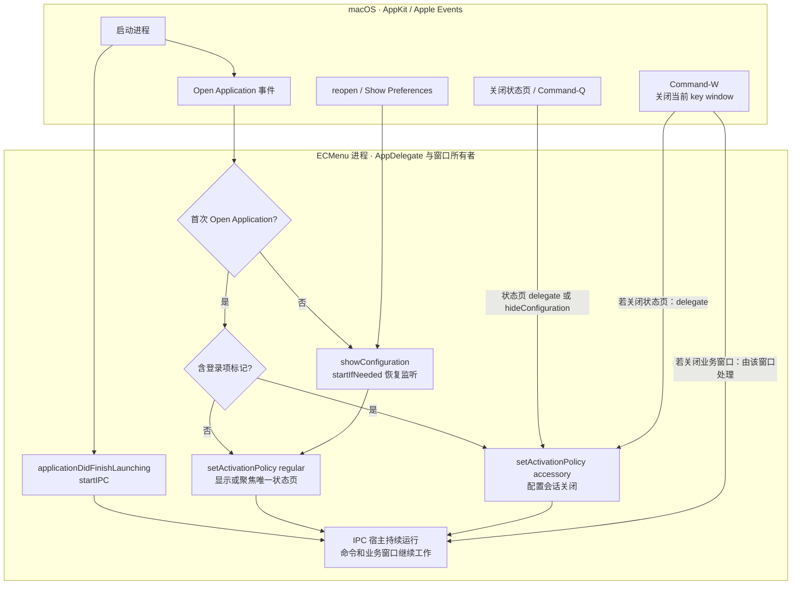
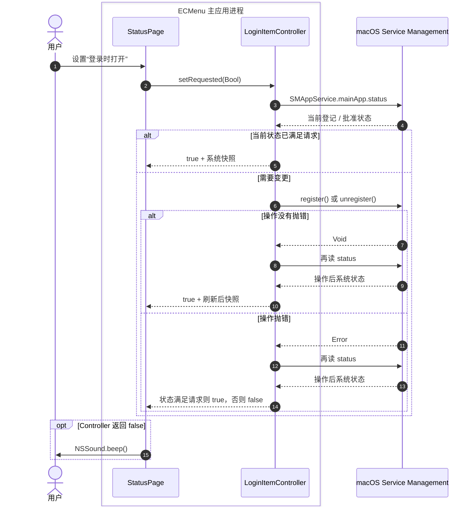
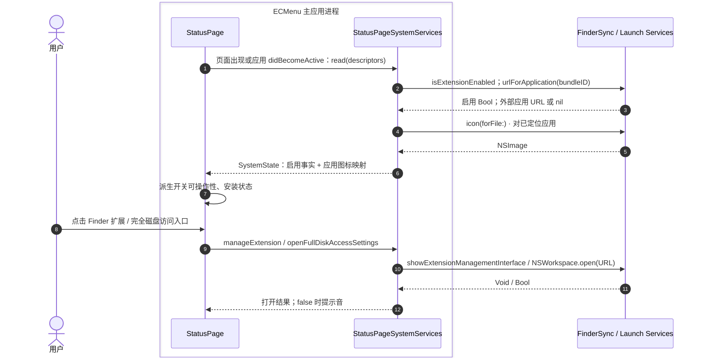
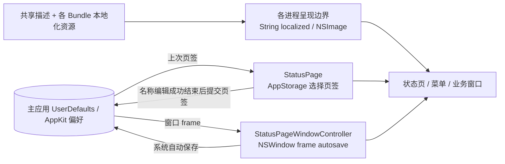

# F13–F15 · 生命周期、系统设置与界面状态

当前主应用以一个进程承担配置界面和常驻命令宿主。窗口形态由配置会话决定，业务参数、警告和进度窗口各自管理生命周期。

## F13 · 打开、关闭和恢复

启动监听与解释首次 Apple Event 是两个生命周期入口，图不承诺系统回调严格先后；源码没有以延时猜测来源。`Command-W` 关闭当前 key window，只有关闭状态页才改变配置会话；`Command-Q` 的应用菜单被替换为关闭配置会话。最小化不关闭配置会话。`setActivationPolicy` 被拒绝时记录失败，显示路径不会继续打开窗口。

| 模块 | 预期输入 | 外部 API | 预期输出 / 失败 |
|---|---|---|---|
| SwiftUI 应用入口 | 应用菜单动作、快捷键 | `@NSApplicationDelegateAdaptor`、`Settings` Scene、`CommandGroup` | 转给唯一 AppDelegate；Settings Scene 本身是空内容 |
| 启动来源解释 | 首次 `kAEOpenApplication` 的 descriptor | `NSAppleEventManager.setEventHandler`；`NSAppleEventDescriptor.paramDescriptor(forKeyword: keyAEPropData)` / `enumCodeValue` | `.loginItem` 或 `.user`；登录标记位置来自已有项目观察 |
| 配置会话协调 | 打开/重开/关闭事件 | `NSApplication.setActivationPolicy`、`activate`、keyWindow `performClose` | regular/accessory 切换 Bool；失败日志；最后窗口关闭仍返回不终止 |
| 状态页窗口 | 已装配的菜单配置、登录项、模板 Controller | `NSHostingController`、`NSWindow`、`makeKeyAndOrderFront`、`deminiaturize`、`close`、delegate | 同一个窗口显示/关闭；AppKit 持有可见与最小化事实 |
| 命令宿主 | 启动或恢复意图 | IPC socket API 见 [F02](MenuAndIPC.md) | stopped/listening/failed；重开可以恢复监听，既往命令不重放 |

主进程被强制退出或崩溃后，Extension 的缓存菜单仍可能存在，点击会投递失败。当前会话的恢复入口是普通打开应用；登录项只影响后续登录。[生命周期技术边界](../../../Technical/Runtime/ApplicationLifecycle.md)包含 SDK/项目观察的版本及限制。

## F14a · 修改登录项

| 模块 | 预期输入 | 外部 API | 预期输出 / 失败 |
|---|---|---|---|
| 状态页 | 用户 Bool 意图、Controller 状态 | SwiftUI Binding、`NSSound.beep` | 开关从状态派生；失败提示音 |
| 登录项 Controller | 请求登记/取消登记 | `SMAppService.mainApp.status`、`register()`、`unregister()`，经 `LoginItemServiceBoundary` 注入 | 系统状态映射为 notRegistered/enabled/requiresApproval/notFound；register/unregister throws 后仍重新查询 |
| 状态规则 | 系统状态与目标意图 | 无外部 I/O | requiresApproval 表达用户已请求开启；即使系统先抛错，查询达到所求状态仍视为请求成立 |

此开关没有另一份 UserDefaults 真相源。`SMAppService.mainApp` 的登记对应后续登录启动，不能借用其他服务类型的自动重启保证。[官方 register 契约](https://developer.apple.com/documentation/servicemanagement/smappservice/register%28%29)。

## F14b · 读取状态与打开系统设置

| 模块 | 预期输入 | 外部 API | 预期输出 / 失败 |
|---|---|---|---|
| 刷新触发 | 页面出现、应用成为 active | SwiftUI `onAppear`、`NotificationCenter` 的 `NSApplication.didBecomeActiveNotification` | 重新读取系统事实和登录项状态 |
| Extension 状态适配 | 当前系统 Extension 身份 | `FIFinderSyncController.isExtensionEnabled` | 启用 Bool；不等于已登记当前构建、正在运行或 IPC 可用 |
| 外部应用适配 | descriptor 中的 bundle ID | `NSWorkspace.urlForApplication(withBundleIdentifier:)`、`icon(forFile:)` | URL? 与图标；找不到应用则缺少该键 |
| 控件状态规则 | 系统快照、总开关、独立可见性 | 无外部 I/O | 是否可编辑从事实派生；系统状态变化不改写已保存显示开关 |
| Finder 管理入口 | 用户点击 | `FIFinderSyncController.showExtensionManagementInterface()` | 系统管理界面请求，Void，无完成回执 |
| 完全磁盘访问入口 | 用户点击 | `NSWorkspace.open(URL)`；URL 由 `FullDiskAccessSettings` 提供 | Bool；false 提示音。这是项目采用的系统设置深链接，不是可查询授权状态的 API |

完全磁盘访问页面不查询/推断授权值；具体文件操作按实际失败处理。[权限边界](../../../Technical/Platform/FileAccess.md)与 [Extension 登记/启用/运行的区别](../../../Technical/Platform/Finder/ExtensionLifecycle.md)沿用既有证据，未在本轮重新实测。

## F15 · 页面、窗口、语言与图标

| 模块 | 预期输入 | 外部 API | 预期输出 / 失败 |
|---|---|---|---|
| 页面选择 | `status-page-selected-pane` 字符串、用户目标页 | SwiftUI `@AppStorage` / UserDefaults | 有限 `StatusPagePane`；当前无效字符串回到 General；用户切页先等待名称编辑结束，成功才改页签，失败停留原页，见 [F05](ConfigurationAndTemplates.md) |
| 窗口位置 | frame autosave name | `NSWindow.setFrameUsingName`、`setFrameAutosaveName`、`center` | 恢复结果 Bool；无法恢复则居中，由 AppKit 后续保存 |
| 产品元数据 | Info.plist 字段 | `Bundle.main.object(forInfoDictionaryKey:)`、`ProcessInfo.processName` | 显示名/版本；当前有缺失值显示分支，属于界面元数据 |
| 本地化呈现 | `LocalizedStringResource`、当前 Locale 和所在产品 Bundle | Foundation `String(localized:)`、SwiftUI 本地化文本 | 当前进程的字符串；共享代码不提前把文案序列化到 IPC |
| 状态页/菜单图标 | SF Symbol 名称/应用图标、呈现场景的几何 | `NSImage(systemSymbolName:)`、`withSymbolConfiguration`、`NSImage.draw`；应用图标来自 NSWorkspace | `NSImage?`；几何规则由共用 renderer 执行，缓存与缺失图标处理留在呈现端 |

语言跟随 macOS，主应用和 Extension 使用各自的 `Localizable.xcstrings`，只保证在进程启动时取得当前语言。切换语言后的真实 Finder 验收需要重新加载 Extension。[本地化边界](../../../Technical/Runtime/Localization.md)。

## 源码与已有验证

- [ECMenuApp](../../../../ECMenu/App/ECMenuApp.swift)、[AppDelegate](../../../../ECMenu/App/AppDelegate.swift)、[StatusPageWindowController](../../../../ECMenu/Settings/StatusPage/StatusPageWindowController.swift)：应用事件、窗口和依赖生命周期。
- [LoginItemController](../../../../ECMenu/Settings/LoginItemController.swift)、[StatusPage](../../../../ECMenu/Settings/StatusPage/StatusPage.swift)、[SystemServices](../../../../ECMenu/Settings/StatusPage/StatusPageSystemState.swift)、[FullDiskAccessSettings](../../../../ECMenu/Settings/FullDiskAccessSettings.swift)：系统读取和用户意图。
- [AppKitIconCanvasRenderer](../../../../ECMenuShared/Rendering/AppKitIconCanvasRenderer.swift)：共用绘图原语，不拥有页面业务状态。
- [生命周期测试](../../../../Tests/ECMenuTests/App/ApplicationInitialOpenSourceTests.swift)、[登录项测试](../../../../Tests/ECMenuTests/Settings/LoginItemControllerTests.swift)、[系统状态测试](../../../../Tests/ECMenuTests/Settings/StatusPage/StatusPageSystemStateTests.swift)、[本地化测试](../../../../Tests/ECMenuTests/App/LocalizationCatalogTests.swift)：已有测试覆盖事件决策、拒绝切换、登记失败后重读、禁用规则和字符串资源。本轮未运行；实际注销登录、Dock/Space、系统设置跳转仍需平台验收。
