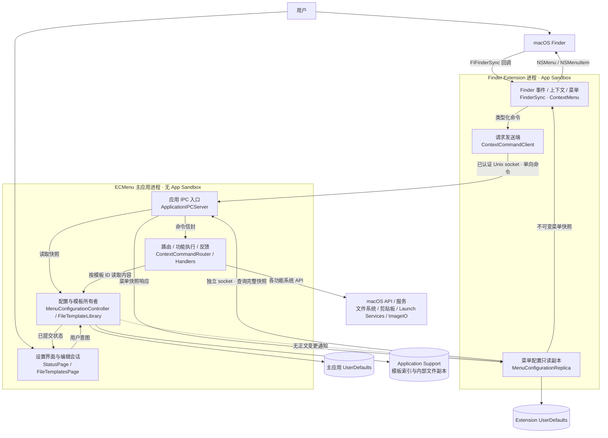

# 当前系统与功能地图

这是[提案基线](../Main.md)的当前结构，不是目标架构。图中的模块是源码已经承担的职责，不要求每个模块都已有独立目录。

## 系统总览

`ECMenuShared` 编译进入双方，保存命令、路径、模板身份、菜单快照、socket 实现及共用图标绘制原语。它当前同时包含领域契约与平台实现；这一组织问题见[结构评估](../Assessment.md)。App Group 仅提供 socket 端点位置，双方偏好各自保存。

## 完整功能索引

| 流程 | 用户行为 / 系统入口 | 完成边界 | 详细图与 API |
|---|---|---|---|
| F01 | Extension 加载、挂载变化、Finder 右键 | 返回当前上下文可用的菜单或空结果 | [菜单生成](MenuAndIPC.md) |
| F02 | 点击任一命令 | 单向投递后由主应用独立执行和反馈 | [命令投递](MenuAndIPC.md) |
| F03 | 修改总开关或功能开关、发布模板菜单变化 | 主应用状态更新；Extension 成功拉取后替换副本 | [配置修改](ConfigurationAndTemplates.md)、[副本同步](MenuAndIPC.md) |
| F04 | 首次读取、迁移、导入模板 | 索引提交后发布有序模板清单 | [模板加载与导入](ConfigurationAndTemplates.md) |
| F05 | 原地编辑显示名或默认文件名 | 单字段保存完成后交接编辑焦点 | [名称编辑](ConfigurationAndTemplates.md) |
| F06 | 打开、更换、删除模板或重试读取 | 打开请求完成，或报告索引提交/清理结果 | [模板文件操作](ConfigurationAndTemplates.md) |
| F07 | 新建 TXT 或其他模板文件 | 不覆盖地创建文件，再请求 Finder 选择 | [新建文件](NewFile.md) |
| F08 | 拷贝路径 | 写入系统文本剪贴板 | [文件命令](FileCommands.md) |
| F09 | 隐藏项目 / 显示项目 | 逐项设置隐藏属性，汇总结果 | [文件命令](FileCommands.md) |
| F10 | 在 VS Code / iTerm2 中打开 | Launch Services 完成打开请求 | [文件命令](FileCommands.md) |
| F11 | 压缩图片并设置参数 | 逐图生成输出及属性，汇总部分成功 | [图片压缩](ImageCompression.md) |
| F12 | 查看进度、取消单个任务、关闭进度窗口 | 协作取消在安全边界停止；关闭只隐藏当时可见任务 | [进度与取消](ImageCompression.md) |
| F13 | 普通打开、登录启动、关闭设置、重新打开 | 单一宿主进程与配置窗口的生命周期切换 | [生命周期](LifecycleAndSettings.md) |
| F14 | 登录项开关、查看系统状态、打开系统设置 | 刷新系统事实或完成登记/打开请求 | [系统设置](LifecycleAndSettings.md) |
| F15 | 选择设置页面、恢复窗口、本地化呈现 | 当前进程按本地偏好/Bundle 解析界面 | [界面状态与语言](LifecycleAndSettings.md) |
| D01–D03 | 开发构建、测试、预览、截图、交付 | 形成可验证产物或明确失败 | [开发与交付](Development.md) |

七个 Finder 一级入口按注册顺序为新建文件、拷贝路径、隐藏、显示、压缩图片、VS Code、iTerm2；隐藏与显示、两个外部应用分别拥有独立开关。撤销和格式转换仍为[其他提案](../../Main.md)，不计入当前运行流程。

## 数据和状态归属

| 数据 / 状态 | 唯一可变所有者及生命周期 | 持久化 / 派生关系 | 消费者与更新时机 |
|---|---|---|---|
| 菜单总开关、隐藏的 Feature ID 集合 | 主应用 `MenuConfigurationController`，进程级 | 主应用 UserDefaults；开关可编辑性由配置和系统事实派生 | 设置页即时观察；Extension 拉取成功后使用 |
| 模板元数据、文件引用 | 主应用 `FileTemplateLibrary` actor，进程级 | `index.json` 与内部副本；actor 缓存已提交索引 | 设置页 Controller、IPC 快照投影、新建文件读取 |
| 模板内容字节 | 当前索引指向的内部文件 | 不缓存字节；外部编辑器可以保存这个文件 | 每次创建重新读取，取得内容后本次命令持有独立 Data |
| 模板页已提交快照 / 读取失败 | `FileTemplateController`，随应用依赖存活 | 由库读取和操作结果形成的呈现状态，不是第二个存储真相源 | SwiftUI 列表观察 |
| 名称草稿 / 提交 / 待交接字段 | `FileTemplateNameEditingSession` 与原生 field editor，会话级 | 不持久化草稿；成功后以提交结果结束或交接 | 当前编辑控件；失败保留输入和焦点 |
| 文件操作会话与反馈 | `FileTemplatePageActions`，状态页内容保留 | 一次操作 Task、占用和延迟反馈；与库串行化负责不同层次 | 切换设置页面仍约束新的文件操作/编辑 |
| 菜单配置副本 | Extension `MenuConfigurationReplica`，Extension 进程级 | 独立 UserDefaults 缓存最后有效完整快照；可用空清单与不可用分开 | 下一次菜单构建读取，不是主应用持久化源 |
| 菜单上下文、动作绑定与图标缓存 | `FinderContextMenuController`，Extension 内持有 tag → action 的有界集合及图标缓存 | 每次回调生成不可变上下文和动作；不同菜单 tag 区分，过旧动作可被淘汰 | 点击从 tag 取绑定命令；失效 tag 提示音；不重新拼接全局“当前选择” |
| 执行中命令任务 | `ContextCommandRouter.inFlightTasks`，每次请求 | 本地 UUID；未跨 IPC 传递，不是持久化队列 | Handler、进度与日志 |
| 进度、显示延迟、协作取消意图 | `ContextCommandProgressCenter` 唯一持有，Reporter 只转发事件 | 命令任务派生的短期状态，不保存历史 | 唯一进度窗口；结束移除 |
| 压缩参数草稿 / 上次提交参数 | 参数窗口 / `ImageCompressionSettingsStore` | 草稿归窗口；确认后的参数保存主应用 UserDefaults | 下一次参数窗口读取；取消不保存 |
| 登录项登记与批准 | macOS Service Management | Controller 只保存系统查询的快照，不另存偏好布尔值 | 初始读取、用户操作前后、应用重新 active 时刷新 |
| Extension 启用、外部应用位置与图标 | macOS；`StatusPage` 保存一次读取结果 | 设置页和菜单各自查询自己的显示上下文 | 页面出现和应用 active 时刷新设置页 |
| 窗口可见/最小化、field editor 焦点 | AppKit 窗口系统 | `AppDelegate` 协调 activation policy；不复制窗口事实 | 状态页关闭、重开、编辑交接 |
| 上次设置页、窗口位置、语言 | `@AppStorage` / AppKit / macOS 语言选择 | 页签和窗口位置是界面偏好；语言在各 Bundle 解析 | 状态页重开、进程启动 |

模板文件操作占用、名称编辑状态、库 actor 串行化各解决不同问题：用户意图重入、焦点连续性、存储一致性。重构时需明确它们的责任，不能仅因都出现“忙碌”就合并成一个布尔值。
