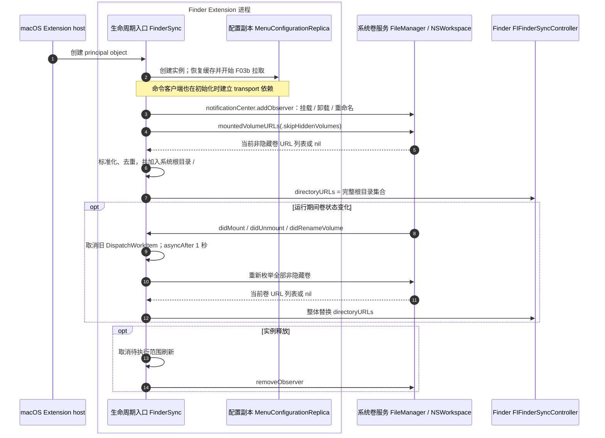
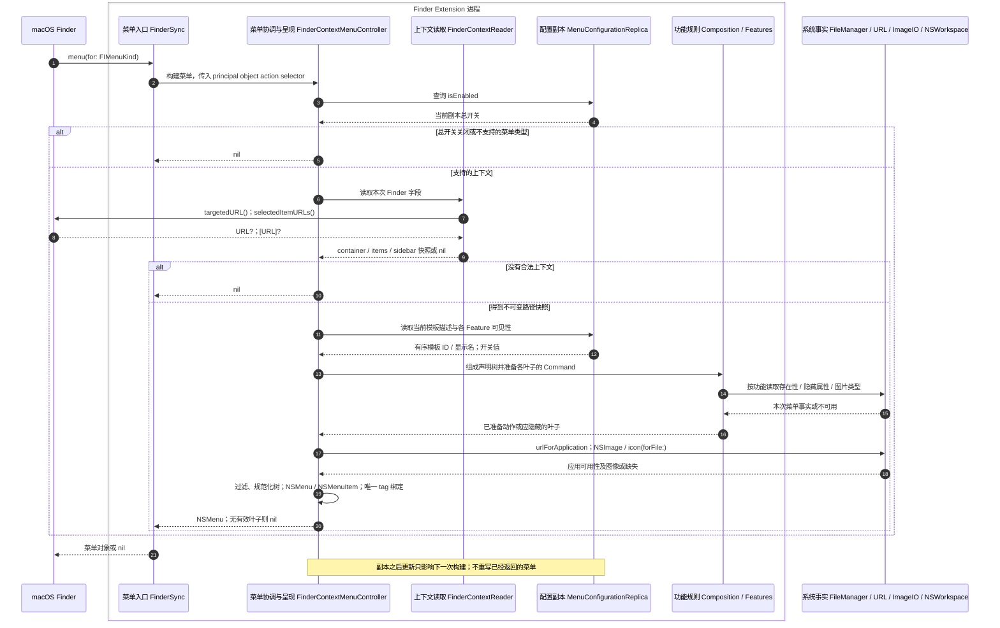
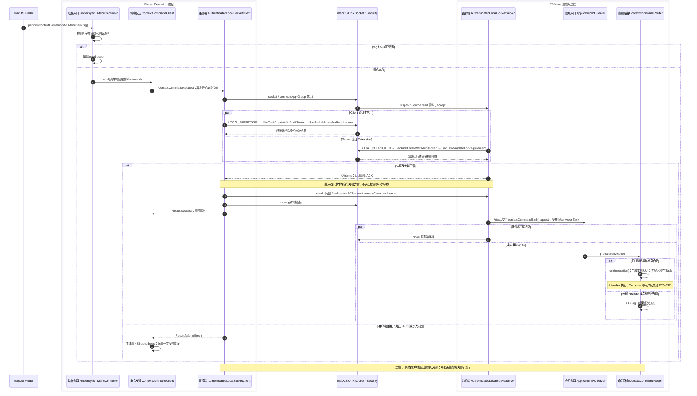
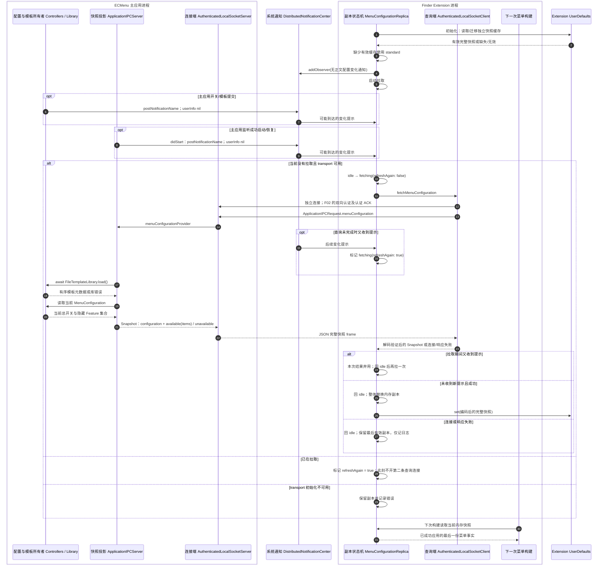

# F01–F03b · Finder 菜单、命令投递与配置副本

本页描述当前源码的职责与执行顺序，属于[当前功能地图](Main.md)。本轮只审阅源码和已有测试，未运行应用、构建或测试。图中 `box` 区分进程；实线是请求、调用或事件，虚线是返回值。平台保证、项目观察与 API 输出含义见[API 证据](../APIContracts.md)。

Finder Extension 负责把一次 Finder 交互变成菜单和类型化命令；主应用拥有配置、模板和业务执行。菜单读取 Extension 的本地副本，命令通过独立的已认证连接单向发送，配置则通过另一条独立连接查询完整快照。这三个生命周期互不等同。

## F01a · Extension 加载与管理范围

| 模块 | 预期输入 | 实际外部 API | 预期输出 / 失败 |
|---|---|---|---|
| 生命周期入口 `FinderSync` | 系统创建实例、卷变化通知、实例释放 | `FIFinderSync.init`；`NSWorkspace.shared.notificationCenter.addObserver/removeObserver`；三类卷通知；`DispatchQueue.main.asyncAfter` | 保留当前实例的副本、客户端、菜单 Controller 和至多一个待刷新任务；连续通知合并为最后一次延迟刷新 |
| 卷事实读取 | 启动或延迟刷新 | `FileManager.mountedVolumeURLs(includingResourceValuesForKeys:options:)`，选项 `.skipHiddenVolumes` | `[URL]?`；当前实现将 nil 按空卷列表处理，不报告用户错误 |
| 管理根规则 `registeredDirectoryURLs` | 枚举得到的 URL 列表 | 无外部 I/O；Foundation URL 值标准化 | 仅保留 file URL，去重后至少含 `/` 的 `Set<URL>` |
| Finder 登记适配 | 完整根集合 | `FIFinderSyncController.default().directoryURLs` setter；OSLog | 设置观察范围，setter 无成功回执；不授予读写权限，也不证明 Extension 启用/正在运行 |

范围刷新延迟是项目策略，不是系统完成挂载的确认机制。仅登记 `/` 与外置卷的关系、SDK 范围契约及证据版本见[管理位置](../../../Technical/Platform/Finder/ManagedLocations.md)。每个 principal object 持有自己的运行状态；不能把系统可能创建的多个实例理解成一个全局菜单会话。

## F01b · Finder 右键到可执行菜单

图将功能求值合并展示。实际对每个叶子依次检查 Feature 开关、外部应用依赖，再调用 Feature 准备命令；未通过前置条件的叶子不会继续读取自己的文件事实。图标在保留叶子渲染时读取。

| 模块 | 预期输入 | 实际外部 API | 预期输出 / 失败 |
|---|---|---|---|
| 菜单入口 `FinderSync` | `FIMenuKind`、随后回传的 `NSMenuItem` | `FIFinderSync.menu(for:)`；principal object 的 Objective-C action | 构建阶段返回 `NSMenu?`；点击转入 F02 |
| 上下文适配 `FinderContextReader` | 本次菜单类型 | `FIFinderSyncController.targetedURL()`、`selectedItemURLs()` | 一次读取后解释为 `FinderContextSnapshot?`；缺失/无效 file URL、空 items 选择返回 nil；toolbar 不支持 |
| 上下文与路径规则 | 原始目标 URL、选择数组、菜单类型 | 无外部 I/O；`URL.standardizedFileURL` 是路径值转换 | container 取选择第一项，空时取 target；items 保留整个非空选择；sidebar 取 target。`AbsoluteFilePath` 只验证绝对文件路径，不保证存在或授权 |
| 配置查询与产品组合 `Replica` / `Composition` | 当前配置副本、有序模板描述、客户端依赖 | 此处无外部 I/O；读取已在内存的状态 | 七个 Feature 的固定声明顺序与可见性；模板状态不可用或有效空清单均不贡献新建父菜单 |
| 单目标事实 `FinderTargetKind` / `EvaluationContext` | 快照中的唯一绝对路径 | `FileManager.fileExists(atPath:isDirectory:)` | `.directory`、`.other` 或 `.unavailable`；多选不读取。新建、VS Code、iTerm2 在同次构建复用事实；不预检写权限 |
| 新建与打开应用规则 | 单目标事实、菜单种类、模板 ID / 固定应用要求 | 规则无外部 I/O；使用上行提供的事实 | 新建把单个普通文件归一为父目录；目录用自身；背景/侧边栏需目录。VS Code 接受存在的单目标，iTerm2 还要求目录；不满足则返回 nil |
| 复制路径规则 `CopyPathFeature` | 快照的非空有序绝对路径 | 无外部 I/O | `CopyPathCommand(paths:)`；菜单阶段不查询对象存在性 |
| 可见性事实与规则 `VisibilitySelectionMenuFacts` | items 选择、普通名称 | `URL.resourceValues(forKeys: [.isHiddenKey])` | 含可见普通对象时准备隐藏命令，含隐藏普通对象时准备显示命令；点号名称排除，读取失败或无值按未知处理。两个 Feature 复用一次事实，已知两类状态后可停止读取 |
| 图片可用性 `CompressImagesFeature` | items 选择 | `URL.resourceValues` 的 `.isDirectoryKey` / `.contentTypeKey`；`CGImageSourceCopyTypeIdentifiers()`；`UTType` / `conforms(to:)` | 全部为非目录、非 PDF、匹配 ImageIO 输入类型才准备命令；未知类型或读取失败隐藏。支持类型进程内只读取一次；此处不解码图片内容 |
| 应用依赖查询 | `ContextCommandApplicationRequirement.bundleIdentifier` | `NSWorkspace.urlForApplication(withBundleIdentifier:)` | `URL?`；nil 隐藏依赖该应用的叶子；执行端仍须处理应用之后消失 |
| 菜单树规则 `ContextMenuNodeResolver` | 过滤后的递归值树 | 无外部 I/O | 保留顺序，移除空子菜单以及每层首尾/连续分隔线 |
| AppKit 呈现与动作绑定 `FinderContextMenuController` | 准备好的叶子、子菜单、图标声明、action selector | `NSMenu`、`NSMenuItem`；`autoenablesItems = false`；`String(localized:)`；`NSFont.menuFont`；`NSImage(systemSymbolName:)` / symbol configuration；`NSWorkspace.icon(forFile:)`；共享 `AppKitIconCanvasRenderer` | 层层关闭自动启用，绑定唯一 tag。SF Symbol 失败可无图标，应用图标读取/适配失败使用占位符；这些呈现失败不改变已准备命令 |

### 菜单打开期间保留什么

`FinderContextSnapshot` 和每个 Command 在构建时固定。动作绑定保留目标路径、模板 ID 或选择集合；模板叶子的显示名与顺序也固定在这次菜单中。执行时不重新读取 Finder 的“当前选择”，也不再次检查最新显示开关。

文件存在性、目录种类、隐藏属性等仅是构建期事实，不是操作许可；短生命周期 `FinderContextMenuEvaluationContext` 在此次同步求值后释放，业务执行仍可能遇到目标变化。模板内容和默认文件名不在菜单中冻结，主应用按执行时的库状态读取，详见[F07](NewFile.md)。

动作表由 Controller 持有。点击会消费对应 tag 一次；下一次构建不会覆盖旧 tag，但实现按 `max(256, 本次菜单叶子数)` 保留最近动作，后续大量菜单可以淘汰旧项。失效/重复 tag 点击仅播放提示音，不能表述为所有历史菜单动作无限期有效。图标缓存也归 Controller，但以符号名或应用路径为键跨菜单保留；同一路径的应用图标变化不会主动清空缓存。

Finder 字段组合是已记录的项目映射，不能当作 Apple 对 container 选择字段的保证；action 入口与自动启用规则见[菜单语义](../../../Technical/Platform/Finder/ContextMenus.md)，图像适配见[菜单图标](../../../Technical/Platform/Finder/MenuIcons.md)。

## F02 · 点击命令、单向投递与主应用分派

图中的错误支路简化了两端并发：Server 认证、framing 或解码失败只记录并关闭；Client 能否察觉，取决于失败发生在本次写入完成前还是后。**完整写出、主应用解码并登记任务、Handler 产生结果是三个不同完成点；协议只把第一个报告给 Client。** 当前没有名为 `accepted` 的业务回执，也没有业务结果回传。

| 模块 | 预期输入 | 实际外部 API | 预期输出 / 失败 |
|---|---|---|---|
| 动作路由 `MenuController` | Finder 回传的 enabled leaf 与唯一 tag | AppKit action；失败 `NSSound.beep()` | 消费一次 `PreparedContextMenuAction`；禁用/无 action 项直接返回，无绑定项提示音；不重新读取 Finder |
| 信封与类型契约 | 具体 `ContextCommandPayload` | `JSONEncoder` / `JSONDecoder`；无外部 I/O | Feature ID + 已编码负载；绝对路径/非空集合在解码时验证。产品内可编码命令的编码被视为实现不变量；不伪造可恢复状态 |
| 命令发送 `ContextCommandClient` | 命令信封 | transport 异步 completion；失败用 `Task @MainActor`、OSLog、`NSSound.beep` | 每次调用一次 send；失败不自动重试，也不启动主应用。transport 初始化失败后该实例每次点击直接报告失败 |
| 端点定位 `ApplicationIPC` | 构建注入的 App Group / 双方 signing ID | `Bundle.object(forInfoDictionaryKey:)`；`FileManager.containerURL(forSecurityApplicationGroupIdentifier:)` | 容器内 socket URL；容器不可用是运行失败，缺失/未展开构建身份是 precondition 失败；App Group 不共享双方偏好 |
| 连接与 framing `LocalSocketIO` / Client | socket 路径、请求 Data、连接期限 | `socket(AF_UNIX, SOCK_STREAM)`、`setsockopt(SO_NOSIGPIPE)`、`fcntl(O_NONBLOCK)`、`connect`、`getsockopt(SO_ERROR)`；`poll`、`send/recv(MSG_DONTWAIT)`、`close`；`DispatchTime` | 每个操作独立 descriptor；完整 frame 或 POSIX/截断/关闭/期限/长度错误。短读短写继续，`EINTR/EAGAIN` 重试但不重置期限 |
| 对端认证 `LocalSocketPeerValidator` | connected descriptor、预期 signing ID | `getsockopt(SOL_LOCAL, LOCAL_PEERTOKEN)`；`SecTaskCreateWithAuditToken`；LightweightCodeRequirements `ProcessCodeRequirement.allOf`、`SecTaskValidateForRequirement` | 双方分别验证精确 ID、与本进程相同 Team、development 签名类别和 signed/dynamicallyValid 标志；任一失败终止，不进入业务解码/发送 |
| 监听所有权 `LocalSocketIO` / Server | 容器端点、创建/停止/恢复监听 | `FileManager.createDirectory`；`open` / `lockf` 端点锁；`bind` / `chmod` / `listen`；`lstat` / `unlink`；`DispatchSource.makeReadSource` / cancel handler；`accept` | 返回监听资源或失败。只有确认 stale 的 socket 才删除；退出按 device/inode 清理自己端点；资源短缺延迟恢复，其他致命错误清理后上报 |
| 服务端请求解码 | 已认证连接、完整 JSON frame | `JSONDecoder`、OSLog；后台 Dispatch queue | `ApplicationIPCRequest.contextCommand` 转发一次；错误仅关闭连接，无应用层错误响应 |
| 应用分派与任务所有权 `ApplicationIPCServer` / Router | command envelope | `Task @MainActor`、`JSONDecoder`、本地 `UUID`、OSLog；此阶段无文件 I/O | `prepare` 恢复类型化 invocation，`run` 登记任务直到 execute/present 结束；未知 ID/坏负载只记录；本地 ID 不进入 IPC |

每条连接的默认传输预算为五秒，从各自队列开始处理连接时起算，不包含此前排队；也不是对 Security 等同步调用可抢占的业务超时保证。配置查询还将响应读取纳入同一预算。已登记的业务任务独立执行，不因 Client 关闭而取消；命令不持久化，无自动重试、去重或状态查询。

监听端 `accept` 遇 `EINTR/ECONNABORTED` 继续，`EAGAIN` 结束本轮；`EMFILE/ENFILE/ENOBUFS/ENOMEM` 暂停 source 并在 100 毫秒后恢复。致命失败经取消回调关闭 descriptor、清理自身端点后，将 `ApplicationIPCServer.state` 置为 failed。用户普通打开/重新打开/显示设置时可以恢复监听，见[F13](LifecycleAndSettings.md)。恢复入口只恢复监听，不重放状态未知命令。完整 wire、身份边界及历史平台实测见[IPC](../../../Technical/Runtime/IPC.md)。

## F03b · 拉取完整菜单快照与副本更新

F03 的配置提交与模板变更来源见[配置和模板](ConfigurationAndTemplates.md)。这里从 Extension 启动或收到提示开始，直到替换自己的只读副本。

| 模块 | 预期输入 | 实际外部 API | 预期输出 / 失败 |
|---|---|---|---|
| 副本启动与缓存 `MenuConfigurationReplica` | Extension 自身偏好、可选 transport | `UserDefaults.data/object/set/removeObject`；`JSONEncoder` / `JSONDecoder` | 恢复最后有效完整快照；无有效值用总开关/Feature 默认开启且模板 unavailable。旧副本迁移独立于主应用存储，格式见[菜单配置](../../../Technical/Runtime/MenuConfiguration.md) |
| 变化提示 `MenuConfigurationChannel` | 主应用已更新开关、模板库 didChange 或 IPC didStart | `DistributedNotificationCenter.postNotificationName(..., userInfo: nil, deliverImmediately: true)`；Extension `addObserver/removeObserver` | 无正文提示与可能的回调；无数据权限、无到达回执。任意进程伪造提示至多促使认证查询 |
| 单飞协调 `MenuConfigurationReplica` | 启动/提示、当前刷新状态、异步结果 | 传输通过 `MenuConfigurationRequesting`；回调使用 `Task @MainActor`；协调规则本身无外部 I/O | idle / fetching(refreshAgain)；并发提示只标记重拉，本次结果即使成功也弃用；成功替换，失败保留副本 |
| 查询传输 Client / Server | `.menuConfiguration` 与响应 Data | F02 的 socket、Security、JSON API；Server 使用 `DispatchSemaphore` 等待 provider 并受连接期限约束 | 解码后的 `MenuConfigurationSnapshot` 或失败；每次查询独立连接，不与命令共享响应或请求 ID |
| 主应用快照投影 `ApplicationIPCServer.menuSnapshot` | `FileTemplateLibrary` 与当前配置读取闭包 | 此层调用 actor 的 `load()`；本身无文件 API；库可能触发索引/文件 I/O，见[F04](ConfigurationAndTemplates.md) | 先等待库元数据，再读取最新开关，生成 `{configuration, fileTemplateState}`。模板读取失败仍返回有效 unavailable 快照，其他命令开关继续同步 |
| 快照领域验证与副本应用 | 响应 JSON / 合法快照 | `JSONDecoder`；应用后 `UserDefaults.set`；OSLog | schema、必需字段、模板 ID 唯一性不合法则拒绝整个响应；available 空清单与 unavailable 均可缓存但语义不同。`set` 更新本地偏好，不是同步落盘确认 |
| 菜单消费 | 已应用的内存副本 | 无外部 I/O | 下一次菜单构建读取；不会就地刷新旧菜单，也不撤销旧动作绑定或主应用任务 |

### 更新保证与时间边界

主应用快照不是两个独立所有者的跨 actor 事务：实现先 `await` 模板库，再在 MainActor 读取当前开关，二者没有公共修订号。拉取期间收到新提示会淘汰本次结果并重拉，可以避开已知变化下的旧响应；提示本身不携带版本，不能证明快照已涵盖全部修改。

源码的外部刷新入口只有 **Extension 初始化** 和 **收到分布式提示**；拉取期间的标记会追加一次查询。没有菜单打开时查询、周期刷新、超时自动重试或命令失败后刷新。主应用成功启动/恢复监听会再发一次提示，但分布式通知可以丢失或无限期延迟，所以不能保证副本在有限时间内必定收敛。查询失败后等待后续提示或新的 Extension 实例；transport 初始化失败后该实例不会自动重新创建 transport。

收到一个模板 unavailable 快照并非传输失败：它会替换并缓存原快照，隐藏新建菜单，其他开关继续生效。连接/认证/响应解码失败则保留整份旧快照。是否需要新增可恢复入口、修订号或菜单打开时的非阻塞刷新，是[目标架构](../Target/Main.md)要明确的行为选择，不能把它们画入当前流程。

## 源码证据与已有验证

以下链接定位职责文件，括号内为本轮阅读时的关键符号和行号；行号随重构变化，以符号为准。

| 证据范围 | 源码入口 |
|---|---|
| principal object、范围刷新、菜单/action 入口 | [FinderSync.swift](../../../../ECMenuFinderExtension/App/FinderSync.swift)（`init` 39、`refreshDirectoryURLs` 56、`registeredDirectoryURLs` 80、`menu` 137） |
| 上下文映射、瞬时事实、准备动作、Feature 组合模型 | [ContextMenuFeature.swift](../../../../ECMenuFinderExtension/ContextMenu/ContextMenuFeature.swift)（`FinderContextReader` 40、`EvaluationContext` 104、`PreparedContextMenuAction` 308、`AnyContextMenuAction` 331）；[Composition](../../../../ECMenuFinderExtension/ContextMenu/ContextMenuComposition.swift)；[Layout](../../../../ECMenuFinderExtension/ContextMenu/ContextMenuLayout.swift) |
| AppKit 呈现、唯一 tag、保留预算 | [FinderContextMenuController.swift](../../../../ECMenuFinderExtension/ContextMenu/FinderContextMenuController.swift)（`menu` 129/150、`perform` 311、`discardOldActions` 345） |
| 功能事实与负载准备 | [FinderTargetFacts](../../../../ECMenuFinderExtension/ContextMenu/FinderTargetFacts.swift)；[新建](../../../../ECMenuFinderExtension/ContextMenu/Features/NewFile/CreateNewFileFeature.swift)；[复制路径](../../../../ECMenuFinderExtension/ContextMenu/Features/CopyPath/CopyPathFeature.swift)；[可见性](../../../../ECMenuFinderExtension/ContextMenu/Features/Visibility/VisibilityFeatures.swift)；[图片](../../../../ECMenuFinderExtension/ContextMenu/Features/ImageCompression/CompressImagesFeature.swift)；[外部应用](../../../../ECMenuFinderExtension/ContextMenu/Features/OpenInApplication/OpenInApplicationFeatures.swift) |
| 发送与副本状态机 | [ContextCommandClient.swift](../../../../ECMenuFinderExtension/IPC/ContextCommandClient.swift)（`send` 44）；[MenuConfigurationReplica.swift](../../../../ECMenuFinderExtension/MenuConfiguration/MenuConfigurationReplica.swift)（`init` 44、`refreshConfiguration` 102、`applyRefreshResult` 134） |
| 信封与跨端路径 | [ContextCommandTransport](../../../../ECMenuShared/ContextCommands/ContextCommandTransport.swift)；[FinderContext](../../../../ECMenuShared/ContextCommands/FinderContext.swift)；[ContextCommandIdentity](../../../../ECMenuShared/ContextCommands/ContextCommandIdentity.swift) |
| transport、认证、监听和系统 I/O | [AuthenticatedLocalSocket.swift](../../../../ECMenuShared/IPC/AuthenticatedLocalSocket.swift)（`LocalSocketPeerValidator` 75、Client 152、Server 252、`handleConnection` 413、`LocalSocketIO` 496）；[ApplicationIPCProtocol](../../../../ECMenuShared/IPC/ApplicationIPCProtocol.swift) |
| 主应用分派和查询投影 | [ApplicationIPCServer.swift](../../../../ECMenu/IPC/ApplicationIPCServer.swift)（生产装配 40、`menuSnapshot` 73、`startIfNeeded` 99）；[ContextCommandExecution.swift](../../../../ECMenu/ContextCommands/ContextCommandExecution.swift)（`prepare` 212、`run` 233） |
| 快照与提示 | [MenuConfigurationSnapshot](../../../../ECMenuShared/MenuConfiguration/MenuConfigurationSnapshot.swift)；[MenuConfigurationChannel](../../../../ECMenuShared/MenuConfiguration/MenuConfiguration.swift)（154）；[主应用配置所有者](../../../../ECMenu/MenuConfiguration/MenuConfigurationController.swift) |

已有测试定义覆盖：

- [范围登记](../../../../Tests/ECMenuFinderExtensionTests/App/FinderDirectoryRegistrationTests.swift)：根目录回退、挂载卷标准化与去重。
- [菜单组合](../../../../Tests/ECMenuFinderExtensionTests/ContextMenu/ContextMenuCompositionTests.swift)、[Feature](../../../../Tests/ECMenuFinderExtensionTests/ContextMenu/ContextCommandFeatureTests.swift)、[布局](../../../../Tests/ECMenuFinderExtensionTests/ContextMenu/ContextMenuLayoutTests.swift)：字段映射、开关/依赖过滤、共享事实、旧 action 保留原路径、模板变化影响下次构建、大模板菜单保留所有当前叶子、层级与分隔线规则。
- [Client](../../../../Tests/ECMenuFinderExtensionTests/IPC/ContextCommandClientTests.swift)：单次发送、失败只提示一次且不重试。
- [Replica](../../../../Tests/ECMenuFinderExtensionTests/MenuConfiguration/MenuConfigurationReplicaTests.swift)：缓存迁移、失败保留、后续刷新恢复、并发提示合并并弃用旧结果。
- [transport 集成定义](../../../../Tests/ECMenuTests/IPC/ContextCommandTransportTests.swift)：类型与快照 wire、运行态身份拒绝/接受、单向和并发投递、错误 ACK、截断 frame、静默对端期限、provider 期限、监听资源失败清理与恢复。

这些测试定义不能代替真实 Finder 的菜单生命周期、分布式通知丢失后的恢复、外置卷变化和两个真实签名进程之间的验收。本轮没有重跑它们；已有平台观察仍只在对应技术文档记录的版本与证据范围内成立。
