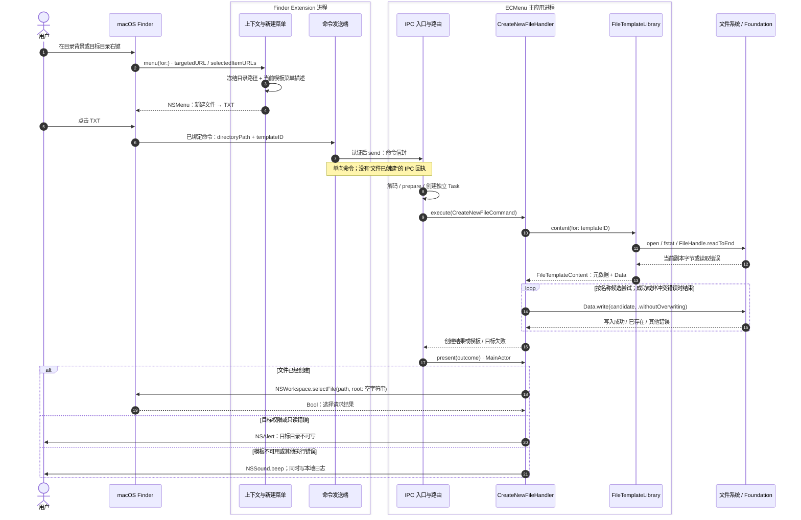

# F07 · 从 Finder 右键到新建 TXT

当前实现的完整用户链路。TXT 是模板库首次初始化提供的一个普通模板；其他模板走同一条执行路径。[菜单/IPC](MenuAndIPC.md)展开前半段公共机制，[模板管理](ConfigurationAndTemplates.md)说明内容来源。

## 执行时序

图中库读取失败时直接产生模板失败，不进入写入循环；每次写入只有“目标已存在”会继续下一个候选。主应用按执行时索引读取名称与字节，Extension 不发送文件内容、模板内部路径或默认输出名。

菜单将单个文件的目标归一为父目录，单个目录使用自身；背景与侧边栏要求目标是目录，多选不贡献新建菜单。

## 模块输入、输出与外部 API

| 模块 | 预期输入 | 实际外部 API | 预期输出 / 失败 |
|---|---|---|---|
| Finder 上下文适配 | `FIMenuKind`、系统提供的目标/选择 | `FIFinderSyncController.targetedURL()`、`selectedItemURLs()`；目标事实通过 `FileManager.fileExists(atPath:isDirectory:)` | 标准化目录上下文；无法确定可用目录则该功能不贡献菜单 |
| 新建菜单规则 | 目录上下文、可见性、`FileTemplateMenuState` | 无外部 I/O；读入已取得的事实 | 按模板顺序生成显示名和绑定的 `{directoryPath, templateID}`；清单为空/不可用时没有父菜单 |
| 菜单呈现 | 语义动作树、名称和图标声明 | AppKit `NSMenu`、`NSMenuItem` target/action；本地化与图标边界见 F01 | Finder 可显示并点击的菜单对象；点击保留原动作绑定 |
| 命令传输 | `CreateNewFileCommand` | `JSONEncoder`、App Group `containerURL`、Darwin socket 与 Security；[完整 API 表](MenuAndIPC.md) | 一次写出的请求或投递错误；不返回创建结果，失败不重放 |
| 主应用路由 | 已认证的命令信封 | `JSONDecoder`、Swift `Task`；无文件 I/O | 类型化 Invocation；无法恢复类型时仅记录并丢弃 |
| 模板库 | 稳定 `FileTemplateID` | 首次索引加载为 `Data(contentsOf:)` / JSON；内容为 `open(O_RDONLY \| O_NOFOLLOW \| O_NONBLOCK)`、`fstat`、`FileHandle.readToEnd()`、`close()` | 元数据与完整内容 Data；readToEnd 的 nil 按空 Data 使用；不存在、非普通文件、读取失败等形成模板失败；defer 中关闭错误被忽略 |
| 候选命名 | 目录 URL、当前 `defaultFileName` | 无外部 I/O | 首选名、`_copy`、带递增序号的候选 URL；不先查询哪个名字“可用” |
| 目标写入 | 已取得的 Data 和一个候选 URL | `Data.write(to:options: .withoutOverwriting)` | 成功创建 URL；`CocoaError.fileWriteFileExists` 继续候选，其余错误立即结束 |
| 完成反馈 | `CreateNewFileOutcome`、本地请求 ID | `NSWorkspace.selectFile(_:inFileViewerRootedAtPath:)`、`NSAlert.runModal()`、`NSSound.beep()`、OSLog | 文件成功后请求 Finder 选择；选择失败只记日志，已创建文件保留；执行失败按类别反馈 |

Handler 另用 `DispatchTime.now().uptimeNanoseconds` 记录诊断耗时；这不影响创建决策。

Foundation 的 `.withoutOverwriting` 保证目标已存在时报告错误；本地 macOS 26.5 SDK 明确它不能与 `.atomic` 组合。这里的完成点是一次文件写入成功，不是跨进程事务或任意崩溃场景的完整性保证。[官方写入选项](https://developer.apple.com/documentation/foundation/nsdata/writingoptions)、[项目证据边界](../../../Technical/Features/NewFile.md#不覆盖创建的证据边界)。

## 数据与时序边界

- **菜单打开时**固定模板 ID 和目标目录。打开之后更改显示开关，不会撤销已经发出的命令；旧菜单不能证明执行端仍可读写目标。
- **库提供内容时**固定本次使用的模板元数据和字节；之后更改模板名称、内容或删除记录，不改变已经取得的这份值。
- 菜单打开后、库读取前删除模板会失败；更名或更换内容在读取前提交，则本次使用新的已提交版本。同名模板仍由不同 ID 区分。
- 外部编辑器可保存内部副本；下一次读取使用当时字节。与外部写入重叠的读取没有额外事务保证。
- 文件创建与 Finder 选择是两个完成点。公开 API 可以激活 Finder 或打开窗口，不能承诺写回右键来源窗口，也不进入原地重命名。[Finder 结果选择](../../../Technical/Platform/Finder/ResultSelection.md)。

## 源码与已有验证

| 责任 | 源码入口 | 现有测试定义 |
|---|---|---|
| 新建菜单与负载 | [CreateNewFileFeature](../../../../ECMenuFinderExtension/ContextMenu/Features/NewFile/CreateNewFileFeature.swift)、[CreateNewFileCommand](../../../../ECMenuShared/ContextCommands/Features/NewFile/CreateNewFileCommand.swift) | [Feature tests](../../../../Tests/ECMenuFinderExtensionTests/ContextMenu/ContextCommandFeatureTests.swift) |
| 模板快照读取 | [FileTemplateLibrary.content](../../../../ECMenu/FileTemplates/FileTemplateLibrary.swift) | [Library tests](../../../../Tests/ECMenuTests/FileTemplates/FileTemplateLibraryTests.swift)、[Replacement tests](../../../../Tests/ECMenuTests/FileTemplates/FileTemplateReplacementTests.swift) |
| 排他创建、结果反馈 | [CreateNewFileHandler](../../../../ECMenu/ContextCommands/Features/NewFile/CreateNewFileHandler.swift)、[FileNaming](../../../../ECMenu/ContextCommands/FileNaming.swift) | [NewFileTests](../../../../Tests/ECMenuTests/ContextCommands/Features/NewFile/NewFileTests.swift)、[FileNamingTests](../../../../Tests/ECMenuTests/ContextCommands/FileNamingTests.swift) |

测试定义涵盖空文件/二进制模板、同名模板身份、失效模板、命名冲突和同进程并发不覆盖；不能据此推定所有文件系统和跨进程竞争都已验收。既有真实 Finder TXT 点击及结果选择的观察见[新建文件技术文档](../../../Technical/Features/NewFile.md)，本轮未重复运行。
