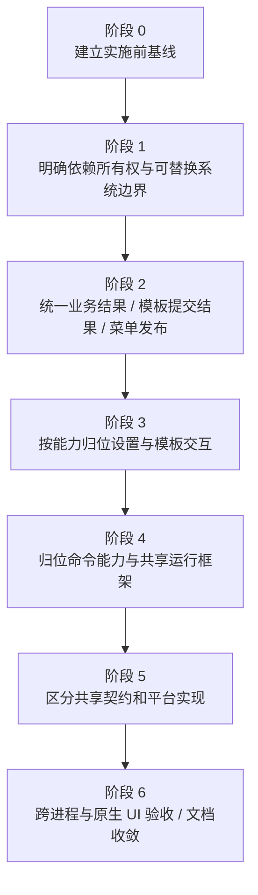

# 分阶段迁移与验证

本文件是待实施计划；本轮仅完成源码调查与文档。每阶段先保持一条可运行、可验证的完整功能链，完成后再进入下一阶段。

## 实施顺序

| 阶段 | 具体工作 | 完成标准 |
|---|---|---|
| 0 · 基线 | 在开始改代码的版本运行完整测试；记录当前 Debug 签名/登记/运行路径及代表性菜单和设置行为 | 基线失败与重构引入问题可以区分；现有数据样本使用仓库内隔离 fixture |
| 1 · 所有权 | 应用 Composition 显式构造库、配置、Router、进度、IPC 和窗口；注入 Workspace/Pasteboard/通知等实际副作用边界 | 无第二份索引、配置或进度源；启动/登录/关闭/重开测试保持，生产装配使用唯一实例 |
| 2 · 结果与发布 | CopyPath 返回真实写入结果；模板结果区分提交前失败和提交后清理问题；快照提供与变更提示从 IPC/UI 路径中归位 | 故障注入能判断哪些变化已生效；提交、初始化/迁移、管理页成功加载/重试均有明确发布入口，普通缓存查询不循环发信号；wire 和存储字节不变 |
| 3 · 设置与模板 | 模板完整模型回主应用，页面/名称控件/会话回能力目录；Settings 保留外壳；菜单配置和系统设置页归各能力 | 名称焦点、一次提交期间目标点击、切页前保存、慢操作反馈、失败保留输入和控件身份全部保留 |
| 4 · 命令与反馈 | 归位五类能力；分离复杂文件中的用例/系统适配/反馈；压缩 Prompt 与 Store 分离；进度执行契约与窗口分离 | 七个注册项顺序和 ID 对齐；Copy/Hide/Show/Open/NewFile/Image 的既有输出与错误语义不变 |
| 5 · Shared/IPC | Contracts/Platform 分区；按认证、framing、连接与监听拆开实现；更新 Xcode 同步组例外及工具引用 | 仍先认证再接受业务数据；deadline/连接关闭/监听恢复测试保持；产品目标、Preview 和 Sender 均编译正确 |
| 6 · 验收与收敛 | 运行全套检查、签名集成和必要真实 UI 验收；更新 Technical 当前职责与导航 | 只保留实施后的事实文档；本提案已实施部分删除/归档为相应技术决策，TODO 仅留未完成工作 |

阶段内可以小步移动文件，但不要把全仓移动、业务结果重写、存储格式升级和新平台 API 一次混在同一批改动。代码目录调整不要求添加新 target；是否建立 Swift module 在真实依赖稳定后再决定。

## 验证矩阵

“已有”指仓库中存在测试定义或既有验收入口；不是本轮运行结果。只对改变的真实边界补有价值的测试，不为文件搬迁或简单包装新增镜像测试。

| 流程 / 边界 | 可复用验证 | 实施时需补足或重新验收 |
|---|---|---|
| F01 菜单与 Feature | `ContextCommandFeatureTests`、`ContextMenuLayoutTests`、`ContextMenuCompositionTests`、`FinderDirectoryRegistrationTests` | 真实 Finder 背景/文件/目录/多选/侧边栏；当前产物登记与运行；外置卷按既有人工边界 |
| F02 认证与投递 | `ContextCommandTransportTests`、`ContextCommandClientTests`、`ContextCommandExecutionTests` | 签名集成 Sender 单次命令效果；坏类型在业务启动前拒绝，写出成功不被解释为完成 |
| F03 配置与副本 | `MenuConfigurationTests`、`MenuConfigurationReplicaTests` | 验证全部发布入口；模板不可用时其他开关继续同步；无索引修改的成功重试仍通知并可恢复副本；记录无通知到达保证 |
| F04/F06 模板库与操作 | `FileTemplateLibraryTests`、`FileTemplateMigrationTests`、`FileTemplateReplacementTests`、`FileTemplateControllerTests` | 新结果类型下：首次初始化提交失败后的重试、索引提交失败、新副本清理失败、删除提交后清理失败、更换后旧 URL 保存的隔离 |
| F05 名称与页面 | `FileTemplateNameDraftTests`、`FileTemplateNameEditingSessionTests`、`FileTemplatesPageTests`、`FileTemplateNameUpdateTests` | 原生隐藏窗口测试和可交互 Preview；快/慢保存、失败、连续目标点击、Esc、切页、窗口关闭、再次打开 |
| F07 新建文件 | `NewFileTests`、`FileNamingTests` | 真实 TXT 菜单点击与 Finder 结果选择；保留同进程并发不覆盖的证据限制 |
| F08 复制路径 | `CopyPathTests` 的纯计划和真实链接 fixture | 通过可替换 PasteboardWriter 验证实际写入成功/失败进入 Outcome；一次人工真实剪贴板检查 |
| F09 可见性 | `VisibilityTests`、`CommandAlertContentTests` | 属性适配失败注入与真实权限/只读边界；链接自身、目录非递归和批量部分成功 |
| F10 外部应用 | `OpenInApplicationTests`、固定失败文案测试 | 注入 Workspace 回调错误；真实 VS Code / iTerm2 打开及原始 URL 语义 |
| F11 图片处理与参数 | `ImageCompressionTests`、`ImageCompressionBoundaryTests`、`ImageCompressionSettingsWindowTests` | 拆出会话后的确认/取消恰好一次、多窗口独立、读取权限/写入/日期失败；图像内容/方向/透明/metadata 现有样本回归 |
| F12 任务与进度 | `ContextCommandExecutionTests`、独立进度 Preview | 用户取消与 Task.cancel 分离；隐藏窗口不取消；真实非激活、焦点/Space、模态警告交互 |
| F13–F15 应用与设置 | 生命周期、LoginItem、StatusPageSystemState、本地化与图标测试 | 普通打开/登录启动、Dock、重开恢复监听；两个 Bundle 中英文；系统设置入口 |
| D01–D03 开发工具 | `Tests/DevelopmentScripts`、窗口/焦点测试、Preview 注册、捕获 `--check` | 源码路径、membershipExceptions、签名身份、README/图标输入；不要因工具能编译而推定真实 Finder 验收通过 |

具体测试文件链接从[当前功能索引](Current/Main.md)进入，避免在这里重复维护全套文件清单。

## 执行检查的约束

1. 完整测试使用 `./scripts/test.sh`。它包含 XCTest、开发脚本/窗口保护、Preview 构建与注册检查、捕获工具静态检查等。
2. 跨进程集成使用 `./scripts/test-integration.sh`，与完整测试分开、顺序执行；它验证配置查询及一次真实隐藏效果，不驱动 Finder 菜单。
3. Extension 变化后使用 `./scripts/run-debug.sh --refresh-finder`，再次核对登记和运行进程均为 `.derivedData/Build/Products/` 当前 Debug 产物。
4. 原生模板交互和业务窗口复用独立 Preview；真实菜单、语言与结果选择按对应技术文档验收。
5. 所有运行产物留在仓库规定目录；scratch 遵循单次运行命名。涉及 Finder 的脚本保留窗口/焦点保护，不并发修改共享环境。

## 需要单独决定的扩展

以下不作为完成结构重构的前置条件，也不在目录迁移中隐式加入：配置有限时间收敛、命令回执/持久队列、全局限流、撤销历史、全新存储 schema、改用 XPC、更改错误窗口交互。若后续选择实施，应有独立产品边界、API 论证与验收。

## 本轮文档验证

本轮对流程图与源码进行交叉审阅。32 张 Mermaid 图已在浏览器中完成渲染；17 份新增或更新文档的 260 个本地链接及章节锚点、代码块闭合和行尾空白检查通过。修改范围仅为文档。没有运行构建、XCTest、IPC 集成、Finder 刷新或登录验收，因此没有新增这些项目的通过记录。
