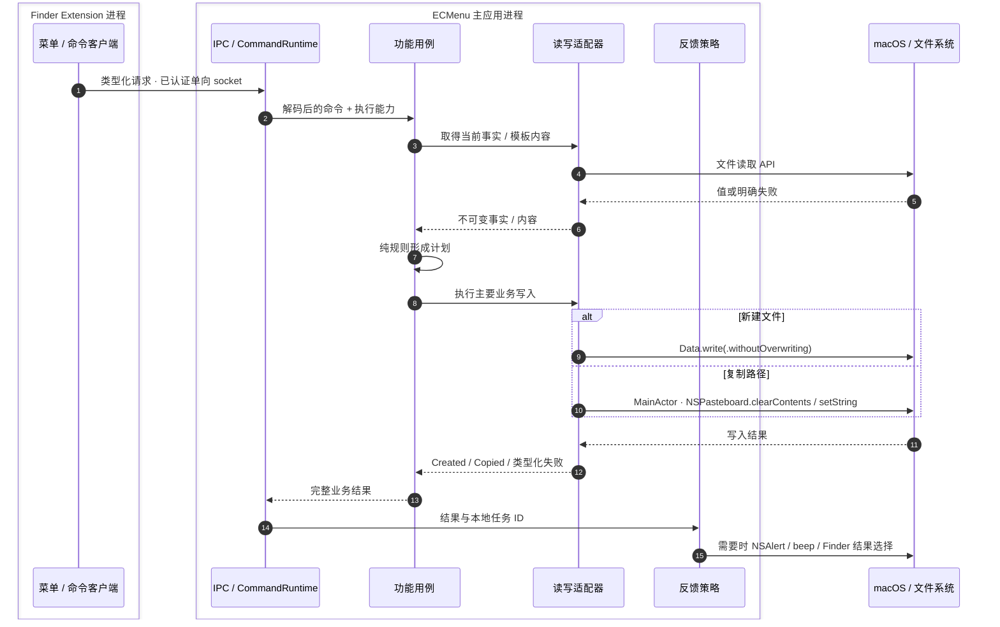
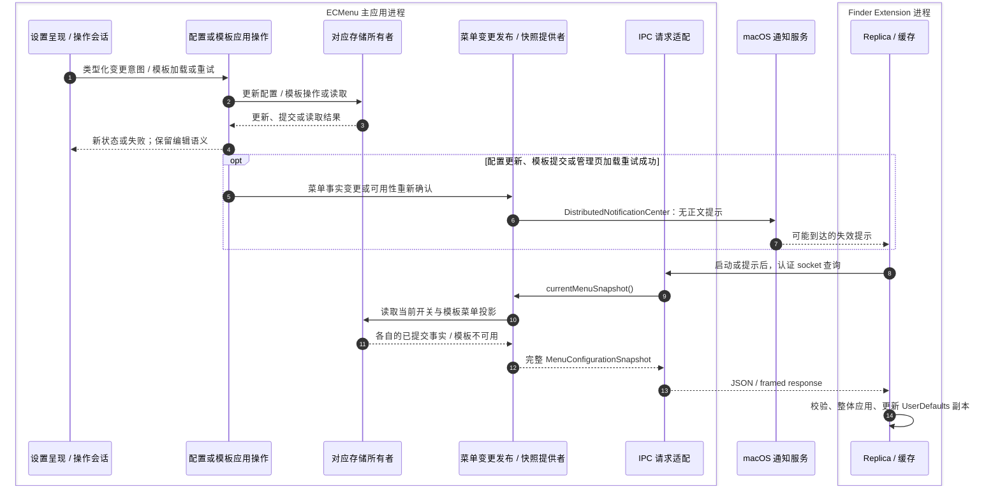
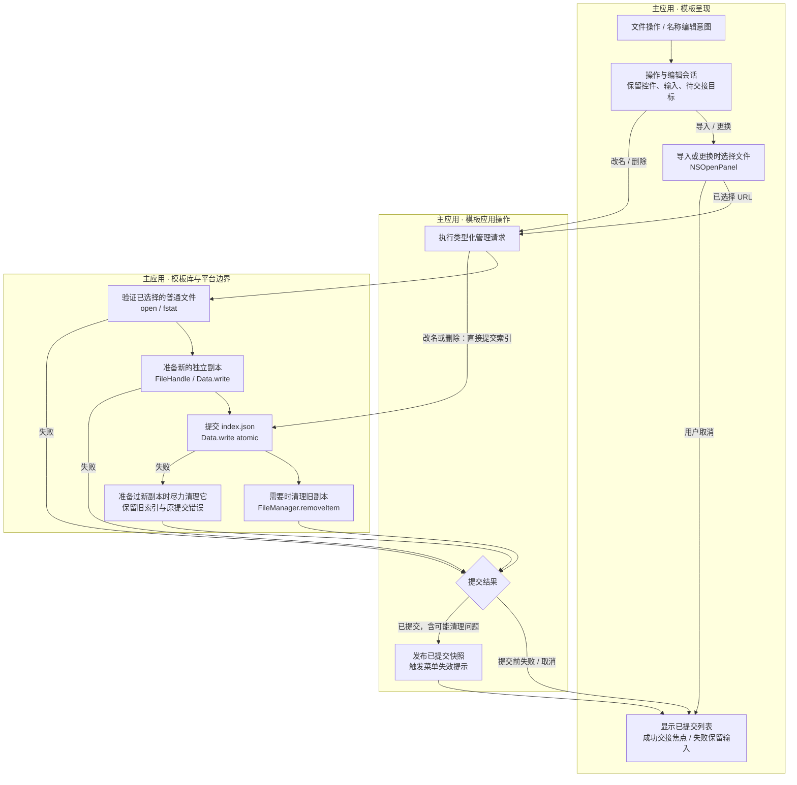
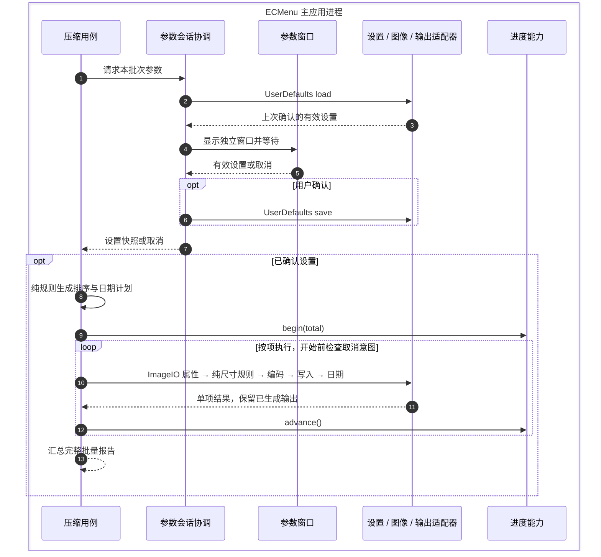

# 目标执行流与外部边界

**以下均为待实施设计。** 目标调整责任和内部契约，保持现有产品流程及系统 API。未单独重画的 F01、F09、F10、F12–F15 沿用当前外部行为，目录/依赖变化见[模块契约](Boundaries.md)；它们的 API 输入/输出仍以对应当前流程表为基线。

## T01 · 新建文件与复制路径的完整业务结果

| 目标模块 | 输入 → 输出 | 外部 API 与失败边界 |
|---|---|---|
| 新建用例 / 纯命名规则 | 目录 + 模板 ID → 创建结果 | 自身依赖模板读取/排他写入接口；纯候选命名无外部 I/O |
| 模板读取适配器 | ID → 元数据 + Data / 模板失败 | 同一 FileTemplateLibrary actor 的 `open/fstat/FileHandle`；取得值后不再查询模板 |
| 排他写入适配器 | Data + 首选 URL → 创建 URL / 目标失败 | `Data.write(.withoutOverwriting)`，只在已存在时继续候选 |
| 复制用例 / 计划 | 非空路径 + 存在事实 → 完整复制结果 | 规则无 I/O；事实读取使用 `lstat`；不遗漏真正写剪贴板的结果 |
| PasteboardWriter | 多行 String → 成功 / 写失败 | MainActor `clearContents` / `setString(.string)`；保留两步非事务语义 |
| 反馈策略 | 已完成的业务结果 → 用户告知/结果定位 | NSAlert、NSSound、OSLog；新文件另调用 `selectFile`，定位失败不把创建成功改写为失败 |

对应当前 [F07](../Current/NewFile.md)、[F08](../Current/FileCommands.md)。新建文件大体保留，复制路径把主要输出从 `present` 纳入用例，避免为了“后台执行”而错误移动 AppKit 调用的线程。

## T02 · 配置变更与模板可用性驱动菜单发布

| 目标模块 | 输入 → 输出 | 外部 API 与失败边界 |
|---|---|---|
| 配置应用操作 | Bool / Feature 可见性 → 有效配置 | 通过 UserDefaults store 更新；set 无同步持久化回执 |
| 模板应用操作 | 管理意图 / 加载重试 → 提交或读取结果 | 经单一 actor 完成文件和索引操作；已提交的清理问题及管理页成功加载/重试都触发提示 |
| 快照提供者 | 当前事实读取边界 → 快照 | 无直接 UI/socket 调用；模板不可用仍保留当前开关，清单为空有独立语义 |
| 变更发布者 | 已改变菜单事实 / 可用性重新确认 → 失效提示 | `DistributedNotificationCenter.post...`；提示可能丢失，不传送配置正文 |
| IPC 适配 | 查询请求 → 完整快照响应 | 同一已认证 socket/JSON/framing；不直接理解模板库错误 |
| Replica | 有效快照 → 下次菜单使用的副本 | `UserDefaults` 缓存；拉取中的新提示使当前响应失效，再拉一次；失败保留最后有效副本 |

对应当前 [F03/F04/F06](../Current/ConfigurationAndTemplates.md)与[副本流程](../Current/MenuAndIPC.md)。提供者可以分成投影纯函数与应用读取协调，按复杂度决定；不保存一份冗余的全局菜单真相。

发布包含成功只读重试，使之前缓存 `.unavailable` 的 Extension 获得重新查询机会。首次读取若完成初始化/迁移提交，由模板应用边界发布；普通查询已缓存清单不发布。IPC 开始监听时仍独立发送提示。完整发布输入见[模块契约](Boundaries.md)。

## T03 · 模板交互、提交与编辑焦点

图中只有导入/更换需要准备新副本；改名只更新索引，删除提交索引后清理。普通“打开模板”经读取边界得到当前 URL，再通过 Workspace 打开，沿用 F06，不产生索引提交。

提交失败后的新副本清理，与提交成功后的旧副本清理分开；前者清理失败只写日志，保留原提交错误和旧清单。成功提交的清理问题则进入已提交结果。

| 目标模块 | 输入 → 输出 | 外部 API 与失败边界 |
|---|---|---|
| 呈现/编辑会话 | 控件事件、草稿 → 提交意图/交接请求 | NSTextField、共享 field editor、SwiftUI；保留原生重入和一次提交期间最后目标点击规则 |
| 参数/文件选择适配 | 导入/更换意图 → URL? | NSOpenPanel；nil 表示用户取消，不制造存储错误 |
| 模板应用操作 | 有效意图 → 提交结果 | 注入库操作与发布闭包；自身不持有另一份索引，不直接操作控件 |
| 持久化 actor | 文件/元数据意图 → 权威清单或失败 | 当前 FileManager、Darwin、FileHandle、Data API；区分提交前与提交后清理结果，保留独立 schema 迁移 |
| 反馈/发布 | 提交状态、维护问题 → 列表、错误反馈、失效提示 | 列表/原生焦点 API、NSAlert/日志、DistributedNotificationCenter；更换和删除保留各自既有清理反馈策略 |

## T04 · 图片参数与处理协作

| 目标模块 | 输入 → 输出 | 外部 API 与失败边界 |
|---|---|---|
| 参数会话 | 本次输入快照 → Settings? | 以 continuation/取消处理连接窗口和等待者；Store 保存发生在确认后 |
| 窗口/表单 | 初始值、用户输入 → 有效设置/取消 | AppKit 控件、Formatter、NSWindow；不自行读写 UserDefaults |
| 设置 store | 键值 → 有效设置；设置 → 偏好更新 | UserDefaults；与领域设置定义分文件，无同步落盘回执 |
| 纯计划/尺寸规则 | URL 列表、设置、图像属性事实、基准时间 → 不可变计划 | 无文件 I/O；保留当前排序、视觉方向、目标尺寸和日期规则 |
| 图像/文件适配 | 单项计划 → 输出与失败事实 | ImageIO、CoreGraphics、FileHandle、Data.withoutOverwriting、setAttributes；日期失败保留输出 |
| 进度能力 / 反馈 | 批次进度与完整报告 → 可见快照/结果定位 | Center 接收事实，独立 NSPanel 渲染；完成后 Finder 选择与汇总反馈沿用 F11/F12 |

此目标保留批间并发、批内顺序、用户取消的安全边界和不同窗口独立输入。窗口任务保活与持久化时机属于参数会话，ImageIO 转换器只处理单图系统边界。
