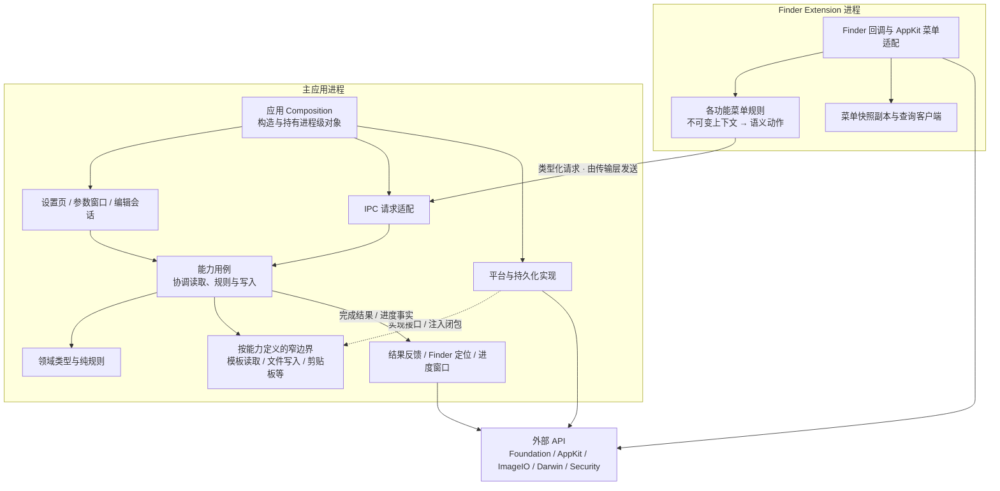

# 目标架构

**待实施设计。** 保持现有产品进程与用户行为，以业务能力组织源码，在能力内部按需要区分领域、用例、呈现和平台/持久化边界。

## 目标依赖关系

此图表达主要依赖与结果流，不表示用例直接构造反馈窗口。运行协调器连接“用例结果 → 反馈策略”，具体平台适配由 Composition 注入；领域与规则不依赖 AppKit 控件、UserDefaults 或 socket。模板页等呈现层仍需 AppKit/SwiftUI 来维持原生交互，图省略这些视觉调用。

`ECMenuShared/Contracts` 只保存两端需一致的值和请求；`ECMenuShared/Platform` 保存确实被双方复用的系统实现。它们是源码组织边界，是否进一步成为独立 Swift module 留到依赖稳定后判断。

## 目录组织

主应用以 FileTemplates、MenuConfiguration、ApplicationSettings 等能力为入口，Finder 操作集中在 Commands；设置窗口与导航由 Settings 负责。能力内部按需要区分 Domain、Application、Persistence、Platform、Presentation；具体定义、归属判断和界面查找入口集中在[目录组织规则](DirectoryRules.md)。

## 进一步阅读

- [目录组织规则](DirectoryRules.md)：五类职责、拆分条件、依赖方向和界面代码入口。
- [模块契约与目录](Boundaries.md)：能力边界、状态所有权、跨端路径、现有文件迁移映射。
- [目标执行流](Flows.md)：新建文件、配置发布、模板操作、复制路径和图片压缩的责任调整及 API 输入/输出。
- [迁移计划](../Migration.md)：先后依赖、每阶段完成标准和验证。
