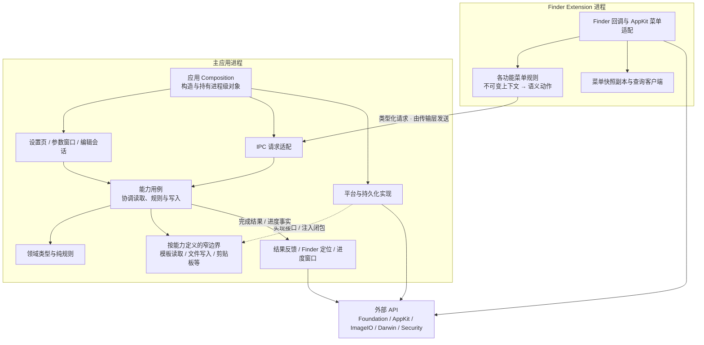

# 目标架构

**待实施设计。** 保持现有产品进程与用户行为，以业务能力组织源码，在能力内部按需要区分领域、用例、呈现和平台/持久化边界。

## 目标依赖关系

此图表达主要依赖与结果流，不表示用例直接构造反馈窗口。运行协调器连接“用例结果 → 反馈策略”，具体平台适配由 Composition 注入；领域与规则不依赖 AppKit 控件、UserDefaults 或 socket。模板页等呈现层仍需 AppKit/SwiftUI 来维持原生交互，图省略这些视觉调用。

`ECMenuShared/Contracts` 只保存两端需一致的值和请求；`ECMenuShared/Platform` 保存确实被双方复用的系统实现。它们是源码组织边界，是否进一步成为独立 Swift module 留到依赖稳定后判断。

## 分层的具体含义

| 责任 | 接收与产生什么 | 拥有什么 | 外部 API 边界 |
|---|---|---|---|
| 呈现 / 编辑会话 | 已提交状态和草稿 → 用户意图 | 窗口、控件、编辑焦点、未提交输入 | SwiftUI/AppKit 控件与窗口；通过应用操作提交业务变更 |
| 能力用例 | 类型化意图 → 完整业务结果 | 一次操作的不可变输入、协调过程 | 调用注入的文件/系统/存储边界，按需要切换 actor |
| 领域规则 | 有效值与不可变事实 → 计划、校验结果 | 无独立可变副本 | 无外部 I/O；Foundation 值类型和本地计算可以使用 |
| 持久化 / 平台适配 | 业务边界请求 → 类型化事实/失败 | 存储与系统资源的明确生命周期 | UserDefaults、文件 API、ImageIO、NSWorkspace 等 |
| 运行与反馈 | 用例结果、进度事实 → 用户反馈 | 在途 Task、进度中心、反馈窗口各自的状态 | Task、NSAlert、NSPanel、Finder 结果选择；不把主要业务写入放进结果呈现 |

这是一种职责分配，不是要求每个能力都创建五个目录或一套 ViewModel。已有 Controller/Session 符合上述责任时可以沿用名称。

## 进一步阅读

- [模块契约与目录](Boundaries.md)：能力边界、状态所有权、跨端路径、现有文件迁移映射。
- [目标执行流](Flows.md)：新建文件、配置发布、模板操作、复制路径和图片压缩的责任调整及 API 输入/输出。
- [迁移计划](../Migration.md)：先后依赖、每阶段完成标准和验证。
