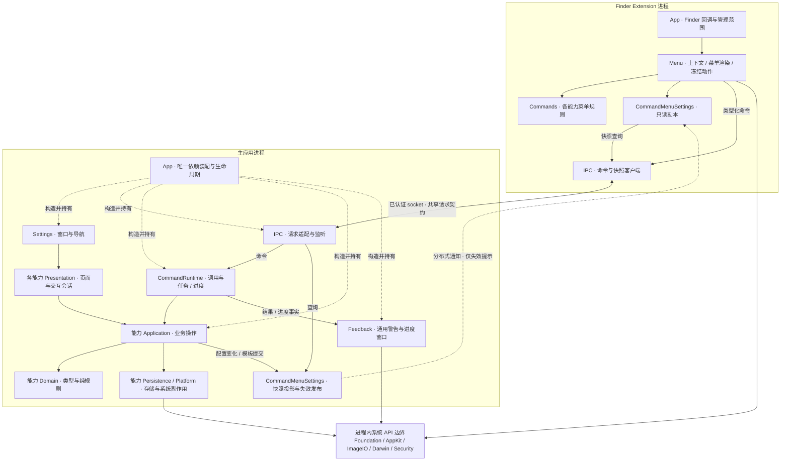

# 系统架构

代码按“进程 → 业务能力 → 必要的职责分层”组织。Finder Extension 读取上下文、构建菜单并发送命令；主应用拥有配置、模板和命令执行。共享代码编译进两个进程。

## 系统与依赖边界

实线表达主要调用或数据交接，虚线标明装配关系或异步提示。平台 API 在调用进程内执行，图中集中展示其边界。具体 API 的输入、输出、失败和完成点由各能力 spec 展开；主应用与 Extension 的认证、连接资源归 [IPC](../Runtime/IPC.md)。

`ECMenuShared/Contracts` 保存两端共同使用的值、请求和结果格式；`ECMenuShared/Platform` 保存实际复用的系统实现。目录表达源码责任，仍使用现有 Xcode targets。

## 阅读与修改入口

- [目录组织规则](DirectoryRules.md)：五类职责、文件拆分、依赖方向和 View 查找表。
- [核心界面入口](../ViewCatalog.md)：三个设置页面、设置弹窗及其他独立窗口的源码路径。
- [Technical spec 编写约束](TechnicalSpecGuidelines.md)：流程图、模块/API 表和验证证据的维护方式。
- [能力导航](../Features/Main.md)：新建文件、模板管理、菜单配置、通用设置与其他命令。
- [运行机制](../Runtime/Main.md)：菜单入口、配置同步、命令任务、应用生命周期和 IPC。
- [API 证据与结果含义](APIContracts.md)：影响跨模块设计的官方边界。
- [验证记录](Verification.md)：当前结构的自动化与实机验证范围。

## 状态所有权

| 状态 | 唯一所有者与生命周期 | 相关入口 |
|---|---|---|
| 主应用依赖图 | AppDelegate 持有一个 ApplicationComposition，随进程存活；生产适配器在此连接 | [ApplicationComposition](../../../ECMenu/App/ApplicationComposition.swift) |
| 菜单配置 | Controller 持有进程内当前值，Store 负责偏好恢复/保存；Provider 只组装快照 | [菜单配置](../Runtime/CommandMenuSettings.md) |
| 模板索引与内部副本 | Library actor 持有已提交记录，Storage 负责文件布局与 I/O；界面草稿由编辑会话持有 | [模板管理](../Features/NewFileTemplates/Main.md) |
| 在途命令 | Router 持有 Task；每个 Invocation 持有本次输入和结果 | [命令执行](../Runtime/CommandExecution.md) |
| 进度与用户取消意图 | ProgressCenter 持有事实、显示延迟与隐藏集合；Presenter 持有窗口 | [命令进度](../Runtime/CommandProgress.md) |
| 参数编辑与上次确认值 | 每个压缩窗口持有草稿；Store 保存实际确认值；Coordinator 连接两者 | [图片压缩](../Features/ImageCompression.md) |
| Extension 配置副本 | Replica 持有当前只读快照和拉取任务；Cache 负责副本恢复，非配置真相源 | [配置同步](../Runtime/CommandMenuSettings.md) |
| 菜单动作 | 菜单控制器按 tag 保存本次已冻结输入，以有界保留策略管理有效期 | [菜单执行](../Runtime/MenuExecution.md) |

## 三个完成边界

模板变更在索引提交后返回权威清单；随后旧副本清理失败属于已提交结果的一部分。删除先更新页面，再显示清理问题；更换记录清理问题并保留成功结果。复制路径在实际剪贴板写入之后产生业务结果。菜单变更发布只提示 Extension 重新查询，socket 命令写出也只表示投递阶段完成。

这些边界用于让调用者判断哪些变化已经生效。跨进程值、偏好键和模板存储格式由对应的编码与存储契约维护。
