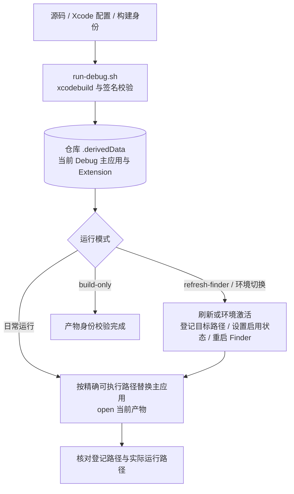
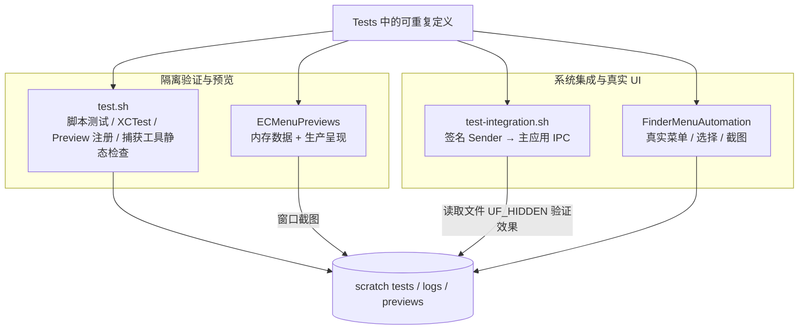
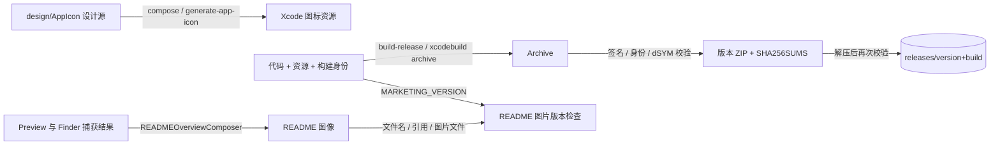

# 开发、验证与交付流程

开发工具与产品运行流程分开。此页按可独立理解的流水线概括 `scripts/`、专用测试宿主、预览和资源生成；完整参数与操作约束以 [scripts/Main.md](../../../scripts/Main.md) 为准。运行证据见[架构验证记录](../Architecture/Verification.md)。

## 构建、启动与环境切换

| 职责模块 | 核心脚本与源码入口 | 输入 | 外部 API / CLI | 输出 / 失败 |
|---|---|---|---|---|
| 构建与产品定位 | [run-debug.sh](../../../scripts/run-debug.sh) 编排构建，[product-paths.sh](../../../scripts/lib/product-paths.sh) 解析产物与身份，[code-signing.sh](../../../scripts/lib/code-signing.sh) 核对签名 | project、scheme、configuration、destination | `xcodebuild`、`plutil`、`codesign` | 签名产物及解析后的路径/身份；非零退出或身份不符终止 |
| 精确进程生命周期 | [process-lifecycle.sh](../../../scripts/lib/process-lifecycle.sh) 提供按可执行路径查询、停止与等待；[run-debug.sh](../../../scripts/run-debug.sh) 打开目标产物 | 产物可执行路径、当前 PID | 进程查询、`kill`、`open` | 旧路径进程结束、当前产物运行；超时失败 |
| Finder 环境 | [activate-environment.sh](../../../scripts/activate-environment.sh) 持有切换与恢复流程，[finder-environment.sh](../../../scripts/lib/finder-environment.sh) 适配登记和启用状态；Debug 刷新由 [run-debug.sh](../../../scripts/run-debug.sh) 编排 | 目标 Extension 路径、Debug/Release 身份 | `pluginkit`、Launch Services `lsregister`、用户级 `launchctl` | 登记/启用/运行分别核对；环境切换失败恢复原启用状态，已完成构建和登记不回滚 |
| 图标刷新 | [run-debug.sh](../../../scripts/run-debug.sh) 的 `--refresh-icon` 流程 | 当前 Debug 应用及缓存 | `lsregister`、IconServices/Dock 进程刷新 | 请求系统重新读取图标；不是产品业务接口 |

`--no-build` 使用已存在产物并重新核对身份；它与 `--build-only` 互斥。Debug 与 Release 数据及 IPC 身份隔离，两个 Finder Extension 的启用状态由环境脚本协调。

## 测试、预览与真实界面捕获

| 职责模块 | 核心类型或脚本与源码入口 | 输入 | 外部 API / CLI | 输出 / 失败 |
|---|---|---|---|---|
| 测试编排 | [test.sh](../../../scripts/test.sh) | 测试定义、签名环境、GUI 会话 | `xcodebuild test`、`xcrun swiftc`、Python、`xcresulttool` | `.xcresult`、日志、各检查退出码；`test.sh` 不包含另一个集成脚本的执行 |
| IPC 集成 | [test-integration.sh](../../../scripts/test-integration.sh) 编排签名宿主与结果验证，[ContextCommandSender.swift](../../../Tests/Integration/ContextCommandSender.swift) 发出请求 | 当前 Debug 产物、签名 Sender、仓库内普通文件 fixture | 当前 socket/Security API；Python `os.stat(..., follow_symlinks=False)` | 配置查询成功；单次隐藏命令后检查 `UF_HIDDEN`，超时失败；不驱动 Finder 菜单 |
| Preview | [PreviewRuntime.swift](../../../Tests/ECMenuPreviews/PreviewRuntime.swift) 持有会话与窗口就绪协议，[capture-previews.sh](../../../scripts/capture-previews.sh) 编排双语截图；场景与启动入口见 [Preview 源码映射](../PreviewTarget.md#职责与源码映射) | 固定 Case、内存状态、语言参数 | 独立 SwiftUI/AppKit 宿主；`screencapture -l` 按窗口编号截图 | 可交互窗口或 PNG；复用产品视图，不写用户设置和业务输出 |
| Finder 菜单捕获 | [capture-finder-menus.sh](../../../scripts/capture-finder-menus.sh) 编排批次，[FinderMenuAutomation.swift](../../../Tests/FinderMenuCapture/FinderMenuAutomation.swift) 驱动本次验收；场景和系统边界见 [Finder 菜单捕获](../FinderMenuCapture.md) | 场景/语言、fixture、真实 Finder | Accessibility `AXUIElementCopyAttributeValue/PerformAction`、`CGEvent` 输入、`SCShareableContent` / `SCScreenshotManager.captureScreenshot`、ImageIO PNG 编码；`defaults` 语言事务 | 真实菜单图像及期望校验；权限、菜单身份、语言或窗口条件不满足则失败 |
| Finder 窗口保持 | [with-finder-windows-checked.sh](../../../scripts/lib/with-finder-windows-checked.sh) 包装测试，[FinderWindowCheck.swift](../../../Tests/FinderWindowPreservation/FinderWindowCheck.swift) 采样和核对；纯规则入口见[窗口保持](../FinderWindowPreservation.md#职责与源码映射) | 测试前后的 Finder 窗口集合 | CoreGraphics `CGWindowListCopyWindowInfo` | 前后窗口集合不同导致检查失败；不以自动关窗隐藏差异 |
| 用户焦点恢复 | [with-user-focus-restored.sh](../../../scripts/lib/with-user-focus-restored.sh) 持有最外层会话，[UserFocusRestorer.swift](../../../Tests/UserFocusRestoration/Support/UserFocusRestorer.swift) 读取并激活应用；纯规则入口见[焦点恢复](../UserFocusRestoration.md#职责与源码映射) | 自动化前的应用身份与结束时的运行应用集合 | AppKit `NSRunningApplication` / `activate` | 尽量恢复同一应用焦点；原应用退出时跳过，恢复失败反馈给脚本 |

这里的系统 API 属于开发宿主，不进入产品权限或命令执行链。具体捕获/窗口读取方法与验证版本分别见 [Finder 菜单捕获](../FinderMenuCapture.md)、[窗口保持](../FinderWindowPreservation.md)、[焦点恢复](../UserFocusRestoration.md)；工具的输入模拟和截图权限不能转化为产品对这些权限的依赖。

## 图标、README 图像与正式发布

| 职责模块 | 核心类型或脚本与源码入口 | 输入 | 外部 API / CLI | 输出 / 失败 |
|---|---|---|---|---|
| 图标资源生成 | [compose.sh](../../../design/AppIcon/compose.sh) 从设计源生成资源，[generate-app-icon.sh](../../../scripts/generate-app-icon.sh) 同步或比较正式资源 | SVG、Icon Composer JSON 模板 | `xmllint`、`jq`、Icon Composer `ictool --export-image`、文件差异比较；[图标源说明](../../../design/AppIcon/Main.md) | 正式资源；`--check` 比较一致性并以退出码反馈，不同步产品文件 |
| README 合成 | [capture-readme-images.sh](../../../scripts/capture-readme-images.sh) 协调捕获及更新，[READMEOverviewComposer.swift](../../../Tests/READMEImageCapture/Support/READMEOverviewComposer.swift) 持有图片排版和编码 | 已验证的设置页和 Finder 图片、Preview 产物版本 | CoreGraphics / ImageIO、`PlistBuddy` | 合成后的中英文版本化图像；全部成功后更新 README 图片与引用 |
| README 图片版本检查 | [check-readme-images.py](../../../scripts/check-readme-images.py)，由截图脚本和 [CI](../../../.github/workflows/ci.yml) 调用 | 工程 `MARKETING_VERSION`、README 引用与图片路径 | `plutil`、Python 文件读取 | 文件名版本、引用和非空图片文件一致；不一致则失败 |
| 发布编排 | [build-release.sh](../../../scripts/build-release.sh) | version/build、签名配置、项目 | `xcodebuild archive`、`codesign`、打包/解压、校验和工具 | Archive、ZIP、校验和；拒绝静默覆盖已有非空版本目录 |

正式交付路径、签名限制和身份值以[交付文档](../Delivery/Main.md)为准。当前发布脚本不执行网络发布。产品源、测试定义和持久文档都不依赖 scratch 产物；共享 Derived Data 或 Finder 登记状态的脚本必须顺序执行。

## 源码与资源边界

Xcode 的文件系统同步组随目录发现源码，`membershipExceptions` 明确排除 Preview 不拥有的应用装配和 Sender 不使用的 AppKit 绘制实现。预览复用能力的 Presentation 与 Settings 外壳；输入驱动、截图权限和固定 fixture 由 Tests 中的独立宿主拥有。目录调整需要同步这些成员关系及源码链接。
