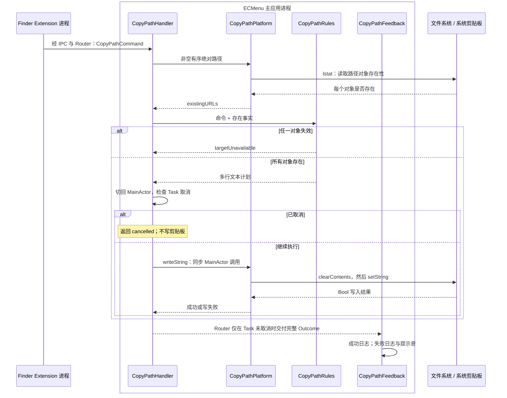

# 拷贝路径

能力范围是把 Finder 冻结的有序绝对路径写入系统剪贴板。产品行为见[需求](../../Requirements/Features/CopyPath.md)，上下文形成与投递分别见 [Finder 菜单语义](../Platform/Finder/ContextMenus.md)和 [IPC](../Runtime/IPC.md)。

## 执行流

`CopyPathPlatform` 是主应用内注入的 SDK 适配边界，图中的剪贴板是系统共享状态。任务取消检查和同步剪贴板写入位于同一次 MainActor 调用；排队等待主执行器期间取消的任务不会写入。写入成功是本能力的业务完成点，反馈阶段不再写剪贴板。

## 模块、输入输出与状态

| 模块 / 源码入口 | 输入 → 输出 | 状态与系统调用 |
|---|---|---|
| [CopyPathFeature](../../../ECMenuFinderExtension/Commands/CopyPath/CopyPathFeature.swift) | 菜单语义快照 → CopyPathCommand? | 纯值转换；发送复用 IPC，目标来源 API 见 Finder 公共说明 |
| [CopyPathHandler](../../../ECMenu/Commands/CopyPath/CopyPathHandler.swift) | 类型化命令、平台能力 → success / failure / cancelled | 单次执行拥有计划；Swift Task 取消与 MainActor 切换 |
| [CopyPathRules](../../../ECMenu/Commands/CopyPath/CopyPathRules.swift) | 有序路径 + 存在集合 → 完整计划 / targetUnavailable | 无外部 I/O；全部目标有效才生成正文，保持顺序 |
| [CopyPathSystem](../../../ECMenu/Commands/CopyPath/CopyPathSystem.swift) | 路径 → 存在集合；String → Bool | `lstat` 与 NSPasteboard；通过 CopyPathPlatform 注入 |
| [CopyPathFeedback](../../../ECMenu/Commands/CopyPath/CopyPathFeedback.swift) | 已完成结果 + 本地 UUID → 日志或提示音 | `Logger`、`NSSound.beep()`；不保存业务状态 |

本能力没有持久化设置或跨请求缓存。命令与执行期存在事实属于本次任务；系统剪贴板由 macOS 拥有，其他应用可以随时改写。

## API 契约与设计依据

| API | 实际输入 → 输出 | 副作用、失败与消费方式 |
|---|---|---|
| Darwin `lstat` | 绝对 POSIX 路径、stat 指针 → 0 / 非 0 | 读取链接目录项自身；非 0 在本能力折叠为目标不可用，不继续写入部分路径 |
| `NSPasteboard.general.clearContents()` | 系统通用剪贴板 → changeCount | 清除旧内容；返回计数不作为写成功证明 |
| [`setString(_:forType:)`](https://developer.apple.com/documentation/appkit/nspasteboard/setstring%28_%3Afortype%3A%29) | 多行 POSIX String、`.string` → Bool | 写首个 pasteboard item 的一种文本表示；false 进入 pasteboardWriteFailed |
| `Logger` / `NSSound.beep()` | 结果、UUID → 日志 / 系统提示音 | 失败反馈不恢复旧剪贴板；取消静默 |

存在检查与写剪贴板不是原子操作，只表达检查时点的事实。使用 `lstat` 保留断链自身的可复制路径。所有路径是一份字符串，多选换行是正文内容，不拆成多个剪贴板条目。

macOS 26.5 SDK 的 `NSPasteboard.h` 明确 `clearContents` 清除内容并返回 change count，`setString` 对首项写指定类型。两步不是事务：写入失败时旧内容已经清除。MainActor 是本项目的剪贴板隔离选择。

## 验证与证据范围

[CopyPathTests](../../../Tests/ECMenuTests/Commands/CopyPath/CopyPathTests.swift)覆盖顺序、整批目标有效性、真实断链，以及注入 writer 的成功、失败、预取消和读取事实后等待主执行器期间取消。测试以注入写入避免改动用户剪贴板；不声称这些测试证明真实剪贴板服务的所有失败原因。SDK 核对版本为 macOS 26.5。

实机验收可在 Finder 选择含空格及 Unicode 名称的多个对象，拷贝后粘贴到纯文本编辑器核对顺序与换行；该路径的操作记录应注明 macOS 版本。当前自动化覆盖与完整测试入口见[命令执行](../Runtime/CommandExecution.md#验证入口)。
