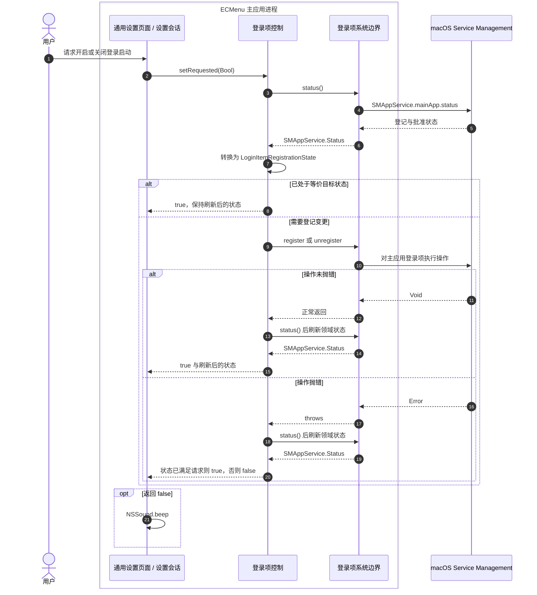
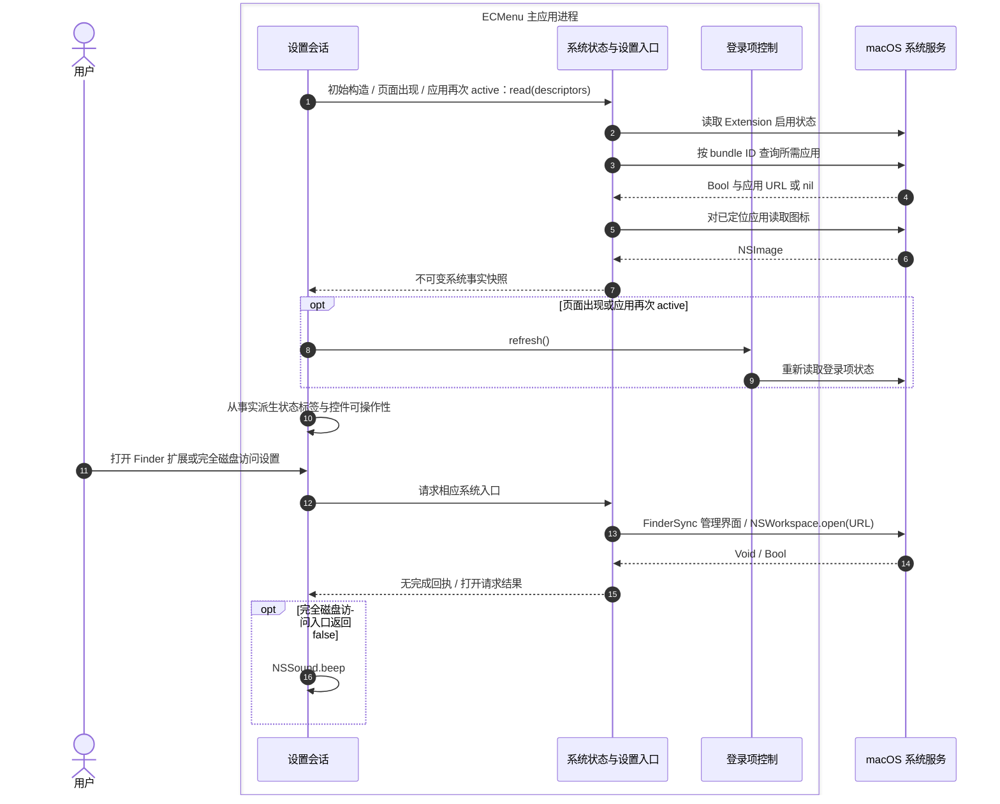
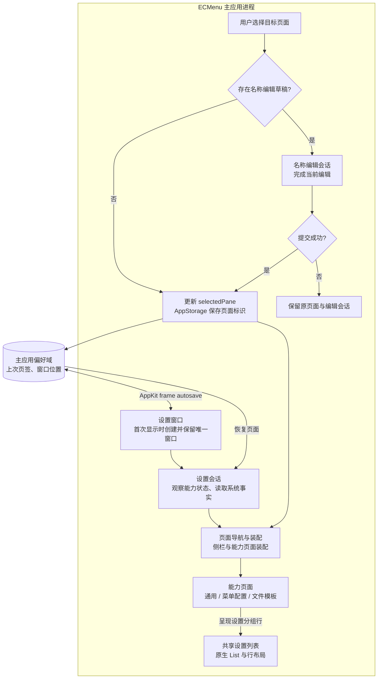

# 通用设置与设置窗口

本能力呈现登录项状态、Finder Extension 状态与系统设置入口。设置外壳负责唯一窗口、页面导航和能力装配；通用页、菜单配置页和模板页分别归其业务能力。产品要求见[状态页](../../Requirements/StatusPage.md)，进程与配置会话边界见[应用生命周期](../Runtime/ApplicationLifecycle.md)。

## 登录项变更

`setRequested` 的 Bool 表示系统调用没有抛错，或错误后重新查询已经达到等价请求状态。它不是当前进程启动、下次登录成功或已取得系统批准的回执。界面始终使用刷新后的状态，而不是把用户请求另存为偏好。

| 职责模块 | 核心类型 | 源码入口 | 输入 → 输出 | 外部 API、失败与状态归属 |
|---|---|---|---|---|
| 通用设置页面 | `GeneralSettingsPage`、`LoginItemRegistrationState` 的呈现扩展 | [页面](../../../ECMenu/GeneralSettings/Presentation/GeneralSettingsPage.swift)、[登录状态文案](../../../ECMenu/GeneralSettings/Presentation/LoginItemPresentation.swift) | `LoginItemRegistrationState` 与用户 Bool 意图 → 开关和请求回调 | SwiftUI Binding 从 `state.isRequested` 派生开关；不读写 Service Management 或 UserDefaults。requiresApproval 仍显示开启，并呈现待批准状态 |
| 设置会话 | `StatusPage` | [StatusPage.swift](../../../ECMenu/Settings/StatusPage.swift) | 页面事件 → Controller 调用或反馈 | 调用 `setRequested`，false 时 `NSSound.beep()`；失败不改变菜单配置或中止其他能力 |
| 登录项控制 | `LoginItemController` | [LoginItemController.swift](../../../ECMenu/GeneralSettings/Application/LoginItemController.swift) | 开启/关闭请求、刷新意图 → 已观察系统状态与 Bool | MainActor、Combine `@Published`；操作前重读，相同目标不重复操作。抛错后仍重读；状态已满足目标时视为请求成立，否则记日志并返回 false |
| 登录项系统边界 | `LoginItemServiceBoundary`、`LoginItemRegistrationState` | [LoginItemServiceBoundary.swift](../../../ECMenu/GeneralSettings/Platform/LoginItemServiceBoundary.swift) | 状态查询、登记或取消登记 → `SMAppService.Status` / Void / Error | `SMAppService.mainApp.status/register/unregister`；平台存储是长期真相源。领域映射区分 notRegistered、enabled、requiresApproval、notFound；notFound 表示本次未找到，仍允许尝试登记 |

`SMAppService.mainApp` 管理主应用自身，不增加 Helper、Launch Agent 或 XPC Service。注册/取消注册只影响后续登录，当前进程继续运行；官方入口及真实登录观察见[登录启动](../Runtime/ApplicationLifecycle.md#登录启动)。

## 系统状态刷新与系统设置入口

图中 macOS 行表示系统服务，FinderSync、AppKit 和 ServiceManagement 的调用对象仍位于主应用进程内。页面初始构造先读取系统快照；页面出现和主应用重新 active 时同时刷新系统事实与登录项状态。

| 职责模块 | 核心类型 | 源码入口 | 输入 → 输出 | 外部 API、失败与使用方式 |
|---|---|---|---|---|
| 设置会话 | `StatusPage` | [StatusPage.swift](../../../ECMenu/Settings/StatusPage.swift) | 初始依赖、onAppear、didBecomeActive → 最新 `systemState` | SwiftUI `@State` 保存当前会话快照；`NotificationCenter.default.publisher(for: NSApplication.didBecomeActiveNotification)` 触发重读。读取由注入服务完成，不把快照写成长期偏好 |
| 系统状态与设置入口：状态读取 | `StatusPageSystemServices` | [StatusPageSystemServices.swift](../../../ECMenu/GeneralSettings/Platform/StatusPageSystemServices.swift) | 当前命令 descriptor 集合 → Extension 启用事实与应用图标映射 | `FIFinderSyncController.isExtensionEnabled` 返回 Bool；分别收集业务依赖与图标声明中的应用，并按 bundle ID 去重，使用 `NSWorkspace.urlForApplication` 查询 URL，再 `icon(forFile:)` 读取图像 |
| 系统事实快照 | `StatusPageSystemState` | [StatusPageSystemState.swift](../../../ECMenu/GeneralSettings/Presentation/StatusPageSystemState.swift) | 系统读取结果 → 应用依赖是否可用 | 无外部 I/O；图标映射中存在键同时表示系统已定位该应用，不再保存一份重复安装布尔值；没有依赖的命令视为依赖满足 |
| 能力页面 | `GeneralSettingsPage`、`CommandMenuSettingsPage` | [通用页](../../../ECMenu/GeneralSettings/Presentation/GeneralSettingsPage.swift)、[菜单配置页](../../../ECMenu/CommandMenuSettings/Presentation/CommandMenuSettingsPage.swift) | 系统事实与保存的菜单配置 → 控件状态 | 纯呈现规则：Extension 未启用只禁用通用页的总开关；菜单页是否可编辑由产品总开关与当前命令依赖决定。系统状态改变不改写用户保存的可见性 |
| 系统状态与设置入口：扩展管理 | `StatusPageSystemServices` | [系统入口](../../../ECMenu/GeneralSettings/Platform/StatusPageSystemServices.swift)的 `manageExtension` | 用户点击 → 系统管理界面请求 | `FIFinderSyncController.showExtensionManagementInterface()` 返回 Void；没有“已启用”结果。返回应用后重新读取 Bool，不能用按钮点击或窗口打开推断状态改变 |
| 系统状态与设置入口：权限设置 | `FullDiskAccessSettings` | [FullDiskAccessSettings.swift](../../../ECMenu/GeneralSettings/Platform/FullDiskAccessSettings.swift) | 用户点击 → 工作区打开请求 Bool | `NSWorkspace.shared.open(URL)` 使用项目固定的系统设置深链接 `x-apple.systempreferences:com.apple.settings.PrivacySecurity.extension?Privacy_AllFiles`。false 触发提示音；成功只表示系统接受打开请求，不是授权状态 |

Finder Extension 的启用、系统登记路径、当前运行进程和 IPC 可用性相互独立，见[Extension 生命周期](../Platform/Finder/ExtensionLifecycle.md)。完全磁盘访问只提供设置入口，不读取或推断当前授权；具体文件操作按实际系统失败处理，见[文件访问](../Platform/FileAccess.md)。

## 设置外壳、导航与能力页面

设置页面显示在哪里由外壳决定，页面实现由业务能力持有。模板的 `FileTemplateNameEditingSession` 和 `FileTemplatePageActions` 由 `StatusPageContent` 持有，跨页切换时保持其生命周期；同一能力的 View、控件和交互会话位于 `NewFileTemplates/Presentation`。名称编辑会话的源码、提交与焦点规则见[模板名称编辑](NewFileTemplates/Editing.md)。

| 职责模块 | 核心类型 | 源码入口 | 输入 → 输出 | 外部 API、状态与完成点 |
|---|---|---|---|---|
| 设置窗口 | `StatusPageWindowController` | [StatusPageWindowController.swift](../../../ECMenu/Settings/StatusPageWindowController.swift) | 已装配能力对象、显示/关闭意图 → 唯一 `NSWindow` | 首次显示时创建 `NSHostingController/NSWindow`；`setFrameUsingName` 返回是否恢复位置，失败居中；`setFrameAutosaveName` 交给 AppKit 保存后续位置。窗口创建、最小化与关闭边界见[应用生命周期](../Runtime/ApplicationLifecycle.md#窗口与呈现状态) |
| 设置会话 | `StatusPage` | [StatusPage.swift](../../../ECMenu/Settings/StatusPage.swift) | 观察的 Controller 状态、保存的页面标识 → 内容与回调 | `@EnvironmentObject` 观察能力对象；`@AppStorage("status-page-selected-pane")` 读写主应用偏好。缺失或无效标识显示 General；`task` 调用模板 `loadIfNeeded`，模板错误由该能力呈现 |
| 页面导航与装配 | `StatusPageContent` | [StatusPageContent.swift](../../../ECMenu/Settings/StatusPageContent.swift) | 当前页面、能力状态、用户导航 → 页面装配或等待编辑 | SwiftUI `@Binding` 连接页面选择；`@StateObject` 持有名称编辑与文件操作会话。有草稿时异步等待 `finishEditing`，成功才更新页面；失败保留原页。`didResignActiveNotification` 请求结束当前编辑，不退出应用 |
| 共享设置列表 | `SettingsList`、`SettingsListRow` | [SettingsList.swift](../../../ECMenu/Settings/Components/SettingsList.swift) | 页面提供的独立行内容 → 统一的原生列表与行布局 | SwiftUI `List` 及行、滚动内容的布局修饰符；只组合视图，不保存业务数据。通用页关闭滚动；排序页由 `SettingsReorderList` 添加移动行为，详见[共享列表布局](#共享列表布局) |
| 应用显示元数据 | `ApplicationMetadata` | [ApplicationMetadata.swift](../../../ECMenu/App/ApplicationMetadata.swift) | 当前 Bundle → 显示名与版本 | `Bundle.main.object(forInfoDictionaryKey:)`；显示名依次读取 DisplayName、Name、进程名，缺失版本显示占位值。这些是界面元数据，不进入业务契约 |
| 共享设置呈现 | `SettingsComponents`、`StatusPageIconRenderer` | [SettingsComponents.swift](../../../ECMenu/Settings/Components/SettingsComponents.swift)、[StatusPageIconRenderer.swift](../../../ECMenu/Settings/Components/StatusPageIconRenderer.swift) | 能力提供的文案/图标与场景度量 → 控件和图像 | SwiftUI、AppKit `NSImage` 与 Symbol configuration；画布计算复用[共享原语](../../../ECMenuShared/Platform/Rendering/AppKitIconCanvasRenderer.swift)。视觉参数属于呈现层，不进入 Requirements |
| 本地化资源 | `LocalizedStringResource` / Bundle 字符串目录 | [资源与使用入口](../Runtime/Localization.md) | `LocalizedStringResource`、当前进程语言 → 显示文字 | Foundation `String(localized:)` 与 SwiftUI 文本；语言不进入 IPC。当前只保证进程启动时的语言选择，完整规则见[本地化](../Runtime/Localization.md) |

### 共享列表布局

三个设置页面的分组行均使用 `GroupBox → SettingsList → SettingsListRow`。通用页的每个分组包含两个独立行，按共享行高与分割线空间计算固定高度，并以 `scrollDisabled(true)` 保持整组静态显示。菜单页与模板页通过 `SettingsReorderList` 复用同一容器，再接入[系统排序](../Runtime/CommandMenuSettings.md#设置列表排序交互)。控件仍由各能力页面构造，业务状态和操作回调不由列表层持有。

`SettingsList` 将 `List` 设为 `.plain`，隐藏滚动内容背景，将 `.scrollContent` 的 `contentMargins` 设为零，并统一最小行高；`SettingsListRow` 将 `listRowInsets` 设为零，隐藏系统分割线并使用透明行背景。页面在行内容后绘制 `Divider`，行内部的水平 padding 仅作用于控件。三页由同一原生容器决定分割线跨度与行边界，具体视觉参数由呈现层保存。

官方契约与项目观察需分开理解：[`listRowInsets`](https://developer.apple.com/documentation/swiftui/view/listrowinsets(_:)) 设置行内容边距，[`contentMargins`](https://developer.apple.com/documentation/swiftui/view/contentMargins(_:_:for:)-1lt8b) 按 placement 设置内容边距；本地 AppKit SDK 对 `NSTableView.Style.plain` 的说明仍保留由 `intercellSpacing.width` 决定的单元格间隔。这些是不同层级的布局量。

项目观察（2026-09-11，macOS 26.6.2、Xcode 26.6）：生产列表组合的底层 `NSTableView.style/effectiveStyle` 均为 `.plain`，滚动内容 inset 全零，`intercellSpacing` 为 `(17, 0)`。在宽 422 点的 table 中，单元格起点为 8、宽度为 405，两端分别留下 8 与 9 点；自绘分割线随该单元格收缩。行内再增加的 8 点 padding 属于页面自己的控件布局。实测标识为 `20260911-194644-settings-list-insets-23900`。零行 inset 和零滚动内容边距仍可与这些原生间隔同时存在；上述数值只描述该系统与当前列表组合。项目采用共享容器继承系统布局，使三页保持一致。

## 状态所有权与设计依据

登录项状态的长期所有者是 Service Management，Controller 只持有最新观察；Extension 启用和应用安装事实由系统提供，`StatusPage` 持有当前界面快照；菜单偏好由菜单配置 Controller 保存。设置外壳从这些事实派生控件状态，不因为按钮被禁用就覆盖保存值。

AppKit 是窗口可见、最小化、frame 和 key window 的所有者；窗口控制器持有唯一实例，生命周期协调不复制这些布尔状态。页面标识是界面偏好，模板草稿与文件操作会话是界面期间的状态，均不替代模板 actor 的已提交索引。

状态读取和操作入口均由装配注入。独立 Preview 可以使用生产页面与内存事实，不申请系统权限或修改登录项；其边界见[预览目标](../PreviewTarget.md)。

## 验证与实机证据

| 验证入口或依据 | 覆盖内容 | 证据限制 |
|---|---|---|
| [登录项测试](../../../Tests/ECMenuTests/GeneralSettings/LoginItemControllerTests.swift) | 状态派生、notFound 后登记、待批准、错误后达到目标、重复请求和取消登记失败 | 注入 Service Management 替身；不能证明后续真实登录或批准结果 |
| [系统状态测试](../../../Tests/ECMenuTests/GeneralSettings/StatusPageSystemStateTests.swift) | descriptor 依赖去重、每次刷新重查、启用与可见性可编辑规则、保留已存值 | 以内存系统事实验证，不能证明系统管理界面跳转或真实安装状态刷新时机 |
| [图标测试](../../../Tests/ECMenuTests/Settings/StatusPageIconRendererTests.swift)、[本地化测试](../../../Tests/ECMenuTests/App/LocalizationCatalogTests.swift)与[Preview](../../../Tests/ECMenuPreviews/Cases/StatusPagePreview.swift) | 生产图标度量、中英文资源、禁用/待批准页面状态 | Preview 不代表 Finder host、系统设置或登录后的窗口恢复行为 |
| [登录实机观察](../Runtime/ApplicationLifecycle.md#登录启动) | macOS 26.6.1（25G76）、Xcode 26.6（17F113）与 macOS 26.5 SDK 下，真实注销/登录事件及隐藏配置会话未被恢复 | 既有观察未记录精确源码提交；不等于任意 macOS 版本或账号状态保证 |
| [Extension 平台证据](../Platform/Finder/ExtensionLifecycle.md) | SDK 的启用 Bool 和管理入口；已有账号下 Debug 登记/当前进程检查 | 启用不能证明已登记正确产物；首次安装、系统升级需独立验收 |

实机复核应分别检查：登记/取消登录项后系统实际状态、待批准时的开关、离开系统设置再回到应用后的重读、两个设置入口落点、页面选择恢复，以及窗口关闭/最小化后的行为。完全磁盘访问深链接是项目采用的入口；没有独立的跨版本跳转或授权查询保证。自动化定义与执行记录需区分，测试通过不替代真实注销、登录、Dock/Space 与系统设置验收。

当前代码的自动化与实机执行记录见[架构验证](../Architecture/Verification.md)。
