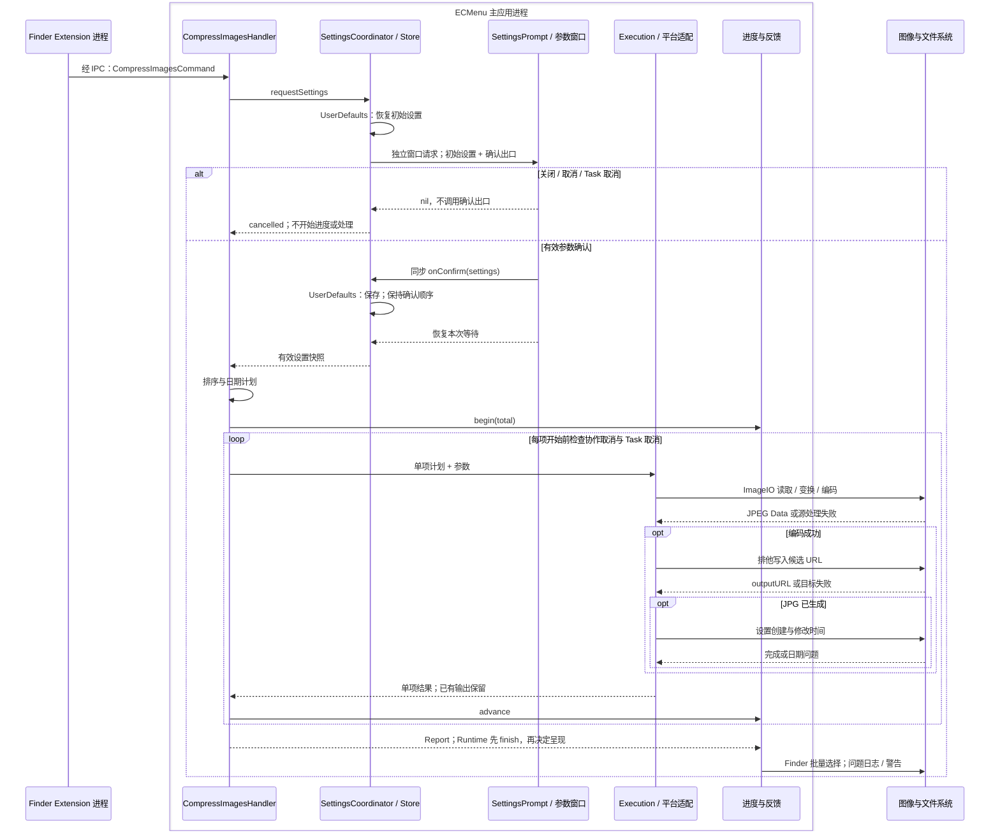

# 压缩图片

能力范围是从 Finder 的非空图片选择收集本批参数，按顺序转换成独立 JPG，保留逐项失败和取消前已完成的输出。产品行为见[需求](../../Requirements/Features/ImageCompression.md)；Finder 场景和最终选择分别见[菜单语义](../Platform/Finder/ContextMenus.md)与[结果选择](../Platform/Finder/ResultSelection.md)。

## 执行流

ImageIO、CoreGraphics、AppKit 控件和存储适配均在主应用进程内调用；图中的“图像与文件系统”表示平台操作边界，不是额外产品进程。Extension 只判断输入类型能力，不在构建菜单时解码文件。

## 模块映射与状态所有权

| 模块 / 源码入口 | 输入 → 输出 | 所有权与外部边界 |
|---|---|---|
| [ImageCompressionMenuInput](../../../ECMenuFinderExtension/Commands/ImageCompression/ImageCompressionMenuInput.swift) | 候选 URL → 类型是否受支持 | Extension 持有 ImageIO 类型能力集合；URL 类型/目录查询，见 IC01 |
| [CompressImagesHandler](../../../ECMenu/Commands/ImageCompression/Application/CompressImagesHandler.swift) | 非空命令、参数请求、平台、时钟 → Outcome | 单次任务拥有冻结选择、设置、计划；使用可选进度能力 |
| [SettingsCoordinator](../../../ECMenu/Commands/ImageCompression/Application/ImageCompressionSettingsCoordinator.swift)、[SettingsStore](../../../ECMenu/Commands/ImageCompression/Persistence/ImageCompressionSettingsStore.swift) | 参数请求 / 确认值 → 初始设置 / 偏好更新 | Coordinator 协调确认时保存；Store 是注入的 UserDefaults 边界，见 IC02 |
| [SettingsPrompt](../../../ECMenu/Commands/ImageCompression/Presentation/ImageCompressionSettingsPrompt.swift)、[SettingsWindow](../../../ECMenu/Commands/ImageCompression/Presentation/ImageCompressionSettingsWindow.swift)、[FormView](../../../ECMenu/Commands/ImageCompression/Presentation/ImageCompressionSettingsFormView.swift) | 初始值 + 用户交互 → Settings? | Prompt 实例保活每个活动窗口；窗口拥有草稿和一次性 completion，结束即释放。原生表单见 IC03 |
| [Settings](../../../ECMenu/Commands/ImageCompression/Domain/ImageCompressionSettings.swift)、[Plan](../../../ECMenu/Commands/ImageCompression/Domain/ImageCompressionPlan.swift)、[Dimensions](../../../ECMenu/Commands/ImageCompression/Domain/ImageCompressionDimensions.swift) | 有效参数、URLs、基准日期、尺寸方向 → 计划与尺寸 | 纯规则，无外部 I/O；排序与尺寸不依赖窗口或 ImageIO 对象 |
| [ImageCompressionExecution](../../../ECMenu/Commands/ImageCompression/Application/ImageCompressionExecution.swift) | Plan、注入平台、可选 Reporter → Report | 顺序处理并拥有逐项结果；Task/协作取消、autoreleasepool |
| [Transcoder](../../../ECMenu/Commands/ImageCompression/Platform/ImageCompressionTranscoder.swift) | URL + 设置 → JPEG Data / throws | IC04–IC06；单项图像对象生命周期止于 autoreleasepool |
| [FileOutput](../../../ECMenu/Commands/ImageCompression/Platform/ImageCompressionFileOutput.swift) | 编码 Data、来源 URL、计划日期 → 输出 / 失败 | IC07–IC08；平台三个闭包可独立注入 |
| [Results](../../../ECMenu/Commands/ImageCompression/Domain/ImageCompressionResults.swift)、[AlertContent](../../../ECMenu/Commands/ImageCompression/Presentation/ImageCompressionAlertContent.swift)、[Feedback](../../../ECMenu/Commands/ImageCompression/Presentation/ImageCompressionFeedback.swift) | 单项事实 → 派生集合、问题文案、最终反馈 | 结果只保存输入终态，成功 URL 和失败分组按需派生；IC09 |
| [通用进度](../Runtime/CommandProgress.md) | begin / advance / finish / 用户意图 → 可见快照 | Center 唯一拥有计数与取消状态；Presenter / Window 拥有 AppKit 资源 |

压缩设置两个稳定键分别是 `image-compression.maximum-width`、`image-compression.quality`。窗口不读写 UserDefaults，确认出口在恢复等待前同步保存，多个窗口以实际确认顺序更新偏好。每个批次使用自己的确认快照，不随后追踪偏好变化。

## 外部 API 输入输出

| 编号 / 调用者 | API 与实际输入 → 输出 | 失败、完成点与限制 |
|---|---|---|
| IC01 / Extension 类型判断 | `CGImageSourceCopyTypeIdentifiers` → 标识符集合；`URL.resourceValues([.isDirectoryKey,.contentTypeKey])` → 类型与目录事实；`UTType.conforms` → Bool | 资源读取失败不显示命令；排除目录与 PDF。类型支持不证明文件可解码 |
| IC02 / 设置 Store | `UserDefaults.object(forKey:)` → Int?；`set` 输入已确认的宽度和质量 → Void | 字段独立验证恢复。更新当前进程值后异步持久化，没有同步落盘回执；[官方契约](https://developer.apple.com/documentation/foundation/userdefaults)，macOS 26.5 SDK `NSUserDefaults.h:79` |
| IC03 / 参数会话与窗口 | `withCheckedContinuation`、`withTaskCancellationHandler`；`NSWindow`、`NSTextField`、Formatter、NSSlider、按钮与关闭回调 | 有效确认 / nil 恰好恢复一次；NSApp.activate、showWindow、makeKeyAndOrderFront 显示非模态窗口。关闭或取消不保存；格式无效留在原窗口 |
| IC04 / 源访问 | `FileHandle(forReadingFrom: URL)`、`close()` → 完成 / throws | 读取与关闭失败属于 source/decode；随后才尝试 ImageIO 容器，保留实际访问错误 |
| IC05 / 图像读取 | `CGImageSourceCreateWithURL`、GetCount、GetPrimaryImageIndex、CopyPropertiesAtIndex；CreateThumbnailAtIndex 输入主图索引、transform=true、目标最大边 → CGImage? | 无容器、无图、无有效尺寸或 nil 缩略图 → decode 失败；方向与尺寸值交给纯规则 |
| IC06 / 图像编码 | `CGColorSpace`、`CGContext`、fill/draw/makeImage；`CGImageDestinationCreateWithData`、AddImage、Finalize 输入新位图与 JPEG 质量 → Data | nil 位图/编码器或 finalize=false → encode 失败；先得到完整内存编码结果 |
| IC07 / 输出写入 | `Data.write(to:,options:.withoutOverwriting)` 输入已编码 Data 与候选 URL → Void / throws | 只对 fileWriteFileExists 尝试下个候选；其他失败是 destination，保留源与目标目录身份 |
| IC08 / 时间属性 | `FileManager.setAttributes` 输入创建/修改时间和已创建路径 → Void / throws | JPG 已生成是独立完成点；日期失败保留输出并附带 fileDateError |
| IC09 / 最终反馈 | `NSWorkspace.activateFileViewerSelecting([URL])`、`Logger`、`NSAlert`、`NSSound` | 非空输出一次性交给 Finder，无选择完成回执；权限与日期问题汇总一次警告，其他问题日志和提示音 |

## 类型能力与实际解码

`CGImageSourceCopyTypeIdentifiers()` 返回当前系统 ImageIO 声明支持的输入类型集合。该集合只能说明类型能力，不能证明某个具体文件内容有效；Finder Extension 只读取目录标志和内容类型来决定菜单是否出现，不在右键菜单构建期间解码图片。

PDF 即使可能被 ImageIO 识别，也被产品语义显式排除，因为命令处理图片而不是文档页。主应用执行时先尝试打开源文件，再创建 `CGImageSource`，从而区分访问权限失败和内容无法解码。Foundation 在读取已经消失的源文件时可返回 `CocoaError.fileReadNoSuchFile`，它与通用的 `fileNoSuchFile` 一起映射为目标失效。

## 执行与取消约束

参数使用标准非模态 `NSWindow`，通过 Swift 并发挂起当前请求等待确认，而不运行应用级模态循环。等待参数不会占住命令入口；其他命令可以继续执行，多个压缩请求也分别持有自己的目标快照和窗口。

单个批次按计划顺序逐项转换，并在每项结束后释放 ImageIO 临时对象，以限制多张大图的峰值内存并保持确定顺序。不同批次没有全局串行限制。

进度在用户确认参数后开始，参数窗口被取消或关闭时不产生进度任务。每个输入到达成功或失败终态时推进一次，因此计数表达已经处理的输入图片数，而不是成功输出数。通用进度窗口边界见[命令进度](../Runtime/CommandProgress.md)。

协作取消边界位于相邻输入之间，不主动中断正在进行的 ImageIO 编码或目标写入。取消意图等待当前输入到达终态，再阻止剩余输入开始；取消前的成功输出和问题仍按批量结果反馈。

## 主图像、方向与像素

多图像容器优先使用 `CGImageSourceGetPrimaryImageIndex` 返回的有效索引，否则使用索引 `0`；其余帧不进入输出。

EXIF orientation `5...8` 会交换视觉宽高，因此最大宽度约束应用于方向修正后的视觉宽度。`kCGImageSourceCreateThumbnailWithTransform` 负责应用方向，随后图像被绘制到精确尺寸的不透明 RGB 位图；画布先填充白色，使 Alpha 区域得到确定的 JPG 背景。

新的 `CGImageDestination` 只接收重新绘制的位图和 JPEG 质量，不复制源属性字典。因此源 EXIF、GPS、XMP 和容器附加帧不会写入结果。

项目在 macOS 26.6.1（25G76）使用 ImageIO 生成的样本验证了 JPEG 的 orientation `5...8` 像素方向、GIF 第一帧、HEIC 非首帧主图像，以及源相机、拍摄时间、GPS 和自定义 XMP 信息不进入输出。这些边界由 [ImageCompressionBoundaryTests](../../../Tests/ECMenuTests/Commands/ImageCompression/ImageCompressionBoundaryTests.swift) 覆盖；样本范围不代表所有系统支持的图片格式均已实测。

## 输出落盘与文件时间

每项先在内存中完成 JPEG 编码，再用 `.withoutOverwriting` 写入最终候选路径。编码失败不会创建目标，已有文件不会被替换。

目标目录写入失败时，受影响图片与失败目录是两个不同的事实：用户反馈以图片名称或数量说明其所在文件夹不可写，诊断同时保留源路径和目标目录。

创建时间和修改时间在 JPEG 成功落盘后设置。时间属性失败时保留已经生成的 JPG，并把该项作为问题反馈，不回滚文件。批量成功 URL 最终一次性交给 Finder 的批量选择 API。

## 验证入口与证据范围

| 验证入口 | 覆盖边界 |
|---|---|
| [ImageCompressionTests](../../../Tests/ECMenuTests/Commands/ImageCompression/ImageCompressionTests.swift) | 设置恢复、排序日期、真实转码、输出冲突、文件日期、白底以及首项完成后的协作取消 |
| [ImageCompressionBoundaryTests](../../../Tests/ECMenuTests/Commands/ImageCompression/ImageCompressionBoundaryTests.swift) | 不可写目录与其他成功、源消失、EXIF 方向、GIF 首帧、HEIC 主图、元数据剥离 |
| [ImageCompressionSettingsWindowTests](../../../Tests/ECMenuTests/Commands/ImageCompression/ImageCompressionSettingsWindowTests.swift) | 确认/关闭/Task 取消一次完成、提前取消不显示、并发窗口独立、同一实例多个确认的同步保存顺序 |
| [ImageCompressionUseCaseTests](../../../Tests/ECMenuTests/Commands/ImageCompression/ImageCompressionUseCaseTests.swift) | 注入编码失败与日期失败时继续并保留输出；参数取消不调用图像/文件边界 |

上述测试定义既包含真实 ImageIO/文件操作，也包含可控失败注入；后者不等同于对应系统错误在实机上必然可复现。已有图像样本观察环境为 macOS 26.6.1（25G76），来源与范围见“主图像、方向与像素”。实机多窗口焦点和 Space 仍需通过真实用户交互验证，自动化窗口测试不替代该验收。完整运行入口见[命令执行](../Runtime/CommandExecution.md#验证入口)。
