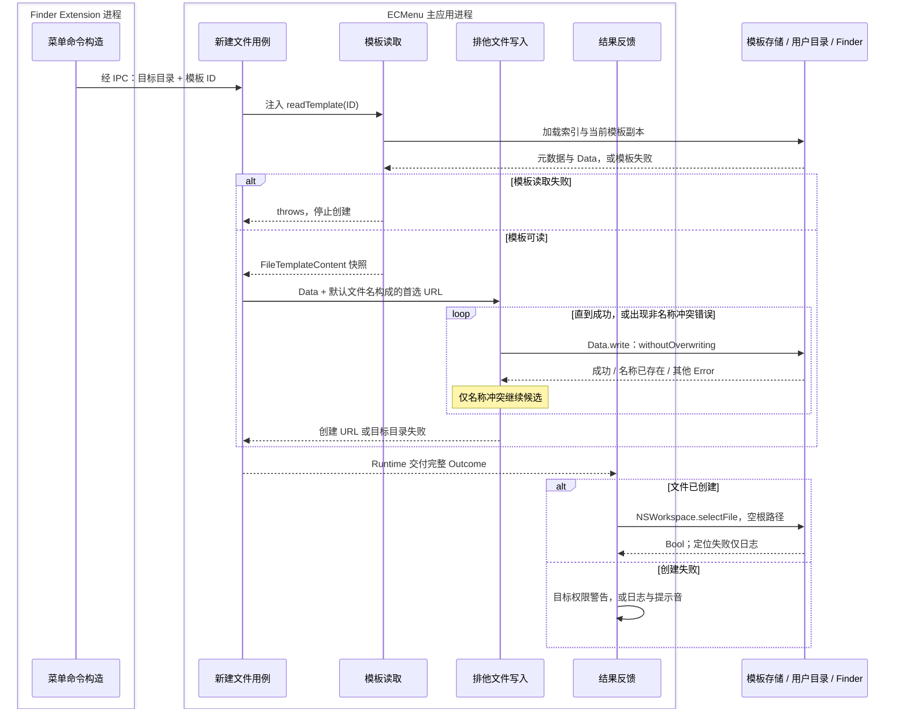

# 新建文件技术决策

产品行为见[新建文件需求](../../Requirements/Features/NewFile.md)。Finder 菜单目标、外置卷、结果选择和权限边界分别见 [Finder 菜单语义](../Platform/Finder/ContextMenus.md)、[Finder 管理位置](../Platform/Finder/ManagedLocations.md)、[Finder 结果选择](../Platform/Finder/ResultSelection.md)和[文件访问](../Platform/FileAccess.md)。

## 执行流

模板叶子依据快照中的默认文件名后缀呈现系统文件类型图标，与其他菜单项共用统一画布；查询、传输和尺寸边界见[菜单图标](../Platform/Finder/MenuIcons.md#文件类型图标)。

模板库由主应用拥有，读取边界返回元数据与独立字节快照后，本次创建不再追踪模板编辑或删除。文件写入成功是业务完成点；Finder 选择属于后续结果反馈，不改变已创建事实。

## 模块、输入输出与状态

| 职责模块 | 核心类型 | 源码入口 | 输入 → 输出 | 外部 API 与状态归属 |
|---|---|---|---|---|
| 菜单命令构造 | `CreateNewFileFeature` | [CreateNewFileFeature.swift](../../../ECMenuFinderExtension/Commands/NewFile/CreateNewFileFeature.swift) | 菜单模板项与目标事实 → CreateNewFileCommand | 纯命令构造；只携带稳定 ID 与目录，不携带模板字节或主应用库对象 |
| 新建文件用例 | `CreateNewFileHandler` | [CreateNewFileHandler.swift](../../../ECMenu/Commands/NewFile/CreateNewFileHandler.swift) | Command + 注入读取/写入/反馈 → Outcome | 协调本次快照与写入；`DispatchTime.now` 仅测量诊断耗时，不决定文件内容 |
| 模板读取 | `FileTemplateOperations`、`FileTemplateLibrary` | [FileTemplateOperations.swift](../../../ECMenu/NewFileTemplates/Application/FileTemplateOperations.swift)与[模板库](NewFileTemplates/Main.md) | 模板 ID → FileTemplateContent / throws | 权威索引与副本由模板能力拥有；Darwin open/fstat、FileHandle 与索引 API 见[存储](NewFileTemplates/Persistence.md) |
| 排他文件写入 | `NewFileWriter` | [接口声明](../../../ECMenu/Commands/NewFile/CreateNewFileHandler.swift)、[系统实现](../../../ECMenu/Commands/NewFile/NewFileWriter.swift) | Data、首选 URL → 新 URL / throws | 用 `FileCollisionNaming` 纯候选与 `Data.write` 完成排他创建，不先查询存在性 |
| 创建结果 | `CreateNewFileSuccess`、`CreateNewFileFailure`、`CreateNewFileOutcome` | [CreateNewFileResult.swift](../../../ECMenu/Commands/NewFile/CreateNewFileResult.swift) | 完成事实或系统错误 → 模板 / 目标失败，或成功 | 不可变结果；模板失败关联 ID，目标失败关联目录，不能混用权限说明 |
| 结果反馈 | `CreateNewFileFeedback`、`CreateNewFileAlertContent` | [CreateNewFileFeedback.swift](../../../ECMenu/Commands/NewFile/CreateNewFileFeedback.swift) | Outcome + 本地 UUID → Finder 选择 / 警告 / 日志 | `NSWorkspace.selectFile`、`NSAlert`、`NSSound`、`Logger`；无独立持久状态 |

## API 输入输出与失败边界

| API / 调用者 | 实际输入 → 输出 | 项目消费方式与约束 |
|---|---|---|
| 模板读取 / NewFileTemplates | ID → 默认文件名、Data / throws | 读取失败不生成空文件、不替换模板；完整 API 和初始化发布边界由模板能力说明 |
| `Data.write(to:options:)` / Writer | 完整 Data、最终候选 URL、`.withoutOverwriting` → Void / throws | 只有 `.fileWriteFileExists` 继续候选；其他失败立即保留实际目标错误 |
| `DispatchTime.now().uptimeNanoseconds` / Handler | 单次执行起止 → UInt64 时间差 | 转毫秒用于成功诊断；不构成超时或取消策略 |
| `NSWorkspace.selectFile(_:inFileViewerRootedAtPath:)` / Feedback | 新文件绝对路径、空根路径 → Bool | true 是定位请求结果，false 仅日志；不回滚文件，不指定来源窗口 |
| `CommandAlertPresenter` / `NSAlert`、`NSSound`、`Logger` | 模板或目标失败 → 一次反馈 | 仅目标权限/只读失败构造目录不可写警告，其余按日志与提示音处理；Task 已取消时 Runtime 跳过反馈 |

## 模板读取边界

新建用例通过注入的读取闭包取得 `FileTemplateContent`，包含当前元数据与独立字节快照。模板管理、持久化、打开与更换、名称编辑属于[文件模板能力](NewFileTemplates/Main.md)；模板身份的跨端约束见[模板身份与名称](NewFileTemplates/Persistence.md#模板身份与名称)。

## 不覆盖创建的证据边界

### SDK 契约

Xcode 26.6（17F113）附带的 macOS 26.5 SDK 将 `NSDataWritingWithoutOverwriting` 定义为防止替换既有文件的写入选项，并明确它不能与 `NSDataWritingAtomic` 组合（`NSData.h:25–27`）。该契约规定目标已经存在时不得覆盖，但没有公开 Foundation 使用的系统调用，也没有单独声明跨进程事务或任意写入中断下的 crash-atomic 保证。

### 项目设计与验证范围

创建流程从所选模板取得完整内容快照，按需求定义的顺序产生名称候选，每个候选直接交给 `Data.write(to:options: .withoutOverwriting)`，不先读取“可用文件名”再执行普通覆盖写入。系统报告目标已存在时继续下一个候选，其他错误立即结束。

[NewFileTests](../../../Tests/ECMenuTests/Commands/NewFile/NewFileTests.swift) 定义空模板、二进制内容、同名模板身份、候选命名、模板失效与同进程并发创建的验证。并发用例要求预先存在的文件内容不变、各次创建结果互不重名且内容完整；它只覆盖同一进程中的并发任务，不提供跨进程压力结果或 Foundation 内部原子实现的证据。产品依赖 SDK 规定的“不覆盖既有目标”结果，而不是未公开的具体实现方式。

模板导入、持久化恢复与错误状态的验证见[模板存储证据](NewFileTemplates/Persistence.md#验证与实机证据)和[应用操作证据](NewFileTemplates/Flows.md#验证证据与限制)。这些隔离测试不驱动真实 Finder，也不替代菜单加载、点击与创建后选择的运行验收。

2026-09-08 在 macOS 26.6.2（25G83）上，上述测试覆盖的二进制内容、同名模板身份、持久化失败及并发不覆盖检查通过。真实 Finder 验收确认 TXT 子菜单可创建零字节的 `untitled.txt` 和冲突后的 `untitled_copy.txt`，并在默认文件创建中确认了自动选中。菜单截图和窗口归属的证据边界见 [Finder 菜单自动截图](../FinderMenuCapture.md#模板子菜单)。

## Finder 自动选择

单一创建结果使用空根路径的 `NSWorkspace.selectFile`，请求 Finder 在 main viewer 中选中新文件。窗口与来源选择限制由 [Finder 结果选择](../Platform/Finder/ResultSelection.md)统一说明；本功能不模拟输入，也不进入重命名模式。
