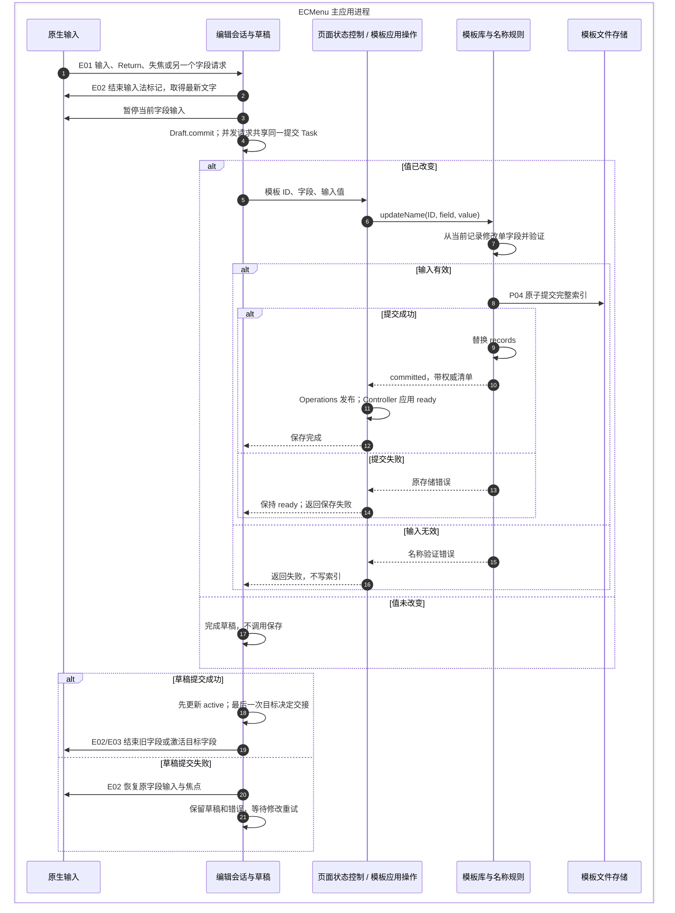

# 名称编辑与交互会话

名称编辑由模板能力的 Presentation 管理原生输入、草稿和焦点；Application 协调提交，Library actor 从当前记录更新单字段。产品交互规则见[文件模板页面](../../../Requirements/StatusPage.md#文件模板)，文件操作流程见[执行流](Flows.md#导入更换与删除)。

每行的显示名和默认文件名分别使用标准 `NSTextField`，保留系统字体、边界、背景与焦点提示。控件通过 `init(string:)` 初始化，SwiftUI 适配从 `intrinsicContentSize` 取得高度，由页面分配可用宽度。单击输入区域直接进入字段编辑；列表拖动从排序提示或非控件区域开始，具体分流见下方原生 API。

## 单字段提交与焦点交接

图中的“页面状态控制 / 模板应用操作”是呈现提交入口和应用操作的连续交接，详细职责见[模块映射](Flows.md#导入更换与删除)。只有 Library 的 `updateName` 从权威记录读取另一个字段；读取、构造有效模板和提交之间没有 actor 异步挂起点。名称修改保持模板 ID、文件引用、内部文件名和顺序，规则允许重名。

编辑会话接收保存期间的新目标，最后一次请求覆盖此前目标；这些请求共享当前草稿的同一次提交，过期请求不再交接焦点。保存挂起时，点击列表空白处产生的原生失焦也将最后目的地改为结束编辑。成功时先修改唯一 active 状态，再结束旧控件，避免旧控件同步产生的失焦通知误清除新目标。失败时原控件继续接收输入，恢复焦点产生的同步通知不另开提交；Controller 不切换 loading、不重新读取或重复发布原快照。

## 模块与状态所有权

| 职责模块 | 核心类型 | 源码入口 | 输入 → 输出；所有权 | 外部边界 |
|---|---|---|---|---|
| 原生输入：字段适配 | `FileTemplateNameTextField`、其 `Coordinator`、`FileTemplateNameNativeField` 与私有 `FileTemplateNameInputCell` | [FileTemplateNameTextField.swift](../../../../ECMenu/NewFileTemplates/Presentation/FileTemplateNameTextField.swift) | 模板 ID + 字段、会话授权与 AppKit 事件 → 系统输入框、提交/交接意图；cell 只声明字段的鼠标输入区域 | E01–E03、E05–E06；控件适配不访问模板存储 |
| 原生输入：页面背景点击 | `FileTemplateEditingBackground`、`FileTemplateEditingBackgroundView` | [背景视图与 SwiftUI 适配](../../../../ECMenu/NewFileTemplates/Presentation/FileTemplateEditingBackground.swift) | 页面外侧与底部空白点击 → `requestFinishing()`；不持有草稿 | E01；通过原生 `mouseDown` 收集点击。列表内部空白由系统 List 接收，通过字段失焦接入会话 |
| 编辑会话与草稿：焦点交接 | `FileTemplateNameEditingSession`、`FileTemplateNameControl` | [FileTemplateNameEditingSession.swift](../../../../ECMenu/NewFileTemplates/Presentation/FileTemplateNameEditingSession.swift) | 原生控件协议、保存闭包和目标请求 → Bool 交接结果 | 无直接 AppKit/文件 I/O；唯一 active 持有草稿和控件，transition 持有最后请求与 Task |
| 编辑会话与草稿：字段草稿 | `FileTemplateNameDraft`、`FileTemplateNameTarget` | [FileTemplateNameDraft.swift](../../../../ECMenu/NewFileTemplates/Presentation/FileTemplateNameDraft.swift) | 原始值、输入和保存闭包 → 保存结果、错误文字 | 无外部 I/O；拥有输入值和 idle/saving/saved 状态，重复提交共享 Task |
| 模板库与名称规则：有效名称 | `FileTemplateNameField`、`FileTemplate` | [单字段更新](../../../../ECMenu/NewFileTemplates/Domain/FileTemplateNameField.swift)、[有效模型](../../../../ECMenu/NewFileTemplates/Domain/FileTemplate.swift) | 当前模板、待修改字段和值 → 有效模板或验证错误 | 纯规则，无外部 I/O |
| 模板库与名称规则：提交 | `FileTemplateLibrary` | [FileTemplateLibrary.swift](../../../../ECMenu/NewFileTemplates/Persistence/FileTemplateLibrary.swift)的 `updateName` | ID、字段和值 → 已提交清单或提交前失败 | 通过 Storage 使用 [P04 索引提交](Persistence.md#文件-api-与完成点) |
| 文件操作会话 | `FileTemplatePageActions` | [FileTemplatePageActions.swift](../../../../ECMenu/NewFileTemplates/Presentation/FileTemplatePageActions.swift) | 文件操作意图、编辑会话 → 先完成名称再执行 | 无直接 I/O；phase 在等待名称、执行文件操作之间转移，切页不释放占用 |
| 页面与导航 | `StatusPageContent`、`NewFileTemplateSettingsPage` | [设置外壳](../../../../ECMenu/Settings/StatusPageContent.swift)、[模板页面](../../../../ECMenu/NewFileTemplates/Presentation/NewFileTemplateSettingsPage.swift) | 页面切换、后台通知、视图消失 → 请求完成编辑或更新导航 | E04；窗口会话持有编辑和文件操作对象，页面内容接收注入回调 |

模板页面通过原生列表的拖动开始回调持有 `requestFinishing()` 返回的 `Task<Bool, Never>`，完成移动时通过 `FileTemplatePageActions.perform(afterNameCommit:operation:)` 消费这一次提交的结果。名称任务已经失败时，不重新尝试保存；拖动结束只释放页面对任务的引用，不取消已发出的名称提交。系统列表通过辅助功能发起移动而没有鼠标拖动时，在移动入口请求完成名称。列表与阶段 API 见[排序呈现模块](../../Runtime/CommandMenuSettings.md#设置列表排序交互)。

草稿只拥有一个字段，不能保存整行旧副本覆盖其他最近提交的值。控件身份由模板 ID + 字段标识；同名模板不能共享一次编辑。名称输入和操作占用根据当前会话读取，不仅依赖下一轮 SwiftUI 属性更新。

## 入口、取消与后续操作

| 用户入口 | 提交与交接规则 |
|---|---|
| 单击未编辑的名称输入框 | 输入区域接收本次鼠标按下，向会话请求开始编辑 |
| Return、失焦、背景点击 | 请求完成当前草稿；背景只接收未命中前景控件的点击，失败保留原草稿 |
| 点击另一字段、保存期间改变目标 | 保存完成后进入最后一次请求的字段；失败不进入后续目标 |
| Tab / Shift-Tab | 成功后使用窗口 key-view 导航，失败不移动 |
| Escape | 无交接任务时取消草稿并恢复原值；已有交接任务时忽略，不撤回正在保存的操作 |
| 点击另一设置分类 | 等待 `finishEditing()` 成功后才切页，失败停留原页 |
| 页面消失 / 应用失去 active | 发起结束编辑任务；它是提交触发，不是同步阻止系统切换的回执 |
| 导入、打开、更换、删除 | PageActions 先完成名称；失败阻止文件操作，成功后占用持续至操作结束，包括文件选择器等待 |
| 从排序提示或行内非控件区域开始拖动 | 立即 `requestFinishing()`，按原有规则提交名称并结束编辑；名称提交不等待放下 |
| 放下到新位置 | PageActions 等待拖动开始时保存的名称提交 Task；成功后执行一次排序，失败保留原草稿与焦点，不重试保存或提交顺序 |
| 键盘或辅助功能移动 | 先请求完成名称，再通过 PageActions 执行一次移动；失败保留原草稿与焦点 |

选择器取消正常释放占用，不回滚先前已完成的名称修改。短操作进度、名称只读与操作锁分别建模；视图移除时取消延迟指示器，不取消库提交。行为验收仍以[页面需求](../../../Requirements/StatusPage.md#文件模板)为准。

排序开始与排序提交是两个输入事件。拖动取消或放回原位只结束拖动态，已经保存的名称保持生效；悬停不提交顺序。整行拖动预览、插入指示与滚动由系统 List 管理，[共用排序呈现组件](../../Runtime/CommandMenuSettings.md#设置列表排序交互)连接阶段通知、移动结果与辅助功能；模板记录的移动与持久化见[排序执行流](Flows.md#调整模板顺序)。

## 原生 API 输入输出

| 编号 / API | 输入 → 事件或结果 | 项目消费方式与约束 |
|---|---|---|
| **E01 控件事件**：`NSTextFieldDelegate` begin/change/end、`doCommandBy`，`mouseDown`、`becomeFirstResponder` | AppKit 原生编辑事件、选择器命令 → Coordinator / NativeField 回调 | 转换为会话意图；用户输入、程序化恢复和原生重入共享控件身份，不能把所有 end 通知都解释为用户离开 |
| **E02 文本与焦点**：`currentEditor()`、`NSTextView.hasMarkedText/unmarkText`、`selectText`、`setSelectedRange`、`NSWindow.makeFirstResponder` | 当前窗口 field editor、文字和选区 → 最新文本、焦点/选区状态 | MainActor；提交前结束标记并读最新文字，恢复时保留交接状态。`selectText` 可能产生同步原生通知，见下方项目观察 |
| **E03 键盘导航**：`selectKeyView(following:/preceding:)` | 当前控件和前后方向 → 窗口的 key-view 选择 | 只在保存成功后触发，不把导航请求视为存储成功回执 |
| **E04 页面生命周期**：`NotificationCenter.default.publisher(for: NSApplication.didResignActiveNotification)`、SwiftUI `onDisappear` | 应用 inactive / 页面消失 → 异步完成编辑请求 | 请求在 MainActor 会话中协调；应用/窗口变化本身不等待索引提交 |
| **E05 输入框构造与尺寸**：`NSTextField.init(string:)`、`NSView.intrinsicContentSize`、`NSViewRepresentable.sizeThatFits` | 名称文字、SwiftUI 提议宽度 → 系统输入框及适合其内容的高度 | 保留 AppKit 默认外观和字体；适配层只协调可用宽度与控件高度 |
| **E06 鼠标区域**：`NSCell.hitTest(for:in:of:)`、`NSCell.HitResult` | 鼠标事件、cell 矩形与控件 → 命中标记 | 已启用输入框的完整 cell 区域返回 `contentArea` 与 `trackableArea`，由字段直接处理文字及框内空白处的鼠标输入；区域外或已禁用时返回空命中 |

系统 field editor 的共享模型由 [Apple Cocoa Text Architecture Guide](https://developer.apple.com/library/archive/documentation/TextFonts/Conceptual/CocoaTextArchitecture/TextEditing/TextEditing.html)说明。具体事件到达顺序仍需按项目使用方式验证，不能仅从共享模型推导全部焦点行为。

外观与尺寸依据 [`NSTextField.init(string:)`](https://developer.apple.com/documentation/appkit/nstextfield/init(string:)) 和 [`intrinsicContentSize`](https://developer.apple.com/documentation/appkit/nsview/intrinsiccontentsize) 的系统控件契约。鼠标分流使用公开的 [`NSCell.hitTest(for:in:of:)`](https://developer.apple.com/documentation/appkit/nscell/hittest(for:in:of:))；Apple 的[表格事件处理说明](https://developer.apple.com/library/archive/documentation/Cocoa/Conceptual/TableView/RowSelection/RowSelection.html)解释，`NSTableView` 会检查子控件 cell 的命中类型，可编辑文字区域可能延迟 first responder 交接。AppKit SDK 的 `NSTableView.h` 进一步说明，`trackableArea` 命中不会开始行拖动。名称 cell 因此把自身范围声明为直接处理鼠标的输入区域；此适配只改变事件分流，外观仍由系统绘制。上述契约描述 AppKit 表格机制，不承诺 SwiftUI `List` 在所有版本上的内部实现或点击延迟。

## 原生焦点证据与验收

项目观察（2026-09-11，macOS 26.6.2、Xcode 26.6）：独立 Preview 中，使用标准输入框外观而保留默认 cell 命中时，真实单击到 AX 首次观察到目标字段聚焦约为 0.59 秒；完整输入区域使用 E06 命中规则后约为 0.06 秒。测量使用 30 毫秒的鼠标按下/释放间隔和 10 毫秒的 AX 轮询，包含派发和查询开销，不能视为控件内部耗时或其他系统版本的性能保证。诊断方法见[原生列表交互诊断](../../PreviewTarget.md#原生列表交互诊断)，运行标识与截图见[界面验证记录](../../Architecture/Verification.md#界面与真实-finder)。

项目观察（2026-09-08，macOS 26.6.2、Xcode 26.6）：对已经编辑的 `NSTextField` 调用 `selectText` 恢复选择时，可能同步产生结束编辑通知。因此程序化恢复期间仍属于当前交接，不能将该通知再次解释为用户离开字段。这是特定系统上的项目验证结果，不是所有 macOS 版本的通知顺序保证。

[会话测试](../../../../Tests/ECMenuTests/NewFileTemplates/Presentation/FileTemplateNameEditingSessionTests.swift)覆盖最后目标、同步重入、准备提交时的最新文字、失败恢复与取消；[草稿测试](../../../../Tests/ECMenuTests/NewFileTemplates/Presentation/FileTemplateNameDraftTests.swift)覆盖未变值不写和重复提交一次；[单字段更新测试](../../../../Tests/ECMenuTests/NewFileTemplates/Presentation/FileTemplateNameUpdateTests.swift)覆盖另一字段最新值和按 ID 更新；[隐藏窗口中的原生页面测试](../../../../Tests/ECMenuTests/NewFileTemplates/Presentation/NewFileTemplateSettingsPageTests.swift)覆盖控件身份、鼠标/键盘焦点、跨页面操作占用、背景点击和失败阻止文件操作。测试宿主的能力限制见[界面预览目标](../../PreviewTarget.md)。

2026-09-08 当前结构完整 231 项测试通过，包含上述原生控件、异步交接、提交结果与页面会话测试，详见[验证记录](../../Architecture/Verification.md)。隐藏窗口自动化不等于真实输入法与所有窗口场景的实机验收。

实机复核应在打开的文件模板页使用真实输入法，连续验证“输入中切字段、Return/Tab/Shift-Tab、保存期间再次点另一字段、保存失败继续修正、切分类和切前台应用、名称尚未完成时点文件操作”。观察应同时记录最终持久化值、原生焦点/选区和后续操作是否发生；仅看到正确文本不足以证明焦点或任务生命周期正确。
