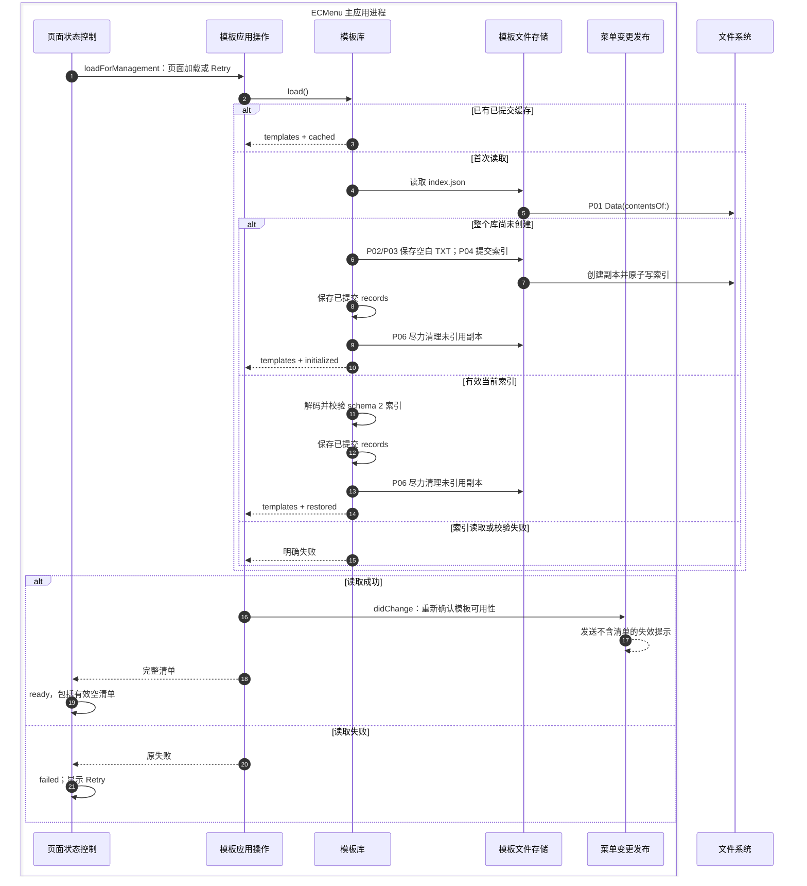
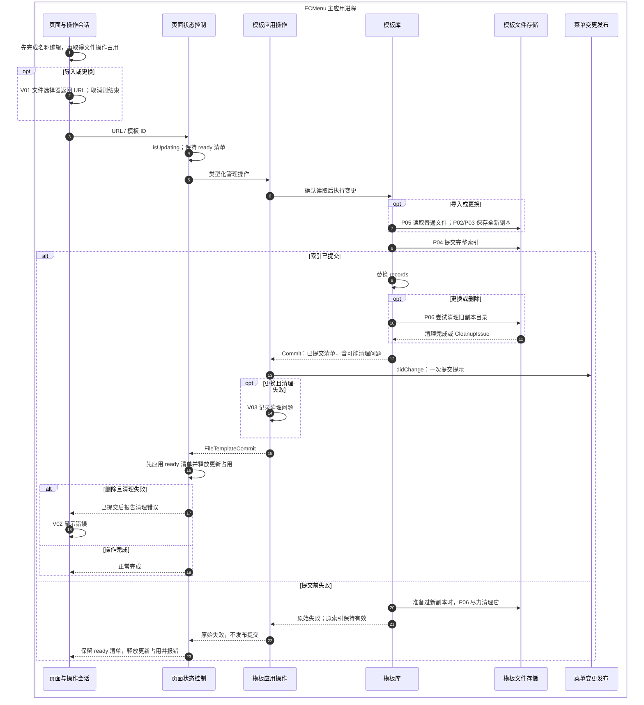
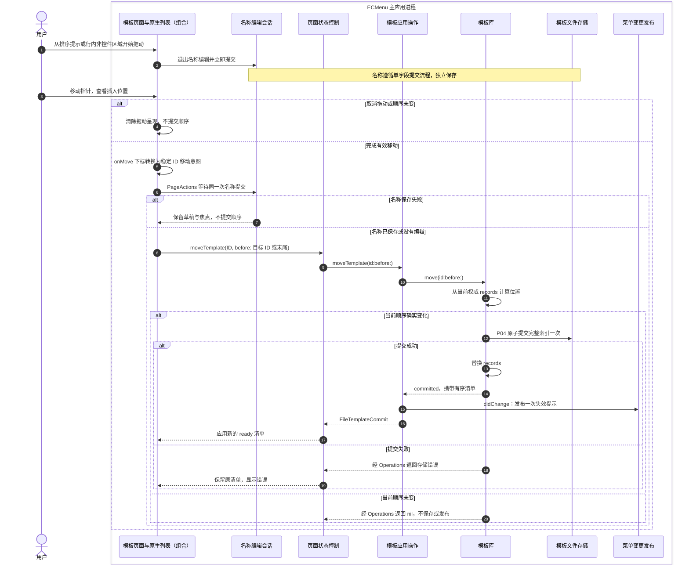
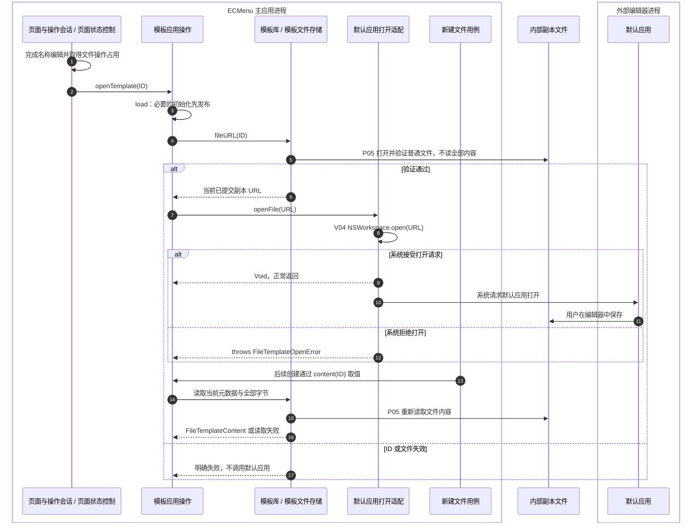

# 模板执行流与模块边界

以下流程描述当前源码的模块协作。`Controller`、`Operations`、呈现会话运行在 MainActor；`Library` actor 串行调用同步 `Storage`。AppKit、Foundation 对象仍在主应用进程内；图外的文件系统和默认编辑器分别表示存储边界与另一进程。

## 加载、初始化与显式重试

`loadIfNeeded()` 让启动和页面入口共享一个初始 Task；初始失败也保留该 Task，用户点击 Retry 才通过 `reload()` 再次读取。重试先进入 loading；库有缓存时只返回缓存，无缓存时重新读取并校验索引。初始化的成功路径同样执行维护式孤儿清理；[存储契约](Persistence.md#初始化与恢复)列出初始化失败边界。

`loadForManagement()` 成功时发送一次提示，即使本次返回缓存，或同时完成初始化；这使之前收到 `.unavailable` 的 Extension 有重新查询机会。生产的普通 `load()`、`content(for:)`、`fileURL(for:)` 只在本次首次读取实际提交了初始化时提示。后两者先完成读取发布，再读取内容或验证打开 URL；即使请求的 ID 随后无法解析，已经发生的初始化提交仍然发布。

| 读取来源 | 库返回的事实 | 普通应用读取是否提示 | 管理页成功加载/重试是否提示 |
|---|---|---|---|
| `cached` | 已提交的进程内 records | 否 | 是 |
| `restored` | 有效当前索引刚恢复 | 否 | 是 |
| `initialized` | 本次首次初始化已提交 | 是 | 是，只发一次 |

这张表只描述发布触发条件。失效提示可能丢失，且不携带配置正文；它不等于 Extension 已应用清单。通知 API、快照中 `.unavailable` 与 `.available([])` 的区分和传输完成点由[菜单配置](../../Runtime/CommandMenuSettings.md)维护。

## 导入、更换与删除

源文件读取或副本准备失败也直接走提交前失败路径，不写索引；准备过程中自身的部分写入由 Storage 尽力清理。已确认的名称提交和后续文件选择是两个完成点，取消选择不撤回名称修改。文件操作开始后没有用户取消入口，视图消失取消的只是进度指示器延迟显示任务。

| 职责模块 | 核心类型 | 源码入口 | 输入 → 输出；拥有的状态 | 外部 API |
|---|---|---|---|---|
| 页面与操作会话 | `NewFileTemplateSettingsPage`、`FileTemplatePageActions` | [页面](../../../../ECMenu/NewFileTemplates/Presentation/NewFileTemplateSettingsPage.swift)、[文件操作会话](../../../../ECMenu/NewFileTemplates/Presentation/FileTemplatePageActions.swift) | 用户意图、编辑会话 → 名称提交后执行文件操作；会话拥有 phase 和错误消息，跨页面重建保留 | V02；操作调度使用 Task，无文件 I/O |
| 文件选择器 | `FileTemplateFileChooser` | [FileTemplateFileChooser.swift](../../../../ECMenu/NewFileTemplates/Presentation/FileTemplateFileChooser.swift) | 面板标题 → 一个 URL 或取消 nil | V01 |
| 页面状态控制 | `FileTemplateController`、`FileTemplatePageState` | [Controller](../../../../ECMenu/NewFileTemplates/Presentation/FileTemplateController.swift)、[状态模型](../../../../ECMenu/NewFileTemplates/Presentation/FileTemplatePageState.swift) | 读取/修改意图 → ready/failed 页面状态；持有初始加载 Task 和更新占用 | Combine `@Published`，无存储/通知 API |
| 模板应用操作 | `FileTemplateOperations` | [FileTemplateOperations.swift](../../../../ECMenu/NewFileTemplates/Application/FileTemplateOperations.swift) | 管理意图/读取请求 → 清单、内容、URL 或 Commit；协调发布，不持有索引副本 | 调用注入边界；仅更换清理日志使用 V03 |
| 模板库 | `FileTemplateLibrary` | [FileTemplateLibrary.swift](../../../../ECMenu/NewFileTemplates/Persistence/FileTemplateLibrary.swift) | 管理意图 → 权威提交结果；唯一拥有 records，串行组合名称规则、副本准备、提交与清理 | 调用 Storage，无直接系统调用 |
| 模板名称规则 | `FileTemplate`、`FileTemplateNameField`、`FileTemplateImportNaming` | [有效模型](../../../../ECMenu/NewFileTemplates/Domain/FileTemplate.swift)、[单字段更新](../../../../ECMenu/NewFileTemplates/Domain/FileTemplateNameField.swift)、[导入命名](../../../../ECMenu/NewFileTemplates/Domain/FileTemplateImportNaming.swift) | 源文件名、现有清单或单字段值 → 有效模板/验证失败 | 纯规则，无外部 I/O |
| 模板文件存储 | `FileTemplateStorage` | [FileTemplateStorage.swift](../../../../ECMenu/NewFileTemplates/Persistence/FileTemplateStorage.swift) | 路径、Data、索引记录 → 已读取字节、已完成写入或类型化失败；拥有每次打开的 handle 生命周期 | [P01–P06](Persistence.md#文件-api-与完成点) |
| 默认应用打开适配 | `FileTemplateOpener` | [系统实现](../../../../ECMenu/NewFileTemplates/Platform/FileTemplateOpener.swift) | 内部副本 URL → 打开请求成功或失败；不持有编辑器状态 | V04 |
| 菜单变更发布 | `MenuChangePublisher` | [MenuChangePublisher.swift](../../../../ECMenu/CommandMenuSettings/Application/MenuChangePublisher.swift) | 已提交清单或可用性重新确认 → 分布式失效提示；不保存清单 | [菜单配置](../../Runtime/CommandMenuSettings.md)的 `DistributedNotificationCenter` 边界 |

## 调整模板顺序

系统 List 持有拖动预览与插入提示，不提前改写 Controller 或 Library 的已提交顺序。开始拖动触发的名称保存独立完成；`onMove` 产生稳定 ID 移动意图后，通过 `FileTemplatePageActions` 等待同一名称提交，成功后执行排序，失败时保留名称错误与编辑焦点，不提交顺序。顺序操作从 Library 的最新记录移动模板，因此保留已提交名称与文件引用。取消排序不撤销名称提交；名称焦点与失败反馈见[编辑会话](Editing.md#入口取消与后续操作)。

图中的“模板页面与原生列表（组合）”由 [NewFileTemplateSettingsPage](../../../../ECMenu/NewFileTemplates/Presentation/NewFileTemplateSettingsPage.swift)、`FileTemplatePageActions`、共用 `SettingsReorderList` 与 `SettingsReorderHandle` 组成。列表将系统移动下标转换为稳定 ID；源码映射与拖动、键盘、辅助功能 API 输入输出由[设置列表排序交互](../../Runtime/CommandMenuSettings.md#设置列表排序交互)维护。本页面连接名称提交与模板移动业务回调。

排序调用沿用上方页面状态控制、模板应用操作、模板库、存储与发布模块。`FileTemplateController.moveTemplate(id:before:)` 持有本次更新占用，接收提交结果后更新 ready；`FileTemplateOperations.moveTemplate(id:before:)` 仅对实际 Commit 发布；`FileTemplateLibrary.move(id:before:)` 在 actor 当前记录中按 ID 移位，nil 目标表示末尾，顺序未变返回 nil。模板或目标 ID 已不存在时返回 `templateNotFound`。排序只调用 [P04 索引提交](Persistence.md#文件-api-与完成点)，不读取或修改内部副本文件。

## 打开内部副本与外部编辑

“后续创建”由[新建文件用例](../NewFile.md)调用，不依赖管理页继续存在。打开本身不提交索引、不设置 Controller 的 `isUpdating`，仍受文件操作会话占用约束。`FileTemplateOpener` 只请求系统打开文件；外部应用如何显示、编辑与保存不属于它的完成回执。返回 URL 到默认应用重新打开之间也不是文件锁定事务。[外部内容边界](Persistence.md#文件打开与更换)说明并发保存和旧 URL 的影响。

| API / 调用者 | 实际输入与输出 | 完成点、失败与约束 |
|---|---|---|
| **V01** FileChooser：`NSOpenPanel.beginSheetModal(for:)` / `begin` | 标题、当前 key window；只选一个文件，禁止选目录，包按目录浏览 → `ModalResponse`，`.OK` 读取 `panel.url` | MainActor；其他响应返回 nil，`.OK` 缺 URL 属于实现不变量错误。面板只收集选择，普通文件验证交给 Storage |
| **V02** 页面：SwiftUI `.alert` | 操作会话中的本地化错误消息 → 用户可关闭的提示 | 主应用呈现状态，不改变已经提交的索引；名称错误由草稿旁文字呈现 |
| **V03** Operations：`Logger.error` | 更换已提交后的 `FileTemplateCleanupIssue.localizedDescription` → 日志 | 无业务成功回执，不撤回提交；原清理问题仍包含在返回 Commit 中 |
| **V04** [FileTemplateOpener](../../../../ECMenu/NewFileTemplates/Platform/FileTemplateOpener.swift)：`NSWorkspace.shared.open(URL)` | 当前内部副本 URL → Bool | MainActor；false 转 `couldNotOpen`，true 表示系统打开请求成功，不表示编辑器已经显示或保存。使用同步 Bool 变体，见 [Apple API](https://developer.apple.com/documentation/appkit/nsworkspace/open(_:)) |

图中的读取、提交、验证和清理 API 统一在[存储表 P01–P06](Persistence.md#文件-api-与完成点)展开；默认编辑器没有由 ECMenu 调用的保存 API。

## 状态所有权

| 状态 | 唯一所有者与生命周期 | 更新/消费边界 |
|---|---|---|
| 已提交模板记录 | Library actor，主应用进程级 | 首次恢复与索引提交成功后更新；内容字节每次读取 |
| 页面 ready/failed 与初始加载 Task | Controller，配置窗口使用的呈现模型 | 读取结果或 Commit 更新；存储失败保持原 ready |
| 文件操作 phase 与错误 | PageActions，状态页窗口会话 | 先结束名称、再选择/执行，defer 释放；页面切换不释放占用 |
| 字段草稿、提交 Task 与最后目标 | NameDraft / NameEditingSession，状态页窗口会话 | [名称编辑流程](Editing.md)控制焦点与结果 |
| 拖动预览、插入位置与滚动 | 系统 List，一次原生拖动期间 | 完成移动通过 onMove 输出下标；共用组件转换为稳定 ID，不修改业务清单 |
| 拖动开始时的名称提交引用 | 模板页面持有名称 Task 引用，一次拖动期间 | 完成移动消费同次名称结果后调用业务移动；结束时释放引用，不取消名称任务 |
| `FileTemplateContent` | 单次调用返回的不可变值 | 新建文件用例消费，不暴露库路径 |
| 读取来源与 Commit | 一次调用的不可变事实 | Operations 决定是否发布；不另存可变“需要发布”标记 |
| 菜单副本 | Finder Extension 的 Replica | 经 IPC 整体应用，仅含 ID 与显示名；不承担模板持久化 |

## 验证证据与限制

[应用操作测试](../../../../Tests/ECMenuTests/NewFileTemplates/Application/FileTemplateOperationsTests.swift)覆盖初始化提示一次、普通缓存查询不提示、管理加载/重试提示、内容请求失败前仍发布已发生的初始化，以及打开入口恢复当前索引后调用注入的打开适配。[Controller 测试](../../../../Tests/ECMenuTests/NewFileTemplates/Presentation/FileTemplateControllerTests.swift)覆盖共享初次加载、失败后显式重试、提交失败保持 ready、删除清理失败先显示已删除清单、更换清理失败保持成功。

[排序测试](../../../../Tests/ECMenuTests/NewFileTemplates/Presentation/FileTemplateOrderingTests.swift)贯穿 Controller、Operations 与 Library，验证移动到指定项前或末尾、重启恢复、已提交名称与内容引用保留、原位不写不发布，以及提交失败保留原顺序并可重试。该测试不驱动鼠标、滚动或原生名称编辑焦点。

提交结果与发布入口的完整测试结果见[验证记录](../../Architecture/Verification.md)。已有真实系统观察见[存储证据](Persistence.md#验证与实机证据)和[原生焦点证据](Editing.md#原生焦点证据与验收)。通知实际到达、默认编辑器真实显示/保存、输入法与窗口切换仍需要对应实机验收。
