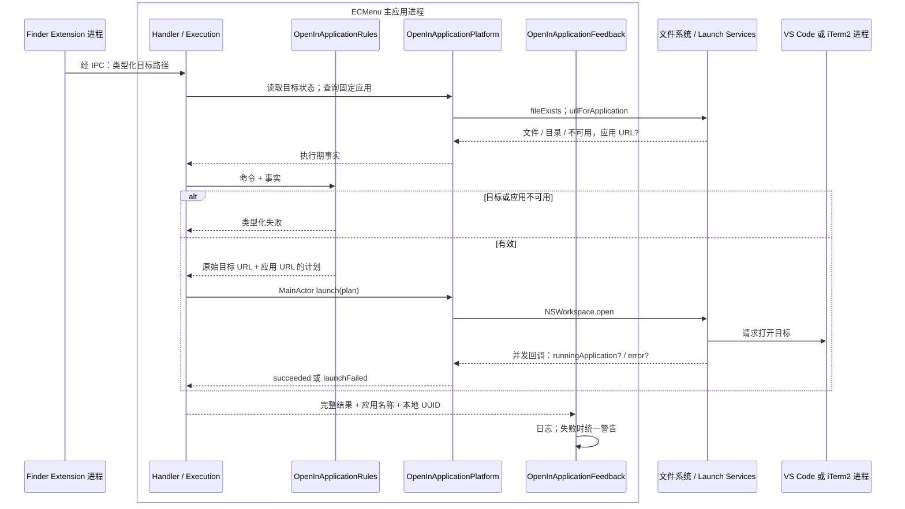

# 进入外部应用

能力范围是把一个 Finder 原始目标交给固定的 VS Code 或 iTerm2 应用。命令类型分别声明目标种类和应用身份。产品行为见[需求](../../Requirements/Features/OpenInApplications.md)，Finder 场景解释见[菜单语义](../Platform/Finder/ContextMenus.md)。

## 执行流

成功表示系统打开请求成功回调；不表示编辑器已完成项目加载或终端已完成工作目录切换。`NSWorkspace` 是进程内 SDK 适配，实际打开请求交给系统服务与外部应用。

## 模块、输入输出与状态

| 模块 / 源码入口 | 输入 → 输出 | 状态 / 外部调用 |
|---|---|---|
| [OpenInApplicationFeatures](../../../ECMenuFinderExtension/Commands/OpenInApplication/OpenInApplicationFeatures.swift) | 单个目标事实 → 专用 Command? | 纯条件；上下文读取与应用查询由菜单公共边界提供 |
| [OpenInApplicationRules](../../../ECMenu/Commands/OpenInApplication/Domain/OpenInApplicationRules.swift) | 命令 + 目标状态 + 应用 URL? → Plan / Failure | 无 I/O；iTerm2 只接受目录，VS Code 接受存在的文件或目录 |
| [Handlers](../../../ECMenu/Commands/OpenInApplication/Application/OpenInApplicationHandlers.swift)、[Execution](../../../ECMenu/Commands/OpenInApplication/Application/OpenInApplicationExecution.swift) | 命令、注入平台 → Outcome | 单次调用保存不可变事实/计划；等待系统回调，不保存另一份应用状态 |
| [OpenInApplicationSystem](../../../ECMenu/Commands/OpenInApplication/Platform/OpenInApplicationSystem.swift) | 路径、应用声明、计划 → 事实 / 打开结果 | FileManager、NSWorkspace 和 continuation；实际输入输出见下表 |
| [AlertContent](../../../ECMenu/Commands/OpenInApplication/Presentation/OpenInApplicationAlertContent.swift)、[Feedback](../../../ECMenu/Commands/OpenInApplication/Presentation/OpenInApplicationFeedback.swift) | Outcome、应用名、UUID → 固定失败说明 / 日志 | 纯文案与 `NSAlert`、`Logger`；成功不增加反馈窗口 |

没有业务持久化状态。Extension 与主应用各自查询应用可定位性，应用安装/移动/删除可以发生在菜单和执行之间；执行必须重新查询。

## API 契约与能力边界

| API | 实际输入 → 输出 | 失败与消费方式 |
|---|---|---|
| `FileManager.fileExists(atPath:isDirectory:)` | 绝对路径与 Bool 输出指针 → exists、isDirectory | 跟随符号链接检查最终对象，断链不可用；执行仍保留原始 URL |
| `NSWorkspace.urlForApplication(withBundleIdentifier:)` | 命令声明的固定 bundle ID → URL? | nil 表示无法定位应用；不依赖显示名称或 PATH |
| [`NSWorkspace.open(_:withApplicationAt:configuration:completionHandler:)`](https://developer.apple.com/documentation/appkit/nsworkspace/open%28_%3Awithapplicationat%3Aconfiguration%3Acompletionhandler%3A%29) | 单元素目标 URL 数组、应用 URL、默认 OpenConfiguration → 异步回调 | 本项目在 MainActor 发起；SDK 回调在并发队列。error 冻结为 launchFailed，无 error 为 succeeded；不使用回调的应用对象 |
| `withCheckedContinuation` | 一次系统完成回调 → Outcome | 等待该次打开请求；Task 取消不能撤回已经提交的系统打开请求，Router 可跳过后续反馈 |
| `NSAlert` / `Logger` | 失败、应用名、UUID → 警告和诊断 | 诊断保留目标与系统错误；用户说明保持命令级语义 |

macOS 26.5 SDK `NSWorkspace.h` 明确异步打开回调的队列和成功/失败参数。调用使用 Launch Services，不构造 shell 或 CLI 字符串。package 按文件系统目录事实处理，没有额外读取 Finder package 标记。

## 验证与实机证据

[OpenInApplicationTests](../../../Tests/ECMenuTests/Commands/OpenInApplication/OpenInApplicationTests.swift)覆盖目录约束、目标消失、应用消失、原始 URL 保留和注入启动失败。自动化不启动用户的编辑器或终端。

VS Code 是否复用窗口、iTerm2 是否将目录作为工作目录是外部应用验收边界。实机复验应记录 macOS、VS Code 与 iTerm2 版本，以普通目录、package 和符号链接分别执行；现有技术记录没有完整的外部应用版本矩阵，不将回调成功当作这些行为的实测证明。
