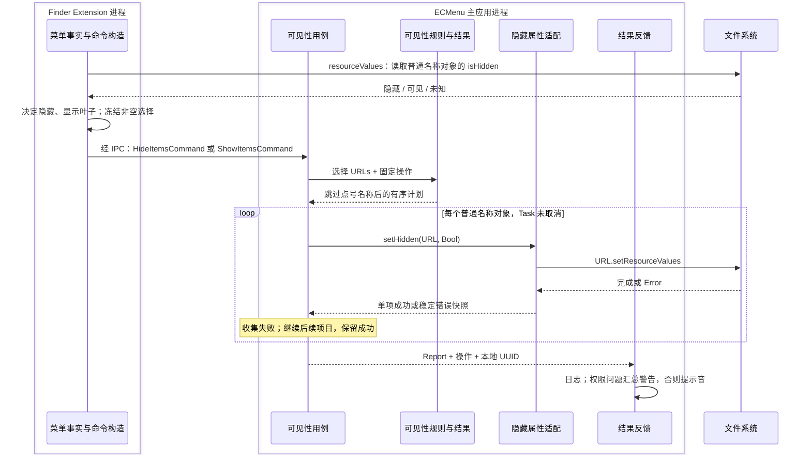

# 隐藏项目与显示项目

能力范围是修改所选对象自身的隐藏属性，两个命令共享规则、执行器与反馈。产品行为见[需求](../../Requirements/Features/Visibility.md)，Finder 场景与菜单组装见[菜单语义](../Platform/Finder/ContextMenus.md)。

## 执行流

单项属性写入返回后即完成该项。整批报告包含成功数量与逐项失败，不提供回滚；Task 生命周期取消在相邻对象间停止，Router 随后跳过反馈。Extension 菜单阶段不预检写权限。

## 模块、输入输出与状态

| 职责模块 | 核心类型 | 源码入口 | 输入 → 输出 | 外部边界与状态 |
|---|---|---|---|---|
| 菜单事实与命令构造 | `VisibilityMenuFactsReader`、`VisibilitySelectionMenuFacts`、`HideItemsFeature` / `ShowItemsFeature` | [事实读取](../../../ECMenuFinderExtension/Commands/Visibility/VisibilityMenuFactsReader.swift)、[纯汇总](../../../ECMenuFinderExtension/Commands/Visibility/VisibilityMenuFacts.swift)、[菜单命令](../../../ECMenuFinderExtension/Commands/Visibility/VisibilityFeatures.swift) | items 选择 → 隐藏事实 → 菜单命令 | `URL.resourceValues`；未知/点号不促成叶子出现，混合状态可同时出现两个命令 |
| 可见性规则与结果 | `VisibilityRules`、`VisibilityPlan`、`VisibilityReport` | [VisibilityRules.swift](../../../ECMenu/Commands/Visibility/Domain/VisibilityRules.swift) | 选择与操作 → 不含点号名称的计划 | 纯规则；计划和结果是本次执行的不可变值 |
| 可见性用例 | `VisibilityHandler<Command>`、`VisibilityExecution` | [VisibilityHandlers.swift](../../../ECMenu/Commands/Visibility/Application/VisibilityHandlers.swift)、[VisibilityExecution.swift](../../../ECMenu/Commands/Visibility/Application/VisibilityExecution.swift) | 命令、注入平台能力 → Report | 命令类型固定 hide/show；执行器拥有本批成功计数与失败集合，逐项检查 Task 取消 |
| 隐藏属性适配 | `VisibilityPlatform` | [接口声明](../../../ECMenu/Commands/Visibility/Application/VisibilityExecution.swift)、[系统实现](../../../ECMenu/Commands/Visibility/Platform/VisibilitySystem.swift) | URL + 目标 Bool → 完成 / throws | Foundation 资源属性写入；无独立缓存 |
| 结果反馈 | `VisibilityAlertContent`、`VisibilityFeedback` | [VisibilityAlertContent.swift](../../../ECMenu/Commands/Visibility/Presentation/VisibilityAlertContent.swift)、[VisibilityFeedback.swift](../../../ECMenu/Commands/Visibility/Presentation/VisibilityFeedback.swift) | Report + 操作 → 文案与反馈 | 纯文案分类；`Logger`、`NSAlert`、`NSSound` 通过[统一反馈](../Runtime/CommandExecution.md)呈现 |

没有持久化配置副本；文件系统拥有最终隐藏属性，任务只保存本次执行事实。`VisibilityIssue` 从底层错误快照推导错误类别，避免重复状态。

## API 契约与设计依据

| API | 实际输入 → 输出 | 约束与失败 |
|---|---|---|
| `URL.resourceValues(forKeys: [.isHiddenKey])` | 普通名称对象 URL → Bool? / throws | Extension 把读取失败作为未知，只影响菜单可用性 |
| [`URLResourceValues.isHidden`](https://developer.apple.com/documentation/foundation/urlresourcevalues/ishidden)、`URL.setResourceValues` | 原始 URL + hide=true / show=false → Void / throws | 修改选中对象；成功才增加计数。权限与只读错误进入汇总警告，其余问题日志加提示音 |
| `Task.isCancelled` | 当前任务 → Bool | 每项开始前查询；不强制中断正在执行的同步属性写入 |
| `NSAlert` / `NSSound` / `Logger` | 类型化报告与 UUID → 一次反馈 | 有权限警告时不再额外播放提示音；成功静默 |

macOS 26.5 SDK `NSURL.h:226` 声明隐藏资源键可读写，同时明确点号名称引起的隐藏不能通过设为 false 消除。因此点号对象在“不重命名”的能力边界内跳过，不计为成功。

项目真实文件测试表明，写符号链接 URL 的隐藏属性修改链接自身，不修改链接目标；目录属性写入不递归。这是已测系统和样本中的项目观察，不扩大为所有文件系统实现的承诺。

## 验证与实机证据

[VisibilityTests](../../../Tests/ECMenuTests/Commands/Visibility/VisibilityTests.swift)覆盖普通文件、目录、符号链接、点号过滤、非递归写入、权限错误分类及单项失败后继续。[Finder 菜单组合测试](../../../Tests/ECMenuFinderExtensionTests/Menu/ContextMenuCompositionTests.swift)覆盖背景/侧边栏排除、未知状态与混合选择。

已有项目观察为上述文件样本；原有记录未单独提供文件系统与 OS 版本矩阵，因此不据此保证其他卷行为。实机复验应记录 macOS 与目标卷类型，在 Finder 检查隐藏/显示前后对象、链接目标和目录子项。完整自动化入口见[命令执行](../Runtime/CommandExecution.md#验证入口)。
