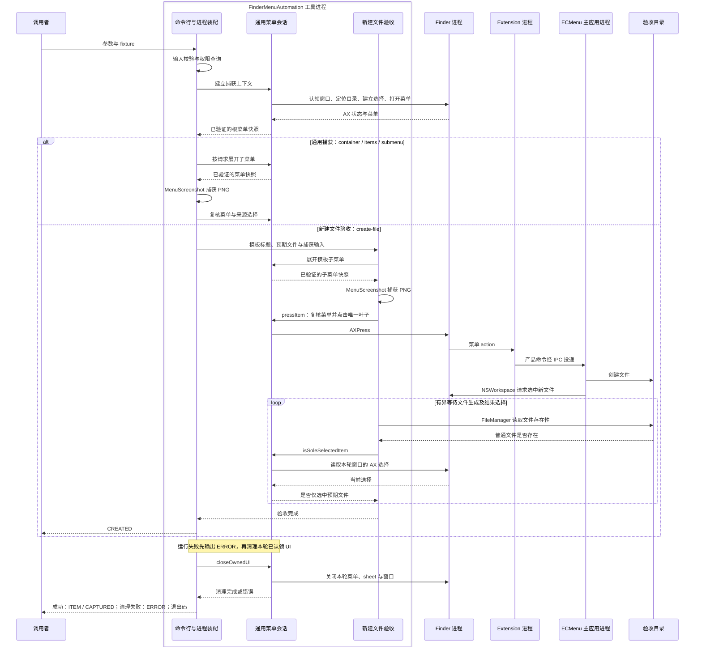

# Finder 菜单自动截图

运行入口见[开发脚本](../../scripts/Main.md#finder-菜单截图)，生产菜单语义见[菜单语义](Platform/Finder/ContextMenus.md)。本文记录真实 Finder 菜单自动化中无法从单个源码位置恢复的平台事实、设计边界和失败经验。通用证据范围见[平台边界](Platform/Main.md)。

## 核心结论

- 截图对象必须是 Finder host 正在显示的真实菜单；重建相似界面不能验证 Extension 的实际菜单链路。
- Accessibility 负责交互、所有权和状态验证，ScreenCaptureKit 只捕获已经确认的独立菜单窗口。生产 Finder Extension 不包含截图分支。
- Finder 是全局、异步 GUI 状态。可靠性来自“动作前订阅、精确认领、截图前后验证、只清理本轮 UI”，不能来自固定等待或对前台窗口的猜测。
- 场景按业务所有权拆分：通用上下文在 `Contexts/`，命令特有的场景或期望在各自 `Features/`，Composition 只聚合，通用 `Support/` 不知道具体命令。
- 完整菜单的语言有两个所有者：Finder 解析原生项目，Finder Extension 解析 ECMenu 项目。双语截图在测试编排边界同时设置 Finder 与 Debug containing app 的按应用语言，重启进程后验证真实菜单；生产 Extension 不接受测试语言参数。

## 执行流与源码映射

流程图概括捕获与执行验收的协作；原生窗口和菜单始终由通用会话持有。`CREATED` 表示验收已观察到文件与选择，`CAPTURED` 在会话清理成功后输出；运行中发生的错误和后续清理错误分别输出 `ERROR`。权限预检与窗口枚举是同一工具的独立命令。

| 职责模块 | 核心类型 / 实现 | 源码入口 | 输入、输出与状态 / API |
|---|---|---|---|
| 命令行与进程装配 | `CLICommand`、`FinderMenuAutomationMain` | [命令解析](../../Tests/FinderMenuCapture/FinderMenuAutomationCommand.swift)、[程序入口](../../Tests/FinderMenuCapture/FinderMenuAutomation.swift) | 参数 → 类型化操作；连接通用捕获与能力验收，通过 `FileHandle.standardOutput` 输出带 Base64 字段的记录，以退出码表示整次操作结果 |
| 通用捕获输入 | `FinderMenuCaptureInput` | [输入校验](../../Tests/FinderMenuCapture/Support/FinderMenuCaptureInput.swift) | 路径参数 → 输出 URL 与合法上下文；`FileManager` 检查 fixture、同目录选择和未占用的 PNG 输出路径，失败发生在 UI 操作前 |
| 权限边界 | `PermissionReport` | [权限查询](../../Tests/FinderMenuCapture/Support/FinderAutomationPermissions.swift) | 查询 / 显式授权请求 → AX 与屏幕录制事实；`AXIsProcessTrusted`、`AXIsProcessTrustedWithOptions`、`CGPreflightScreenCaptureAccess`、`CGRequestScreenCaptureAccess`；仅 preflight 可以请求授权 |
| 通用菜单会话 | `FinderMenuSession`、`AXClient`、输入与窗口适配 | [会话](../../Tests/FinderMenuCapture/Support/FinderMenuSession.swift)、[AX 操作](../../Tests/FinderMenuCapture/Support/FinderAccessibility.swift)、[键盘](../../Tests/FinderMenuCapture/Support/FinderKeyboard.swift)、[指针](../../Tests/FinderMenuCapture/Support/FinderPointer.swift)、[窗口清点](../../Tests/FinderMenuCapture/Support/FinderWindowInventory.swift) | 上下文 → 已验证菜单快照、点击及选择事实；会话唯一持有 AX 对象和清理状态。AppKit 激活、AX 观察/动作、CGEvent 输入的约束见下方平台契约与稳定协议 |
| 图像捕获 | `MenuScreenshot` | [截图实现](../../Tests/FinderMenuCapture/Support/MenuScreenshot.swift) | 一个或父子两个菜单快照 → PNG / 错误；ScreenCaptureKit 匹配窗口并捕获、ImageIO 编码，完成后仍由调用者复核菜单 |
| 新建文件验收 | `NewFileMenuAcceptance` | [验收请求与执行](../../Tests/FinderMenuCapture/Features/NewFile/NewFileMenuAcceptance.swift) | 模板标题、预期文件名与 fixture → 文件生成且被选中 / 明确失败；复用通用截图与会话点击，`FileManager.fileExists` 与 AX 选择观察在有界等待内验证结果 |
| 通用值与失败 | `FinderMenuContext`、`MenuSnapshot`、`AutomationFailure` | [共享值](../../Tests/FinderMenuCapture/Support/FinderMenuCaptureTypes.swift) | 不可变上下文、菜单几何和标题、失败及等待策略；无权限请求或具体产品命令逻辑 |
| 场景与语言编排 | shell Composition、各 Context / Feature、语言注册表 | [场景装配](../../Tests/FinderMenuCapture/FinderMenuCaptureComposition.sh)、[新建文件场景](../../Tests/FinderMenuCapture/Features/NewFile/NewFileCaptureExpectations.sh)、[语言定义](../../Tests/FinderMenuCapture/Languages/CaptureLanguages.sh)、[脚本入口](../../scripts/capture-finder-menus.sh) | 场景 / 语言 → fixture、菜单期望与串行捕获；持有进程锁、语言保存与恢复事务，具体能力期望归各自 Feature |

工具 target 的文件系统同步组覆盖 `Tests/FinderMenuCapture/` 中的 Swift 实现，shell 定义由脚本加载并从 target 成员中排除。输入验证、权限与会话属于开发工具，产品实现仍由各业务 spec 描述。

## 已排除的方案

| 方案 | 失败原因与保留结论 |
|---|---|
| 按屏幕矩形截图，再裁切到菜单边界 | 半透明菜单已经与后方 Finder 或桌面合成；裁切不能恢复窗口 alpha。必须捕获菜单自身的独立窗口。 |
| 重建菜单，或向顶层 ContextMenu、生产 Extension 注入截图场景 | 无法证明 Finder host 的真实结果，也会把命令特有逻辑扩散到组合层。截图定义留在测试侧，命令期望归所属 Feature。 |
| 复用当前窗口、按路径或单次 focused 状态推断所有权 | 容易操作或关闭用户窗口，也曾造成超时和窗口遗留。窗口必须从触发前注册的 created notification 中认领，并验证精确 AX 身份。 |
| Finder 激活后无条件调用带 Command-N 快捷键的菜单项 | Finder 在“未激活且零窗口”时会因激活自行创建窗口；再次新建会多开窗口。该初始状态必须直接认领激活产生的窗口。 |
| 动作后才观察，或把 `cannotComplete` 当作失败后重试 | 会错过短暂通知，或重复执行其实已经发生的动作。先注册 observer，再观察 UI 事实。 |
| 用通用 `AXConfirm`、默认按钮或取消按钮替换 Return/Escape | “前往文件夹”sheet 在验证环境中没有稳定、唯一且能完成同一流程的控件。保留严格焦点约束下的 Return/Escape，不为形式上的纯 AX 改写已验证路径。 |
| 直接写入项目多选，或不限制范围地调用带 Command-A 快捷键的菜单项 | Finder 项目视图不稳定接受直接写入的选择；全选还可能带入非场景文件。先点击并验证首项，只在 fixture 覆盖目录全部项目时调用 Finder 的全选 action，随后读取 `AXSelectedChildren` 验证。 |
| 菜单出现后立即截图，或只隐藏截图光标 | 隐藏光标不会清除已有 hover，菜单也可能尚未稳定。先把指针移出菜单，再取得连续一致的菜单快照。 |
| 用 `open -g Finder.app` 兜底启动 Finder | `-g` 只控制前台激活，仍会发送应用打开事件；零窗口时实测创建了默认主目录窗口。通过用户级 launchd service 重启 Finder，并把零窗口作为后置条件。 |
| 给截图 helper 传入 `-AppleLanguages` | 只改变 helper 自身；Finder 与系统启动的 Extension 是另外两个进程，真实菜单语言不变。 |
| 只修改 Finder、只修改 Extension，或写 Extension 自身偏好域 | 只修改一侧会产生混合语言菜单；PluginKit 注入的 Extension `-AppleLanguages` 位于优先级更高的 argument domain。当前项目按 containing app 的应用语言驱动 Extension，不增加无效的 Extension 偏好写入点。 |
| 修改全局 `AppleLanguages`、`AppleLocale`，或加入生产 locale 注入 | 全局修改会影响用户会话；生产注入只能改变 ECMenu 项目，也绕过真实系统语言选择。截图只使用可恢复的按应用偏好事务。 |

## 平台契约

Xcode 26.6 附带的 macOS 26.5 SDK 声明：

- `AXWindowCreated`、`AXSheetCreated`、`AXMenuOpened` 和 `AXMenuClosed` 通知分别携带对应的 Accessibility element（`AXNotificationConstants.h:108–116, 162–165, 208–220`）。
- `AXUIElementPerformAction` 返回 `cannotComplete` 时，动作可能已进入目标应用的模态处理，并不证明动作失败（`AXUIElement.h:315–331`）。
- `SCContentFilter.initWithDesktopIndependentWindow` 只捕获传入的独立窗口（`SCStream.h:142–146`）。`SCScreenshotConfiguration` 默认按被捕获内容的像素尺寸输出，`ignoreShadows` 控制是否忽略窗口阴影，子窗口默认包含（`SCScreenshotManager.h:45–89`）。
- `SCScreenshotManager.captureScreenshot` 从 macOS 26.0 起按 filter 和 configuration 返回 `SCScreenshotOutput`，其中包含所请求的 SDR 或 HDR `CGImage`（`SCScreenshotManager.h:102–124, 163–178`）。
- `SCContentFilter(display:including:)` 捕获指定窗口集合，并排除桌面与程序坞。`SCStreamConfiguration.sourceRect` 使用显示器逻辑点坐标，输出宽高使用像素；`ignoreShadowsDisplay` 可排除阴影。`SCScreenshotManager.captureImage` 接收 filter 和 configuration，返回 `CGImage`（`SCStream.h:157–162, 262–274, 312–315`；`SCScreenshotManager.h:145–152`）。

## 项目观察

以下结论于 2026-09-04 在 macOS 26.6.1（25G76）、Xcode 26.6（17F113）下验证，不代表 Apple 对未来版本的承诺：

- Finder 右键菜单同时暴露为 `AXMenu` 和可分享的 `SCWindow`。按“在屏幕上、Finder PID、AX 菜单 frame”联合匹配并要求唯一，可以定位菜单窗口；标题和窗口枚举顺序不适合作为身份。
- desktop-independent filter 的 PNG 保留菜单窗口自身的 alpha，不包含 Finder 窗口或桌面背景。项目显式忽略阴影、排除子窗口并输出 SDR PNG。
- 新创建的 AX element 可能短暂返回 `cannotComplete`、属性未就绪或 element 已失效；通知负责保留对象身份，连续观测负责确认状态稳定，不能把所有错误静默重试。
- Finder 不活跃且没有窗口时，激活本身会创建第一个窗口。“前往文件夹”sheet 未稳定暴露可替代 Return/Escape 的 confirm/default/cancel 路径。隐藏截图光标不会清除菜单已有的蓝色 hover。
- 英文与简体中文各四个场景的完整连续运行都得到具有 alpha、无背景、无 hover 的图片；在初始没有 Finder 窗口时，语言切换、每个场景和最终恢复后均为零窗口。
- Finder Extension 由 PluginKit 启动时，命令行包含系统注入的 `-AppleLanguages`。本机另一个具有按应用语言设置的 PluginKit 扩展得到 containing app 的语言数组，而扩展自身偏好域没有该键；据此推断 ECMenu 应修改 Debug containing app，而不是 `.finderext` 的应用域。运行时仍以当前目标语言的真实 Finder 与 ECMenu 菜单标题作为最终判据。

### 模板子菜单

2026-09-08 在 macOS 26.6.2（25G83）、Xcode 26.6（17F113）下，简体中文 TXT 子菜单完成独立窗口截图、叶子点击及零字节 `untitled.txt` 创建；helper 的 AX Finder 普通窗口计数在验收前后均为零。这是该环境中的实测结果。

AX 子节点已有 frame 不能独立证明子菜单已经显示。模板子菜单在悬停前订阅通知，只接受本次 `AXMenuOpened` 携带的对应子菜单，再等待其 frame 与标题稳定。AX 菜单状态和 ScreenCaptureKit 窗口公布按异步边界处理：初次枚举未命中时，在两秒预算内重新枚举，始终要求屏幕可见、Finder PID 和精确 frame 唯一匹配；超时报告 AX frame 与候选窗口信息。这是项目的等待策略，不是 Apple 对两个 API 同步时序的保证。

`new-file-submenu` 场景通过 `FinderMenuAutomation submenu` 只展开和拍摄，不点击模板。输入为目录、父菜单标题与 PNG 输出路径；输出同时保留主菜单和一级模板子菜单。截图边界接收两个已验证的菜单快照，分别匹配 `SCWindow`，在同一显示器上只捕获这两个窗口，以二者包围矩形作为输出范围，背景透明，保持实际相对位置。截图后同时复核父子菜单，再关闭本轮 UI。

2026-09-09 在 macOS 26.6.2（25G83）、Xcode 26.6（17F113）下，英文和简体中文均完成父子菜单联合截图；图片保留透明背景，没有包含后方 Finder 窗口或桌面，语言恢复后 Finder 普通窗口计数为零。证据限于同一显示器上的一级子菜单。

macOS 或 Xcode 升级后，至少重新验证 Finder 的 AX 树、激活时的窗口行为、菜单 `SCWindow` 匹配、透明度与截图边界，以及“前往文件夹”sheet 的交互路径。

## 双语语言事务

截图语言注册表显式对应产品语言 ID、Finder 资源名和一个 Finder 原生菜单标志项；当前为 `en` 与 `zh-Hans`，其中后者对应 Finder 的 `zh_CN.lproj`。不能用资源目录名称的字符串相等替代平台语言匹配。未知语言在任何进程或偏好变化前失败。

运行只修改 `com.apple.finder` 与从当前 Debug 构建产物解析出的 containing app bundle identifier 的 `AppleLanguages` 键。修改前分别保存“键不存在”或原字符串数组，不导入、恢复或删除整个偏好域；全局语言、`AppleLocale`、Release 和 Extension 自身偏好均不修改。正常结束、失败和中断都恢复两个键，再重启 Finder 和 Extension 使原状态实际生效。

语言是外层批次，场景是内层批次：构建、登记、fixture 和权限预检只执行一次；主应用在准备阶段启动后保持同一 PID。每种语言写入并读回两个偏好键，重启 Finder 与 Extension 后，再连续截取全部选定场景。Extension 的新 PID、精确可执行路径和 `-AppleLanguages` 参数只作为进程代际证据；每张截图必须同时包含当前语言的 Finder 标志项与该场景要求的 ECMenu 标题，不能接受另一支持语言作为替代。

切换语言必须重启 Finder，因此脚本在首次偏好写入前要求 Finder 没有窗口，并在每个场景与最终恢复后重新验证零窗口。它不关闭或尝试重建用户已有窗口。

## 稳定协议

1. 动作前注册 AX observer；`cannotComplete` 后观察目标 UI，不立即重复可能产生第二个窗口或菜单的动作。只认领通知中 role 为 `AXWindow`、identifier 为 `FinderWindow`、仍属于 Finder 窗口列表，并经连续观测同时为 focused 与 main 的唯一窗口；不借用或关闭用户原有窗口。
2. 按快捷键元数据定位 Finder 菜单栏中带 Command-Shift-G 的菜单项，并对其执行 `AXPress`；只有 Return/Escape 使用键盘事件。写入路径并确认文本框焦点后发送 Return。项目项按文件 URL 从 AX 树解析，点击前用系统级 hit-test 确认没有被遮挡，选择后读取实际值验证。
3. 在打开菜单前订阅通知；项目场景对已经命中验证的选中项发送真实右键，目录背景场景对选择容器执行 `AXShowMenu`。移出指针后，以“Finder PID、frame、包含分隔项的全部标题”形成稳定快照；按 PID 与 frame 唯一匹配 `SCWindow` 并捕获独立窗口。
4. 截图后再次验证 Finder 前台、本轮窗口为 main、选择未变且菜单快照相同。成功或失败都只按 session 已拥有的状态关闭本轮菜单、sheet 和窗口；一个清理步骤失败时仍继续后续清理，同时返回最早失败。

真实 Finder 场景串行执行，并用进程锁排除其他截图任务。运行期间桌面必须已解锁，操作者不得切换焦点或操作 Finder；所有权、焦点、选择或菜单发生变化时，本次截图失败。

## 显式模板执行验收

`FinderMenuAutomation create-file` 使用调用者给出的父菜单标题、模板显示名和预期文件名，打开目录背景菜单及其一层子菜单，捕获子菜单独立窗口，复核父子菜单与来源选择后点击唯一匹配的叶子。参数入口见[开发脚本](../../scripts/Main.md#finder-菜单截图)。验收目录必须已有一个可用于打开 Finder 的项目，预期输出文件必须尚不存在；重复命名验收可依次指定 `untitled.txt` 和 `untitled_copy.txt`。

执行成功须同时观察到普通文件生成和 Finder 选中新文件，随后才关闭本轮认领的窗口，避免结果选择仍在处理时提前关闭来源窗口。成功与失败均沿用 session 的菜单、sheet 和窗口清理；只操作本轮精确认领的 AX 对象。调用者保持桌面无并行操作，并在前后使用 helper 的 `finder-windows` 核对普通浏览器窗口数量。该入口按显示名定位测试目标，因此要求当前验收叶子名称可唯一匹配；产品模板身份仍由稳定 ID 区分。

## 权限与 CI 边界

helper 需要 Accessibility 来读取和操作 Finder，需要“屏幕与系统音频录制”来读取共享窗口；权限仅属于开发工具，不改变 ECMenu 产品本身的权限需求。helper 的固定身份见[构建身份](Delivery/BuildIdentity.md)：脚本在真实截图前分别核对嵌入式 Bundle ID、code-signing identifier 和 Development Team，不能只检查构建设置中的 Bundle ID。

真实截图依赖已解锁桌面、当前 Finder 进程、当前启用的 Debug Extension 和前台焦点，因此不进入无人值守 CI。`--check` 只验证场景注册、fixture、双语命令 key、helper 编译和静态 TCC 身份配置，不能替代真实截图验收。
