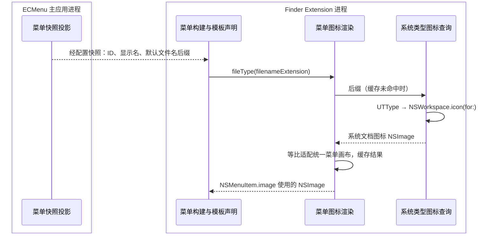

# Finder 菜单图标

通用证据范围见[平台边界](../Main.md)。本文件记录 Finder host 对菜单图像的布局观察，以及该行为对共享渲染算法形成的约束。

## 文件类型图标

| 职责模块 | 源码入口 | 输入 → 输出；状态及 API |
|---|---|---|
| 菜单快照投影 | [MenuSnapshotProvider](../../../../ECMenu/CommandMenuSettings/Application/MenuSnapshotProvider.swift) | 已提交模板 → `FileTemplateMenuItem`；`NSString.pathExtension` 提取后缀，空串表示无后缀。快照传输与副本所有权见[菜单配置](../../Runtime/CommandMenuSettings.md) |
| 菜单构建与模板声明 | [CreateNewFileFeature](../../../../ECMenuFinderExtension/Commands/NewFile/CreateNewFileFeature.swift)、[FinderContextMenuController](../../../../ECMenuFinderExtension/Menu/FinderContextMenuController.swift) | 模板描述 → 叶子名称、`.fileType` 图标声明、命令及 NSMenuItem；控制器调用图标渲染器并设置 image，执行命令仍只携带模板 ID 与目标目录 |
| 系统类型图标查询 | [FileTypeIconProvider](../../../../ECMenuShared/Platform/Rendering/FileTypeIconProvider.swift) | 后缀 → `UTType(filenameExtension:)` → `NSWorkspace.icon(for:)` → `NSImage`；两端共用、MainActor 同步调用，不拥有缓存 |
| 菜单图标渲染 | [FinderMenuIconRenderer](../../../../ECMenuFinderExtension/Menu/FinderMenuIconRenderer.swift)、[AppKitIconCanvasRenderer](../../../../ECMenuShared/Platform/Rendering/AppKitIconCanvasRenderer.swift) | 类型图标 → 与其他菜单图标相同的正方形画布；按后缀缓存，控制器赋值给 `NSMenuItem.image` |

**官方契约**：[`UTType(filenameExtension:)`](https://developer.apple.com/documentation/uniformtypeidentifiers/uttype-swift.struct/init(filenameextension:conformingto:)) 返回声明或动态内容类型，无效输入返回 nil；项目在 nil 时使用 `.data`。[`NSWorkspace.icon(for:)`](https://developer.apple.com/documentation/appkit/nsworkspace/icon(for:)) 返回对应类型的图标，操作失败时返回默认图标，不抛错。该路径根据后缀选择文档图标，图像外观由本机类型注册与系统资源决定。

**项目设计**：设置页与 Finder 使用同一类型查询。设置页尺寸由页面参数控制；Finder 按系统菜单字体的完整行盒生成统一画布，与应用图标使用相同的等比适配。后缀保存成功后经既有配置刷新影响下一次菜单构建，已打开菜单的图标保持不变；图标不参与模板执行身份或内容读取。

## AppKit 契约

`NSImage.alignmentRect` 是客户端可用于布局的对齐元数据；底边包含基线语义，其他边提供对应方向的对齐信息。图像绘制不会自动应用它，是否采用由客户端决定（macOS 26.5 SDK `NSImage.h:160–168`）。当前 `NSMenuItemCell` 已不再负责菜单绘制，因此不能据此推断 Finder host 会采用 `alignmentRect`。

## 标准动作的自动图标

**官方契约**：[Adopting Liquid Glass](https://developer.apple.com/documentation/technologyoverviews/adopting-liquid-glass#Menus-and-toolbars) 说明，系统根据菜单项的 selector 为剪切、拷贝、粘贴等标准动作选择图标。**项目观察**：2026-09-08 在 macOS 26.6.2（25G83）以 JXA 创建标题为 `TXT`、`target` 为 `nil` 的 `NSMenuItem`，显式设置 `image = nil` 并加入 `NSMenu` 后，`terminate:` 的 `image` 仍返回 `Quit_app` 图标，`performContextCommand:` 则为 `nil`；该探针仅验证 AppKit 对象，未显示 Finder 菜单。**测试约束**：菜单图标测试使用产品实际的 `performContextCommand:`，避免占位标准动作引入系统图标。

## 项目观察

项目于 2026-08-21 在 macOS 26.6.1（25G76）、Xcode 26.6（17F113）和 macOS 26.5 SDK 中测得系统菜单字体为 13pt、cap height 约 9.16pt；相同字号和常规字重的 SF Symbol `.small` 比例生成约 9pt 高的主体 `alignmentRect`。`photo` 与 `photo.badge.arrow.down` 的主体区域相同，后者只增加主体外的 badge；完整尺寸会随渲染上下文产生约 1pt 的离散变化，不作为产品契约。

同次人工对比中，Finder 会把直接提交的非正方形图像拉伸进方形槽位，使 `eye` 横向压缩、`text.document` 横向拉宽。Finder 自带“快速查看”的 eye 约为 14×9pt，与上述系统度量相符。18pt 方形外壳实验还表明，Finder 根据完整图像外框适配槽位，不会因内部 `alignmentRect` 较小而保留主体尺度，因此 `alignmentRect` 不能作为不影响尺度的溢出预留区。

这些测量只描述当前验证环境，原始截图未作为仓库证据保留。

## 渲染约束

Finder 菜单图标先在调用端按系统字体和 Symbol 比例生成源图，再烘焙进方形画布。渲染器把源 `alignmentRect` 的中心平移到画布中心，不根据带 badge 的完整外框重新居中，也不进行第二次缩放；越界附属像素由画布裁切。输出不依赖 Finder 解释源图的 `alignmentRect`。

Launch Services 返回的应用和文件类型图标没有 SF Symbols 的字形度量，因此保持宽高比、居中适配到相同画布且不放大。应用在菜单判定和图标读取之间消失时使用 SF Symbol 占位符；该真实竞态不改变已经冻结的菜单结构。

主应用与 Finder Extension 共用“按语义主体居中”和“不放大的等比画布适配”这两项无场景图像变换，各自仍拥有源图生成、画布和视觉参数。平台升级后应重新比较 Finder 自带菜单图标，并验证非方形 Symbol 的比例、badge 主体位置和附属图形裁切。

## 验证

菜单对象测试验证模板叶子与父菜单的 `NSImage.size`、`alignmentRect` 相同且保留彩色图标；快照与 IPC 测试覆盖后缀保存、传输和缓存。2026-09-11 在 macOS 26.6.2 上完成真实 MD、TXT 子菜单截图，确认图标比例与菜单布局；运行标识、截图路径及验证范围见[界面验证记录](../../Architecture/Verification.md#界面与真实-finder)。
