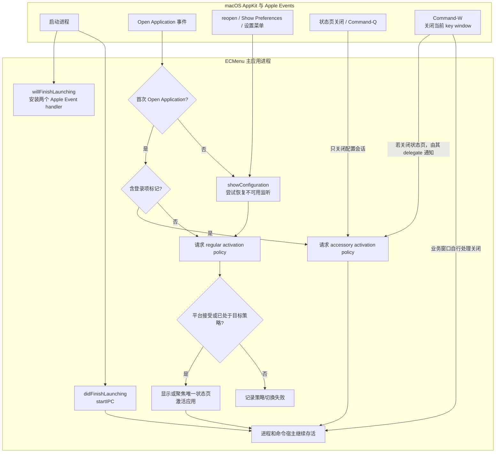
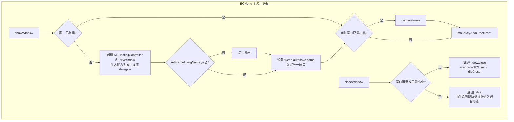

# 应用运行生命周期

主应用以一个进程同时承担配置界面和后台命令宿主；配置会话关闭时，命令监听、已开始的任务和业务窗口继续按各自生命周期运行。用户可见行为见[应用生命周期需求](../../Requirements/ApplicationLifecycle.md)，页面内容和登录项管理见[通用设置](../Features/GeneralSettings.md)。

## 启动、打开与关闭

图中的安装 handler 与处理事件应分别理解：`willFinishLaunching` 先接管相关事件，首次 Open Application 的具体内容由随后到达的事件决定。监听启动与首次打开事件是独立入口，不要求二者严格先后。首次普通打开只呈现状态页；首次登录项打开只请求后台形态；后续打开统一进入带监听恢复的路径。

`Command-Q` 的应用菜单动作是关闭配置会话，不终止进程。`Command-W` 调用当前 key window 的标准关闭；只有状态页的 delegate 通知才改变配置形态。最后一个窗口关闭仍返回不终止应用，最小化不关闭配置会话。

## 模块、API 与所有权

| 模块与源码入口 | 输入 → 输出 | 外部 API、状态与失败边界 |
|---|---|---|
| [ECMenuApp](../../../ECMenu/App/ECMenuApp.swift) | SwiftUI 进程入口、设置/关闭/退出菜单动作 → AppDelegate 调用 | `@NSApplicationDelegateAdaptor` 持有唯一 delegate；空 `Settings` Scene 保留应用菜单，`CommandGroup` 将设置、Command-W、Command-Q 路由到明确入口，不创建第二个设置窗口 |
| [ApplicationComposition](../../../ECMenu/App/ApplicationComposition.swift) | 第一次需要生产依赖 → 已连接的进程级对象图 | MainActor 构造并持有配置、模板 actor/Operations/Controller、登录项、Router、进度中心、业务窗口协调器、IPC 和设置窗口控制器；注入系统适配，不另存能力状态或产品注册表 |
| [AppDelegate](../../../ECMenu/App/AppDelegate.swift) | AppKit 生命周期、Apple Event、菜单动作、状态页关闭 → 监听或呈现操作 | `NSAppleEventManager.setEventHandler` 接管 `kAEOpenApplication` 与 `kAEShowPreferences`；唯一保存“首次 Open Application 是否已处理”。当前窗口事实由 AppKit 提供，不复制可见/最小化状态 |
| [ApplicationInitialOpenSource](../../../ECMenu/App/ApplicationLifecycleEffects.swift) | 首次 Open Application descriptor → user / loginItem | `NSAppleEventDescriptor.paramDescriptor(forKeyword: keyAEPropData)?.enumCodeValue` 与 `keyAELaunchedAsLogInItem` 比较；不使用延时、进程参数或激活状态猜测启动来源 |
| [ApplicationLifecycleEffects](../../../ECMenu/App/ApplicationLifecycleEffects.swift)及生产装配 | 打开、关闭、激活或监听意图 → 系统动作结果 | `NSApplication.activationPolicy()`、`setActivationPolicy` Bool、`activate(ignoringOtherApps:)`、`NSApp.keyWindow?.performClose(nil)`。目标 policy 已成立视为成功；regular 切换拒绝后不显示窗口，accessory 切换拒绝则记录错误，不伪造平台已改变 |
| [StatusPageWindowController](../../../ECMenu/Settings/StatusPageWindowController.swift) | show/close 意图 → 唯一窗口显示、关闭及 didClose | `NSHostingController`、`NSWindow`、delegate；首次显示才创建设置控件。窗口状态和 frame 仍归 AppKit；关闭后保留实例供重开复用 |
| [ApplicationIPCServer](../../../ECMenu/IPC/ApplicationIPCServer.swift) | 启动/恢复意图 → stopped / listening / failed | 唯一持有应用侧监听状态；`startIfNeeded` 已在监听时无操作。成功调用发布者，失败记录；底层清理完成后才上报监听失败，完整系统 API 见[IPC](IPC.md#实现边界与源码入口) |
| [ContextCommandRouter](../../../ECMenu/CommandRuntime/ContextCommandRouter.swift)与业务窗口所有者 | 已恢复 Invocation → 独立任务及反馈 | Router 持有在途 Task；生命周期菜单不取消这些任务。参数、警告和进度窗口按各自输入/关闭规则处理，不改变配置会话的 activation policy，见[命令执行](CommandExecution.md)和[进度](CommandProgress.md) |

`ApplicationComposition` 是依赖与生命周期所有者，不是服务查找器。能力通过初始化参数取得窄边界，业务调用不回到 composition 查找对象；测试可直接注入 `ApplicationLifecycleEffects`，执行相同事件处理逻辑。

## 窗口与呈现状态

窗口位置使用 `ECMenu.StatusPage` 作为 AppKit autosave 名称，`setFrameUsingName` 的 Bool 决定能否恢复，不能恢复时居中。`isReleasedWhenClosed = false` 使关闭后可以复用原窗口；登录启动只装配窗口控制器，不提前创建设置控件或模板编辑会话。

以下是呈现关系，不是重复维护的源码状态枚举：配置会话打开时请求 `.regular`，关闭时请求 `.accessory`。业务窗口独立于配置会话；最小化状态页仍保持 regular。平台拒绝策略切换时，实际结果以 AppKit 为准并记录失败。

显示路径在取得 regular 策略后执行窗口显示与应用激活；这些 Void API 不提供“用户已经看到窗口”或 Space 切换完成的回执。关闭窗口的 Bool 只表示本次是否实际发起了状态页关闭，不代表进程或命令已结束。

页面标识、名称编辑交接及系统状态重读见[设置外壳](../Features/GeneralSettings.md#设置外壳导航与能力页面)；这些界面状态不决定命令服务器存活。

## 登录启动

[`SMAppService.mainApp`](https://developer.apple.com/documentation/servicemanagement/smappservice/mainapp) 管理主应用自身的登录项，不增加 Helper、Launch Agent 或 XPC Service。登记与取消登记只影响后续登录，不启动或终止当前进程；状态和变更算法由[登录项能力](../Features/GeneralSettings.md#登录项变更)维护。

Xcode 26.6（17F113）附带的 macOS 26.5 SDK 将 `keyAELaunchedAsLogInItem` 定义为 `kAEOpenApplication` 的登录项启动标记。项目在 macOS 26.6.1（25G76）的真实注销、登录中观察到，loginwindow 只发送一次 Open Application 事件，并把标记作为 `keyAEPropData` 的枚举值携带。无论登录窗口是否选择重新打开窗口，注销前隐藏的配置会话都没有被会话恢复重新显示。这是指定环境中的项目观察，既有记录未标注精确源码提交，不扩展为平台对未来版本的保证。

应用完整接管 Open Application 与 Show Preferences，避免 SwiftUI Settings Scene 形成第二条配置窗口路径。首个 Open Application 含登录标记时请求后台形态，否则打开配置会话；进程存活期间的后续打开与设置事件始终显示唯一状态页。应用没有文档窗口或 untitled-document 恢复语义；加入这类能力时需重新评估完整接管事件的边界。

## 恢复边界

主进程退出后命令服务器随之消失；Finder Extension 仍运行或能显示缓存菜单，不表示执行端存在。`SMAppService` 只负责后续登录启动，不在当前会话监护或重启进程。

主进程存活时，IPC 初始化失败或监听终止由同一个应用侧所有者记录。普通打开、reopen 或显示设置会尝试恢复监听，成功后提示 Extension 再次查询配置。这只恢复入口，不重放失败或状态未知的命令。监听取消完成、路径清理和连接期限见[IPC](IPC.md#等待与监听恢复)。

Finder Extension 的公开 URL 打开入口在当前验证环境中不能可靠冷启动主应用，证据见[Extension 生命周期](../Platform/Finder/ExtensionLifecycle.md)。当前会话中的恢复入口是用户普通打开应用；配置开关关闭也不会关闭监听或停止已开始任务。

## 验证与实机证据

[ApplicationInitialOpenSourceTests](../../../Tests/ECMenuTests/App/ApplicationInitialOpenSourceTests.swift) 替换窗口与 activation policy 副作用，直接执行生产 AppDelegate 入口，覆盖：

- 首次普通打开与 didFinishLaunching 的两种先后顺序均只由启动入口开始监听。
- 登录打开不显示配置，后续普通打开显示窗口并检查监听。
- 最小化后重开、Command-Q 与业务窗口并存、Command-W 只结束其实际关闭的窗口。
- regular 策略拒绝时不显示窗口，登录标记的 descriptor 解释不依赖猜测。

这些测试证明事件协调在给定效果边界下的结果，不代替 AppKit 的实际窗口、Dock/Space 或真实 loginwindow。独立 Preview 验证页面呈现，不复用主应用的真实登录项和进程生命周期。

| 实机主题 | 已有依据 | 复核条件与限制 |
|---|---|---|
| 注销、登录与窗口恢复 | 上文 macOS 26.6.1 / Xcode 26.6 环境的 loginwindow 观察 | 真实开启并批准登录项，关闭配置会话，分别选择和取消“重新打开窗口”后注销/登录，核对状态页、Dock、激活与命令可用性；不能只手工构造 Apple Event |
| Extension 仍在而主应用已退出 | [Extension 生命周期](../Platform/Finder/ExtensionLifecycle.md)记录 URL 冷启动入口的实际失败 | 在独立验收环境观察菜单仍存在时的投递错误，再普通打开主应用并验证恢复；不得把已有菜单或启用 Bool 当作执行端证据 |
| 监听故障恢复 | [IPC](IPC.md)记录 macOS 26.6.1 的连接/监听系统调用探针，测试注入监听失败 | 探针验证系统调用边界，不能替代两端当前签名产物及真实 Finder 回调；恢复后需核对当前进程和登记路径 |

官方 API、项目观察和推断分别维护在上述链接中。平台升级后的实际登录、配置窗口恢复与业务窗口交互需要独立验收；自动化通过不扩展既有实机证据的版本范围。

当前代码的自动化与实机执行记录见[架构验证](../Architecture/Verification.md)。
