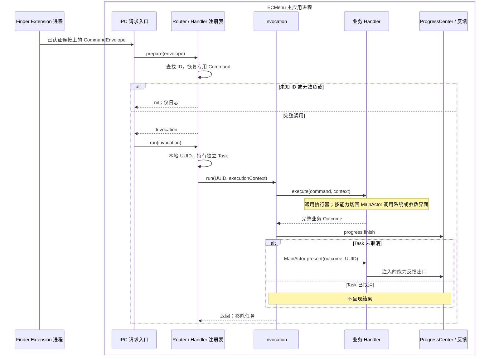

# 命令执行边界

运行时把认证后的命令信封恢复为专用命令，管理独立任务、可选进度和最终反馈。业务自身的规则与系统 API 见[能力说明](../Features/Main.md)，传输、认证和可靠到达边界见 [IPC](IPC.md)。

## 执行流

Extension 不等待图中的 Outcome；服务端认证 ready 帧和客户端写完字节均不是业务完成回执。UUID 只在主应用内部关联任务、日志和进度。

## 模块、输入输出与所有权

| 模块 / 源码入口 | 输入 → 输出 | 责任、状态与 API |
|---|---|---|
| [ContextCommandHandlers](../../../ECMenu/CommandRuntime/ContextCommandHandlers.swift) | 具体 Handler → 注册表；Envelope → Invocation? | 不可变注册表按 ID 保留唯一类型；JSONDecoder 解码，无业务 I/O |
| [ContextCommandRouter](../../../ECMenu/CommandRuntime/ContextCommandRouter.swift) | Envelope / Invocation → 已准备调用 / 在途 Task | 唯一拥有 inFlightTasks；`UUID`、Swift `Task`、`Logger`；释放时取消在途任务 |
| [ContextCommandInvocation](../../../ECMenu/CommandRuntime/ContextCommandInvocation.swift) | 绑定命令与 Handler、执行上下文 → 一次完整执行 | 类型擦除后的编排；始终先结束进度，再依据 Task 状态决定反馈 |
| [ContextCommandHandling](../../../ECMenu/CommandRuntime/ContextCommandHandling.swift) | 专用 Command → Sendable Outcome → MainActor 反馈 | 框架契约；具体业务平台、参数请求与反馈均由装配层注入 |
| [ProgressReporter / Center](../../../ECMenu/CommandRuntime/Progress/ContextCommandProgressReporter.swift) | 业务进度事件 → 当前事实 / 取消意图 | Reporter 只绑定本地身份并转发；Center 是唯一可变源，见[进度说明](CommandProgress.md) |
| [CommandAlert](../../../ECMenu/Feedback/CommandAlert.swift)及各能力反馈 | 业务 Outcome / 纯文案 → 用户反馈 | `NSAlert`、`NSApp.activate`、`runModal`、`NSSound`、`Logger`；Finder 选择仍由对应能力解释 |

## 类型对齐

`ContextCommandFeatureID` 是用户配置、跨进程信封和主应用 Handler 共用的功能身份；`ContextCommandDescriptor` 为该功能提供共享名称、图标和运行依赖。运行依赖来自命令业务声明，图标独立表达视觉来源；外部应用命令从唯一应用声明派生执行依赖与产品图标。一个 Feature 可以贡献单个 Action，也可以贡献包含叶子、子菜单和分隔线的完整菜单子树；Action 只在所属 Feature 内拥有局部身份，配置和执行仍以 Feature 为单位，叶子图标的选择不改变所属功能的运行依赖。Finder 对菜单树的过滤和规范化见[菜单语义](../Platform/Finder/ContextMenus.md#菜单树与启用状态)。

每个 Finder Action 从已经冻结的语义快照直接构造其功能专用的 `ContextCommandPayload`。命令类型只表达对应 Handler 能处理的有效目标，不继续携带可形成无关 Finder 场景的通用上下文。

类型擦除只发生在组合与进程边界：Extension 把具体命令封装为带 Feature ID 的 `ContextCommandEnvelope`；主应用的不可变 Handler 注册表按同一 ID 找到唯一具体类型并解码。重复注册属于组合错误并以 precondition 暴露；认证后的未知 ID 或无效 payload 属于输入失败，记录后丢弃，不构造半有效调用。

## 完整业务结果与系统副作用

`execute` 协调主要业务效果并返回不可变结果。它可以在通用执行器运行文件或图像处理，也可以按系统能力切回 MainActor。是否属于业务执行取决于责任，不由调用线程决定。

例如，CopyPath 在 `execute` 中等待 MainActor 的同步剪贴板写入，只有 `setString` 成功后才返回成功；`present` 只承担日志和提示。它在同一次 MainActor 调用中先检查取消再写入，取消不清除旧剪贴板。新建文件和压缩图片的文件写入、外部应用的打开回调也属于执行结果；后续 Finder 选择失败不撤销已经创建的文件。

能力内部在存在独立决策时采用“读取事实 → 纯规则 → 执行效果”。排他创建用一个系统写入处理名称冲突，不拆成存在预检。系统适配通过 Sendable 闭包或明确实例注入，运行时不在执行中寻找全局可变单例。

## 外部 API 与失败边界

| 调用者 / API | 输入 → 输出 | 项目消费方式与限制 |
|---|---|---|
| 注册表 / `JSONDecoder` | payload Data、命令类型 → 有效 Command / throws | 未知 ID、解码失败日志后丢弃，不产生业务任务；重复注册是实现错误，以 precondition 暴露 |
| Router / `UUID`、`Task` | 完整 Invocation → 本地身份与任务生命周期 | 不同请求并发；原始 Task 贯穿 Handler，不用 detached 子任务丢失取消状态 |
| Handler / `@concurrent`、MainActor 调用 | 类型化输入 → 跨执行器的 Sendable 结果 | actor 隔离不等于外部效果撤销；取消协作传播，不强制中断同步 API |
| Invocation / `Task.isCancelled` | 当前任务状态 → 是否调用 present | 所有正常结果路径先 finish 进度；Task 取消跳过整个反馈出口 |
| 警告 / `NSAlert.runModal` | 完整标题与正文 → 用户关闭响应 | 当前错误警告使用应用模态循环，并主动激活；压缩参数窗口是非模态，进度面板不自动激活 |
| 诊断 / `Logger` | 请求身份、类型化失败 → 日志 | 不给 Extension 返回业务结果，不承担重试、撤销或持久化队列 |

## 任务生命周期与并发

Router 在类型恢复之后才登记独立 Task。等待参数的命令不会占用一个全局串行命令队列；具体能力仅为自身真实约束增加局部顺序，例如模板存储 actor 或压缩批内顺序。

Router 释放请求取消尚未完成的任务，进程终止不承诺取消清理。任务取消不能撤销已经发生的文件写入或已提交的系统打开请求。进度按钮传递的是单独的用户协作意图，不调用 Router Task.cancel；区别见[命令进度](CommandProgress.md)。

## 验证入口

`./scripts/test.sh` 是完整测试入口，实际运行记录统一保存在仓库内产物目录。测试定义包括 [ContextCommandExecutionTests](../../../Tests/ECMenuTests/CommandRuntime/ContextCommandExecutionTests.swift) 的 prepare/run、无效负载、原任务取消传播和 Router 生命周期；[ContextCommandCompositionTests](../../../Tests/ECMenuTests/App/ContextCommandCompositionTests.swift) 固化产品注册；[CommandAlertContentTests](../../../Tests/ECMenuTests/Feedback/CommandAlertContentTests.swift) 固化纯反馈语义。各能力 spec 链接自身系统边界和交互测试。

2026-09-08 当前结构通过完整 231 项测试、Preview 与工具检查，并通过签名 IPC 集成；环境、覆盖与实机范围见[验证记录](../Architecture/Verification.md)。测试定义和注入反馈不能证明 Finder 选择或外部应用加载已在实机成功。
