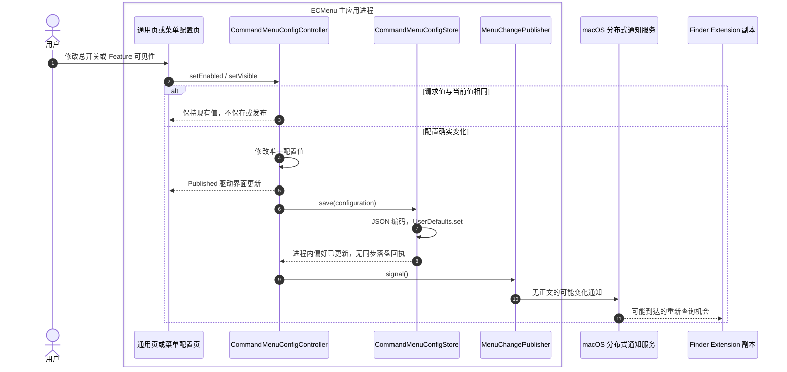
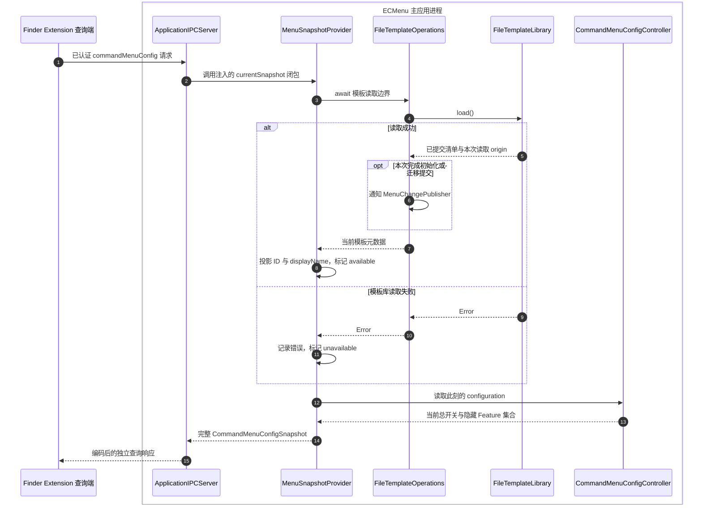

# 菜单配置

菜单配置能力管理产品总开关和各固定功能的显示偏好，并把当前配置与模板菜单描述投影为跨进程快照。产品边界见[状态页](../../Requirements/StatusPage.md)与[Finder 菜单](../../Requirements/FinderMenu.md)；Extension 的完整同步与菜单消费流程见[菜单执行流](MenuExecution.md#配置副本同步)。

## 修改配置与发布变化提示

配置呈现更新、偏好存储调用返回和 Extension 应用新快照是不同完成点。`@Published` 的界面通知由配置变更触发；失效提示在 `store.save` 返回后发布，不能把这个顺序解释为磁盘与两个进程已经完成原子提交。

模板和监听恢复也通过同一个发布出口接入：

| 触发来源 | 发布条件 | 不发布的情况 |
|---|---|---|
| `CommandMenuConfigController` | 总开关或 Feature 可见性实际变化，保存调用返回后 | 重复设置相同值；从偏好恢复 Controller |
| `FileTemplateOperations.load()` | 库读取返回 `.initialized` 或 `.migrated`，这次读取确实产生了提交 | `.cached` 或 `.restored`；读取抛错 |
| `FileTemplateOperations.loadForManagement()` | 管理页加载或显式重试成功，重新确认模板可用性 | 读取抛错 |
| 模板导入、改名、更换、删除 | 操作返回携带权威清单的 `FileTemplateCommit`，包括已提交且清理存在问题 | 本次变更提交前失败；此前读取产生的初始化/迁移提交仍按 load 规则发布 |
| `ApplicationIPCServer.startIfNeeded()` | 首次或恢复监听成功后调用注入的 `didStart` | 已在监听；初始化失败 |

普通查询不无条件发布，避免“查询 → 通知 → 再次查询”的循环。发布条件直接来自本次读取的 origin 或变更结果，不维护额外的可变发布标记。若一次管理操作之前还需要初始化，初始化和后续变更是两个独立提交事实。

## 查询当前菜单快照

投影先等待模板读取，再读取 MainActor 上的当前开关；两者没有共同修订号或跨存储事务。模板库失败仍产生包含当前开关的有效 unavailable 快照。连接、认证或响应解码失败才属于查询失败；这两类结果在副本端有不同处理。

## 模块、API 与输入输出

| 模块与源码入口 | 输入 → 输出 | 实际外部 API、状态与失败 |
|---|---|---|
| [ApplicationComposition](../../../ECMenu/App/ApplicationComposition.swift) | 生产适配器 → 配置 Controller、模板 Operations、Provider 与 Publisher 的连接 | 装配唯一依赖，不另存配置值；注入 `UserDefaults.standard`、`CommandMenuConfigChannel.signalConfigurationChange`、模板 `load` 和配置读取闭包 |
| [ApplicationSettingsPage](../../../ECMenu/ApplicationSettings/Presentation/ApplicationSettingsPage.swift)与[CommandMenuConfigPage](../../../ECMenu/CommandMenuConfig/Presentation/CommandMenuConfigPage.swift) | 已提交配置、系统事实、用户意图 → `setEnabled/setVisibility` 回调 | SwiftUI Binding 与控件呈现；不读写偏好。Extension 未启用只禁用通用页总开关；命令页由总开关与该命令的外部应用可用性决定交互。禁用不改写保存值 |
| [CommandMenuConfigController](../../../ECMenu/CommandMenuConfig/Application/CommandMenuConfigController.swift) | 类型化开关意图 → 当前配置与保存/提示请求 | Combine `@Published` 通知观察者；MainActor 唯一持有可变 `configuration`。相同值是无操作；初始化只恢复存储或采用 standard |
| [CommandMenuConfigStore](../../../ECMenu/CommandMenuConfig/Persistence/CommandMenuConfigStore.swift) | 偏好 Data → 有效配置或 nil；配置 → 偏好写入 | `UserDefaults.data(forKey:)`、`set(_:forKey:)` 与 JSON 编解码。缺失返回 nil；损坏或不支持 schema 记日志并返回 nil。读取不会把 standard 自动覆盖到原偏好；set 没有同步磁盘成功回执 |
| [CommandMenuConfig 与版本信封](../../../ECMenuShared/Contracts/CommandMenuConfig/CommandMenuConfig.swift)、[编码键](../../../ECMenuShared/Contracts/CommandMenuConfig/CommandMenuConfigChannel.swift) | 有效配置 ↔ 当前 schema JSON | 纯值与编解码规则；无文件 I/O。当前必需字段和 schema 不合法则拒绝；合法值的编码是实现不变量 |
| [FileTemplateOperations](../../../ECMenu/NewFileTemplates/Application/FileTemplateOperations.swift) | 查询/管理意图 → 已提交模板清单、提交结果或错误 | 调用唯一模板 actor，自身不直接使用文件 API；按读取 origin 或提交结果调用 `didChange`。存储与清理失败边界见[模板管理](../Features/NewFileTemplates/Main.md) |
| [MenuSnapshotProvider](../../../ECMenu/CommandMenuConfig/Application/MenuSnapshotProvider.swift) | 配置读取闭包、异步模板读取闭包 → 完整快照 | 纯投影与异步调用协调，OSLog 记录模板读取失败；不持有副本，不直接访问文件。模板失败转换为 unavailable，当前开关继续返回 |
| [MenuChangePublisher](../../../ECMenu/CommandMenuConfig/Application/MenuChangePublisher.swift)与[系统提示适配](../../../ECMenuShared/Platform/IPC/CommandMenuConfigSignal.swift) | 已提交或可用性恢复事实 → 无正文通知 | `DistributedNotificationCenter.postNotificationName(..., userInfo: nil, deliverImmediately: true)`；无权威数据、无到达回执，Publisher 不持有状态 |
| [ApplicationIPCServer](../../../ECMenu/IPC/ApplicationIPCServer.swift) | 已认证查询 → Provider 的异步结果；监听成功 → didStart | `Task @MainActor` 连接应用边界，socket 与 Security API 见[IPC](IPC.md#实现边界与源码入口)。IPC 不持有模板业务状态，也不判定模板提交完成 |
| [Extension Replica](../../../ECMenuFinderExtension/CommandMenuConfig/Application/CommandMenuConfigReplica.swift)与[缓存 Store](../../../ECMenuFinderExtension/CommandMenuConfig/Persistence/CommandMenuConfigCacheStore.swift) | 有效快照或查询失败 → 下一次菜单使用的状态 | 独立 UserDefaults、通知 observer、认证查询；成功整体替换，失败保留，单飞期间新提示淘汰当前结果。完整 API、迁移与生命周期见[副本同步](MenuExecution.md#配置副本同步) |

## 状态模型

能力目录、类型和调用入口统一使用 `CommandMenuConfig`。外部字节契约独立于源码名称：查询请求在 JSON 中使用 `kind: "menuConfiguration"`，完整快照的模板字段为 `fileTemplates`，通知后缀为 `.menu-configuration.did-change`，偏好与缓存键见下文。请求种类由 [ApplicationIPCRequest](../../../ECMenuShared/Contracts/IPC/ApplicationIPCRequest.swift) 的显式原始值定义，快照字段由显式 CodingKeys 定义。

主应用在自身 `UserDefaults` 的 `menu-configuration-v1` 键保存当前 schema JSON，内容是默认开启的产品总开关与偏离默认状态的隐藏 Feature ID 集合：

- 总开关关闭不会改写各 Feature 的可见性或取消已经开始的任务。
- Feature 开关控制该 Feature 的完整 Action 子树，不产生叶子级配置。
- 新 Feature 不在隐藏集合中，默认可见；重新显示等于删除对应 ID。

当前解码器只接受字段完整的当前 schema；持久化升级由独立迁移完成。Feature ID 是已发布契约，不随源码重命名变化。“新建文件”继续使用 `new-text-file`，保留用户既有显示偏好。

[完整菜单快照](../../../ECMenuShared/Contracts/CommandMenuConfig/CommandMenuConfigSnapshot.swift)有自己的 schema，将配置与 `available([FileTemplateMenuItem]) / unavailable` 组合。有效空清单和不可用状态在存储与 IPC 中保持区别，菜单呈现均隐藏新建父菜单。模板描述只含 ID 与 displayName；创建命令按 ID 从模板能力读取执行时的内容和默认文件名。

| 状态 | 唯一所有者 | 生命周期与其他使用者 |
|---|---|---|
| 已提交菜单开关的进程内值 | 主应用 `CommandMenuConfigController` | 随进程保留；设置页与 Provider 读取，Store 负责恢复/保存 |
| 已提交模板索引与内容副本 | 主应用 `FileTemplateLibrary` | actor 隔离；Operations 提供读取与提交结果，Provider 只投影 |
| 派生的跨进程快照 | `MenuSnapshotProvider` 每次调用的局部结果 | 不在主应用长期缓存第二份快照；交给当前查询连接 |
| 已应用菜单副本与刷新状态 | 每个 Extension `CommandMenuConfigReplica` | 用于下一次同步菜单构建；不反向修改主应用数据 |
| 可恢复副本缓存 | Extension 自己的 UserDefaults 域 | `menu-configuration-snapshot-v1`；App Group 不合并两端偏好 |

Extension 没有有效缓存时使用总开关/Feature 默认开启且模板 unavailable 的 standard。其独立迁移只在新快照键不存在时读取旧开关缓存，写入 unavailable 快照后删除旧键；主应用同名旧键属于另一个存储域，不参加该迁移。Debug/Release 的偏好、模板库、通知名与 App Group 隔离，身份规则见[构建身份](../Delivery/BuildIdentity.md)。

## 通知与持久化的完成边界

Apple 的 [DistributedNotificationCenter 契约](https://developer.apple.com/documentation/foundation/distributednotificationcenter)允许通知延迟或丢失，不提供有限到达时间；[UserDefaults](https://developer.apple.com/documentation/foundation/userdefaults)立即更新进程内值，异步写入磁盘。这些是 2026-09-08 核对的官方 API 契约，不是项目运行耗时测量。

Extension 只在初始化和收到信号时查询，拉取期间的新提示会追加查询。它没有周期校验、菜单打开时查询或超时自动重试。因此，保存调用返回不等于磁盘已落盘或 Finder 已更新；监听恢复提示也只是新的查询机会，不能保证有限时间内必定同步。任意本机进程伪造通知只能促使认证查询，不能直接修改配置或触发命令，见[IPC 信号边界](IPC.md#配置变更信号)。

## 验证与证据范围

- [配置值与 wire 测试](../../../Tests/ECMenuTests/CommandMenuConfig/CommandMenuConfigTests.swift)：稀疏可见性、总开关、版本/必需字段验证。
- [Controller 测试](../../../Tests/ECMenuTests/CommandMenuConfig/CommandMenuConfigControllerTests.swift)：发布时已能读到更新偏好，相同值不发布，恢复不发布。
- [模板操作测试](../../../Tests/ECMenuTests/NewFileTemplates/Application/FileTemplateOperationsTests.swift)：提交与初始化/管理加载的发布边界；普通缓存查询不产生通知循环。
- [IPC 测试](../../../Tests/ECMenuTests/IPC/ContextCommandTransportTests.swift)与[副本测试](../../../Tests/ECMenuFinderExtensionTests/CommandMenuConfig/CommandMenuConfigReplicaTests.swift)：模板 unavailable 与传输失败的区分、缓存迁移、失败保留、并发提示与旧响应淘汰。
- [系统状态测试](../../../Tests/ECMenuTests/ApplicationSettings/StatusPageSystemStateTests.swift)：禁用规则由当前事实派生，应用缺失或 Extension 状态变化不改写保存值。

这些定义通过注入边界和独立偏好域验证模块契约，不证明真实分布式通知可靠到达。实机验收应使用当前成对签名产物：修改总开关/Feature 后重新打开 Finder 菜单，管理页加载恢复模板可用性，验证有效空库、模板读取错误、主应用未运行和恢复监听的区别。实际命令仍需确认目标副作用，不能只观察菜单变化。

通知/偏好完成语义的依据是上述官方契约；既有 Finder 与双向认证观察的 macOS、Xcode 版本及材料限制见[菜单执行验证](MenuExecution.md#实机证据与适用范围)。仓库没有将特定同步耗时或丢失通知恢复率记录为实机保证。

当前代码的自动化与实机执行记录见[架构验证](../Architecture/Verification.md)。
