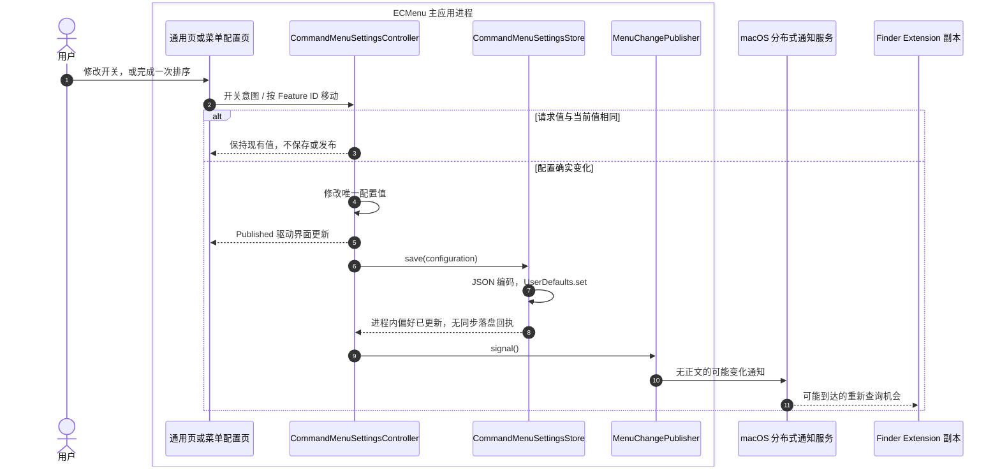
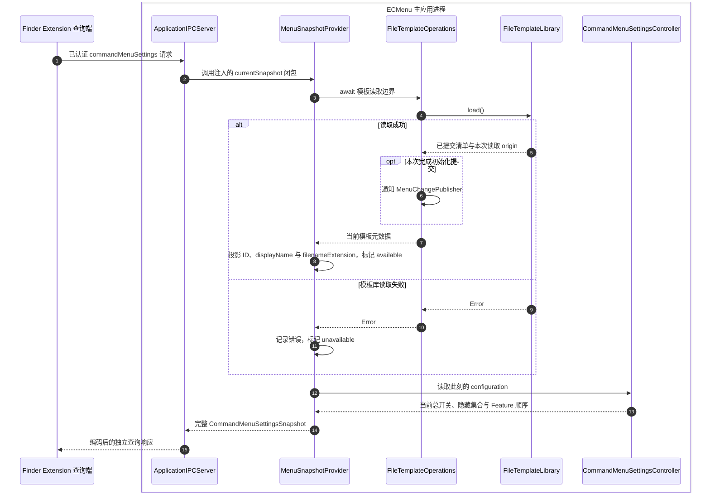

# 菜单配置

菜单配置能力管理产品总开关、各固定功能的显示偏好与一级入口顺序，并把当前配置与有序模板菜单描述投影为跨进程快照。产品边界见[状态页](../../Requirements/StatusPage.md)与[Finder 菜单](../../Requirements/FinderMenu.md)；Extension 的完整同步与菜单消费流程见[菜单执行流](MenuExecution.md#配置副本同步)。

## 修改配置与发布变化提示

配置呈现更新、偏好存储调用返回和 Extension 应用新快照是不同完成点。`@Published` 的界面通知由配置变更触发；失效提示在 `store.save` 返回后发布，不能把这个顺序解释为磁盘与两个进程已经完成原子提交。

## 设置列表排序交互

右键菜单页与文件模板页共用基于 SwiftUI `List` 与 `ForEach.onMove` 的设置列表。列表容器与行布局由 `SettingsList`、`SettingsListRow` 提供，通用页也复用这一层；`SettingsReorderList` 负责排序事件与移动转换。系统负责整行拖动预览、插入指示、取消与边缘滚动；页面按稳定 ID 呈现已提交清单。左侧三线是重排提示，可从提示或行内非控件区域发起系统行拖动，名称输入、开关和按钮保留各自的原生交互。

完成移动时，列表把 `onMove` 的来源下标与插入下标转换为稳定来源 ID 和目标 ID，再调用一次业务移动入口。原位放下不产生移动意图；悬停和取消不写配置。手柄的键盘与辅助功能上移、下移操作也使用同一业务保存入口。

| 职责模块 | 核心类型 | 源码入口 | 输入 → 输出与状态所有权 | 外部 API |
|---|---|---|---|---|
| 共享列表容器与行布局 | `SettingsList`、`SettingsListRow` | [SettingsList.swift](../../../ECMenu/Settings/Components/SettingsList.swift) | 能力提供的行内容 → 原生列表与统一行布局；不持有配置或顺序 | SwiftUI `List` 与行、滚动内容的布局修饰符；API 使用方式和实测间隔见[共享列表布局](../Features/GeneralSettings.md#共享列表布局) |
| 原生排序列表与移动转换 | `SettingsReorderList`、`SettingsListMove` | [SettingsReorderList.swift](../../../ECMenu/Settings/Components/SettingsReorderList.swift) | 已提交行清单、移动可用性、系统移动下标 → 稳定 ID 移动意图与开始/结束回调 | R01–R03；拖动呈现由系统 List 持有，纯转换不保存第二份清单 |
| 排序提示与相邻移动入口 | `SettingsReorderHandle` | [SettingsReorderHandle.swift](../../../ECMenu/Settings/Components/SettingsReorderHandle.swift) | 本地化行标题、可用的相邻移动闭包、键盘/辅助功能事件 → 相邻移动请求 | R04；SwiftUI 呈现三线图像并接收焦点，不建立独立拖拽源或持有业务配置 |

| API / 调用者 | 输入 → 输出或事件 | 项目消费方式与边界 |
|---|---|---|
| **R01 行呈现与移动**：SwiftUI `List`、`ForEach.onMove(perform:)` | 有序的 Identifiable 行清单、用户完成的移动 → `IndexSet` 来源与目标插入下标 | 系统提供拖动图像、插入提示和滚动。当前列表为单行移动，转换器按系统下标语义计算移除来源后的目标 ID；nil 表示末尾，原位返回 nil。业务层只接收 ID |
| **R02 拖动生命周期**：`onDragSessionUpdated`、`DragSession.phase` | 当前系统拖动会话 → `.initial`、`.active`、`.ended` 等阶段通知 | `.initial` 调用页面开始回调，模板页立即请求名称提交；`.ended` 调用结束回调，释放页面对名称 Task 的引用。阶段通知本身不提交顺序，完成移动由 R01 驱动 |
| **R03 移动可用性**：`moveDisabled` | 当前操作占用 → 行的系统移动是否可用 | 模板文件操作占用期间禁用移动；命令显示开关的禁用条件不影响行排序 |
| **R04 键盘与辅助功能**：`focusable`、`focusEffectDisabled`、`onMoveCommand`、`accessibilityActions` | 手柄焦点、方向命令或本地化上移/下移 action → 相邻移动闭包 | 手柄保留键盘焦点入口，关闭系统焦点高亮。位于边界时不提供对应 action。调用只表示已发出页面意图，异步模板提交仍有独立结果；系统列表自己的辅助功能移动通过 R01 接入 |

模板页在拖动开始请求提交名称；放下时复用编辑会话已有提交任务，名称失败时保留编辑并不提交顺序。两个提交的职责与完成点见[模板排序流程](../Features/NewFileTemplates/Flows.md#调整模板顺序)及[名称交接](../Features/NewFileTemplates/Editing.md#入口取消与后续操作)。

视觉依据是用户提供的 [RClick 2.2.0 录屏](../../../screenshots/RClick/录屏2026-09-11%2013.10.54.mov)：整行半透明预览随指针移动，原位置保留行，系统插入指示标出落点。本地参考快照为 RClick 2.1.0、提交 `cd9a7efc5b886ec9e2fcb62f53b440665455dadf`；其[动作设置页](../../../reference/RClick/RClick/Settings/ActionSettingsTabView.swift)和[新建文件设置页](../../../reference/RClick/RClick/Settings/NewFileSettingsTabView.swift)使用 `List` 与 `ForEach.onMove`。ECMenu 采用系统行重排机制，并将其移动结果连接到自身的 ID 与提交边界。

官方契约（2026-09-11 核对）：[`onMove`](https://developer.apple.com/documentation/swiftui/dynamicviewcontent/onmove(perform:))提供来源集合与目标插入位置；[`onDragSessionUpdated`](https://developer.apple.com/documentation/swiftui/view/ondragsessionupdated(_:))及 [`DragSession.Phase`](https://developer.apple.com/documentation/swiftui/dragsession/phase-swift.enum)提供拖动阶段，本地 SDK 将该更新 API 标记为 macOS 26.0 起可用。

项目观察（2026-09-11，macOS 26.6.2、Xcode 26.6）：当前 List 组合的一次真实鼠标移动依次产生 `.initial` 一次、`.active` 多次、`onMove` 一次、`.ended(.move)` 一次。因此移动入口可先取得本次名称提交任务，再由结束回调释放页面引用。该顺序是当前系统与页面组合的实测结果；整行预览、上下移动、取消、名称交接、下边缘滚动及事件日志的范围见[界面验证记录](../Architecture/Verification.md#界面与真实-finder)。

## 变更提示来源

模板和监听恢复也通过同一个发布出口接入：

| 触发来源 | 发布条件 | 不发布的情况 |
|---|---|---|
| `CommandMenuSettingsController` | 总开关、Feature 可见性或顺序实际变化，保存调用返回后 | 重复设置相同值、顺序未变；从偏好恢复 Controller |
| `FileTemplateOperations.load()` | 库读取返回 `.initialized`，这次读取确实产生了提交 | `.cached` 或 `.restored`；读取抛错 |
| `FileTemplateOperations.loadForManagement()` | 管理页加载或显式重试成功，重新确认模板可用性 | 读取抛错 |
| 模板导入、改名、更换、删除、排序 | 操作返回携带权威清单的 `FileTemplateCommit`，包括已提交且清理存在问题 | 本次变更提交前失败、排序未变返回 nil；此前读取产生的初始化提交仍按 load 规则发布 |
| `ApplicationIPCServer.startIfNeeded()` | 首次或恢复监听成功后调用注入的 `didStart` | 已在监听；初始化失败 |

普通查询不无条件发布，避免“查询 → 通知 → 再次查询”的循环。发布条件直接来自本次读取的 origin 或变更结果，不维护额外的可变发布标记。若一次管理操作之前还需要初始化，初始化和后续变更是两个独立提交事实。

## 查询当前菜单快照

投影先等待模板读取，再读取 MainActor 上的当前配置；两者没有共同修订号或跨存储事务。模板库失败仍产生包含当前开关与一级顺序的有效 unavailable 快照。连接、认证或响应解码失败才属于查询失败；这两类结果在副本端有不同处理。

## 模块、API 与输入输出

| 职责模块 | 核心类型 | 源码入口 | 输入 → 输出 | 实际外部 API、状态与失败 |
|---|---|---|---|---|
| 菜单依赖装配 | `ApplicationComposition` | [ApplicationComposition.swift](../../../ECMenu/App/ApplicationComposition.swift) | 生产适配器 → 配置 Controller、模板 Operations、Provider 与 Publisher 的连接 | 装配唯一依赖，不另存配置值；注入 `UserDefaults.standard`、`CommandMenuSettingsChannel.signalConfigurationChange`、模板 `load` 和配置读取闭包 |
| 配置页面入口（组合） | `GeneralSettingsPage`、`CommandMenuSettingsPage` | [GeneralSettingsPage.swift](../../../ECMenu/GeneralSettings/Presentation/GeneralSettingsPage.swift)、[CommandMenuSettingsPage.swift](../../../ECMenu/CommandMenuSettings/Presentation/CommandMenuSettingsPage.swift) | 已提交配置、系统事实、用户意图 → 开关回调或 Feature 移动请求 | SwiftUI Binding 与控件呈现；不读写偏好。Extension 未启用只禁用通用页总开关；命令页的显示开关由总开关与外部应用可用性决定交互，排序手柄保持可用。禁用不改写保存值 |
| 菜单配置协调 | `CommandMenuSettingsController` | [CommandMenuSettingsController.swift](../../../ECMenu/CommandMenuSettings/Application/CommandMenuSettingsController.swift) | `setEnabled` / `setVisible` / `move(_:before:)` → 当前配置与保存/提示请求 | Combine `@Published` 通知观察者；MainActor 唯一持有可变 `configuration`。相同值或顺序未变是无操作；初始化只恢复存储或采用 standard |
| 菜单偏好存储 | `CommandMenuSettingsStore` | [CommandMenuSettingsStore.swift](../../../ECMenu/CommandMenuSettings/Persistence/CommandMenuSettingsStore.swift) | 偏好 Data → 有效配置或 nil；配置 → 偏好写入 | `UserDefaults.data(forKey:)`、`set(_:forKey:)` 与 JSON 编解码。缺失返回 nil；损坏或不支持 schema 记日志并返回 nil。读取不会把 standard 自动覆盖到原偏好；set 没有同步磁盘成功回执 |
| 菜单配置契约 | `CommandMenuSettings`、`CommandMenuSettingsEnvelope`、`CommandMenuSettingsChannel` | [CommandMenuSettings.swift](../../../ECMenuShared/Contracts/CommandMenuSettings/CommandMenuSettings.swift)、[CommandMenuSettingsChannel.swift](../../../ECMenuShared/Contracts/CommandMenuSettings/CommandMenuSettingsChannel.swift) | 有效配置、Feature ID 与插入目标 → 新配置；有效配置 ↔ 当前 schema JSON | 纯值、移动与编解码规则；无文件 I/O。顺序必须是全部固定命令 ID 的唯一完整排列；当前必需字段和 schema 不合法则拒绝；合法值的编码是实现不变量 |
| 模板应用操作 | `FileTemplateOperations` | [FileTemplateOperations.swift](../../../ECMenu/NewFileTemplates/Application/FileTemplateOperations.swift) | 查询/管理意图 → 已提交模板清单、提交结果或错误 | 调用唯一模板 actor，自身不直接使用文件 API；按读取 origin 或提交结果调用 `didChange`。存储与清理失败边界见[模板管理](../Features/NewFileTemplates/Main.md) |
| 菜单快照投影 | `MenuSnapshotProvider` | [MenuSnapshotProvider.swift](../../../ECMenu/CommandMenuSettings/Application/MenuSnapshotProvider.swift) | 配置读取闭包、异步模板读取闭包 → 完整快照 | 纯投影与异步调用协调，OSLog 记录模板读取失败；不持有副本，不直接访问文件。模板失败转换为 unavailable，当前开关与一级顺序继续返回 |
| 菜单变化发布（组合） | `MenuChangePublisher`、`CommandMenuSettingsChannel.signalConfigurationChange` | [MenuChangePublisher.swift](../../../ECMenu/CommandMenuSettings/Application/MenuChangePublisher.swift)、[CommandMenuSettingsSignal.swift](../../../ECMenuShared/Platform/IPC/CommandMenuSettingsSignal.swift) | 已提交或可用性恢复事实 → 无正文通知 | `DistributedNotificationCenter.postNotificationName(..., userInfo: nil, deliverImmediately: true)`；无权威数据、无到达回执，Publisher 不持有状态 |
| 主应用 IPC 入口 | `ApplicationIPCServer` | [ApplicationIPCServer.swift](../../../ECMenu/IPC/ApplicationIPCServer.swift) | 已认证查询 → Provider 的异步结果；监听成功 → didStart | `Task @MainActor` 连接应用边界，socket 与 Security API 见[IPC](IPC.md#实现边界与源码入口)。IPC 不持有模板业务状态，也不判定模板提交完成 |
| Extension 副本与缓存（组合） | `CommandMenuSettingsReplica`、`CommandMenuSettingsCacheStore` | [CommandMenuSettingsReplica.swift](../../../ECMenuFinderExtension/CommandMenuSettings/Application/CommandMenuSettingsReplica.swift)、[CommandMenuSettingsCacheStore.swift](../../../ECMenuFinderExtension/CommandMenuSettings/Persistence/CommandMenuSettingsCacheStore.swift) | 有效快照或查询失败 → 下一次菜单使用的状态 | 独立 UserDefaults、通知 observer、认证查询；成功整体替换，失败保留，单飞期间新提示淘汰当前结果。完整 API 与生命周期见[副本同步](MenuExecution.md#配置副本同步) |

## 状态模型

能力目录、类型和调用入口统一使用 `CommandMenuSettings`。外部字节契约独立于源码名称：查询请求在 JSON 中使用 `kind: "menuConfiguration"`，完整快照的模板字段为 `fileTemplates`，通知后缀为 `.menu-configuration.did-change`，偏好与缓存键见下文。请求种类由 [ApplicationIPCRequest](../../../ECMenuShared/Contracts/IPC/ApplicationIPCRequest.swift) 的显式原始值定义，快照字段由显式 CodingKeys 定义。

主应用在自身 `UserDefaults` 的 `menu-configuration-v1` 键保存 schema `2` JSON，内容是默认开启的产品总开关、偏离默认状态的隐藏 Feature ID 集合，以及 `orderedFeatureIDs` 保存的完整命令顺序：

- 总开关关闭不会改写各 Feature 的可见性或取消已经开始的任务。
- Feature 开关控制该 Feature 的完整 Action 子树，不产生叶子级配置。
- 重新显示等于删除对应隐藏 ID；显示开关、依赖可用性和总开关都不改写顺序。
- `orderedFeatureIDs` 使用稳定 Feature ID，恰好包含当前全部固定命令各一次；默认顺序来自 `defaultFeatureIDs`。移动以目标 Feature ID 表示插入位置，nil 表示末尾，不以显示名称或视图下标持久化。

当前解码器只接受字段完整的当前 schema。Feature ID 是稳定契约，不随源码重命名变化，“新建文件”使用 `new-text-file`。1.1.1 从 1.1.0 的 schema `1` 升级时，旧菜单偏好解码失败并采用默认总开关、显隐和命令顺序；读取本身保留原偏好字节，下一次有效设置变更写入 schema `2`。文件模板库继续使用原有 schema `2`，模板数据直接沿用。

[完整菜单快照](../../../ECMenuShared/Contracts/CommandMenuSettings/CommandMenuSettingsSnapshot.swift)使用独立的外层 schema `2`，将当前配置与 `available([FileTemplateMenuItem]) / unavailable` 组合。有效空清单和不可用状态在存储与 IPC 中保持区别，菜单呈现均隐藏新建父菜单。模板描述包含 ID、displayName 与 filenameExtension，并保留模板索引的数组顺序。后缀由已提交默认文件名的 `NSString.pathExtension` 推导，空字符串表示无后缀；Extension 用它在本机读取文件类型图标，见[菜单图标](../Platform/Finder/MenuIcons.md)。创建命令按 ID 从模板能力读取执行时的内容和默认文件名。

| 状态 | 唯一所有者 | 生命周期与其他使用者 |
|---|---|---|
| 已提交菜单开关与一级顺序的进程内值 | 主应用 `CommandMenuSettingsController` | 随进程保留；设置页与 Provider 读取，Store 负责恢复/保存 |
| 已提交模板索引与内容副本 | 主应用 `FileTemplateLibrary` | actor 隔离；Operations 提供读取与提交结果，Provider 只投影 |
| 派生的跨进程快照 | `MenuSnapshotProvider` 每次调用的局部结果 | 不在主应用长期缓存第二份快照；交给当前查询连接 |
| 已应用菜单副本与刷新状态 | 每个 Extension `CommandMenuSettingsReplica` | 用于下一次同步菜单构建；不反向修改主应用数据 |
| 可恢复副本缓存 | Extension 自己的 UserDefaults 域 | `menu-configuration-snapshot-v1`；App Group 不合并两端偏好 |

Extension 从自身偏好域的 `menu-configuration-snapshot-v1` 恢复当前快照；没有有效缓存时使用总开关/Feature 默认开启且模板 unavailable 的 standard，初始化时发起主应用查询。Debug/Release 的偏好、模板库、通知名与 App Group 隔离，身份规则见[构建身份](../Delivery/BuildIdentity.md)。

Extension 把副本的当前 `menuSettings` 交给 `ContextMenuComposition`，按一级顺序组织完整 Feature 子树，之后再由菜单控制器执行可见性、依赖和上下文过滤。过滤保持相对顺序；“新建文件”的模板子树整体移动，子树内部顺序由模板索引决定。源码与 API 见[菜单构建模块映射](MenuExecution.md#从右键回调到可执行菜单)。

## 通知与持久化的完成边界

Apple 的 [DistributedNotificationCenter 契约](https://developer.apple.com/documentation/foundation/distributednotificationcenter)允许通知延迟或丢失，不提供有限到达时间；[UserDefaults](https://developer.apple.com/documentation/foundation/userdefaults)立即更新进程内值，异步写入磁盘。这些是 2026-09-08 核对的官方 API 契约，不是项目运行耗时测量。

Extension 只在初始化和收到信号时查询，拉取期间的新提示会追加查询。它没有周期校验、菜单打开时查询或超时自动重试。因此，保存调用返回不等于磁盘已落盘或 Finder 已更新；监听恢复提示也只是新的查询机会，不能保证有限时间内必定同步。任意本机进程伪造通知只能促使认证查询，不能直接修改配置或触发命令，见[IPC 信号边界](IPC.md#配置变更信号)。

## 验证与证据范围

- [配置值与 wire 测试](../../../Tests/ECMenuTests/CommandMenuSettings/CommandMenuSettingsTests.swift)：稀疏可见性、总开关、完整顺序的编码恢复与严格验证、版本/必需字段验证。
- [Controller 测试](../../../Tests/ECMenuTests/CommandMenuSettings/CommandMenuSettingsControllerTests.swift)：发布时已能读到更新偏好；总开关关闭且命令隐藏时仍可排序，每次有效移动保存并发布一次，相同值与恢复不发布。
- [模板操作测试](../../../Tests/ECMenuTests/NewFileTemplates/Application/FileTemplateOperationsTests.swift)：提交与初始化/管理加载的发布边界；普通缓存查询不产生通知循环。
- [IPC 测试](../../../Tests/ECMenuTests/IPC/ContextCommandTransportTests.swift)与[副本测试](../../../Tests/ECMenuFinderExtensionTests/CommandMenuSettings/CommandMenuSettingsReplicaTests.swift)：模板 unavailable 与传输失败的区分、缓存恢复、失败保留、并发提示与旧响应淘汰。
- [系统状态测试](../../../Tests/ECMenuTests/GeneralSettings/StatusPageSystemStateTests.swift)：禁用规则由当前事实派生，应用缺失或 Extension 状态变化不改写保存值。

这些定义通过注入边界和独立偏好域验证模块契约，不证明真实分布式通知可靠到达。实机验收应使用当前成对签名产物：修改总开关/Feature 后重新打开 Finder 菜单，管理页加载恢复模板可用性，验证有效空库、模板读取错误、主应用未运行和恢复监听的区别。实际命令仍需确认目标副作用，不能只观察菜单变化。

排序交互的实机验收应覆盖两个面板的手柄拖动、插入位置、原位放下、Esc 与拖出目标后的取消、键盘和辅助功能移动，以及模板长列表的边缘滚动。模板名称编辑中开始拖动后分别完成和取消，核对名称与顺序各自的保存结果；重开应用与 Finder 菜单后，核对一级入口和模板子菜单的相对顺序。已有存储与菜单构建测试不能替代这些原生拖动和系统菜单观察。

通知/偏好完成语义的依据是上述官方契约；既有 Finder 与双向认证观察的 macOS、Xcode 版本及材料限制见[菜单执行验证](MenuExecution.md#实机证据与适用范围)。仓库没有将特定同步耗时或丢失通知恢复率记录为实机保证。

当前代码的自动化与实机执行记录见[架构验证](../Architecture/Verification.md)。
