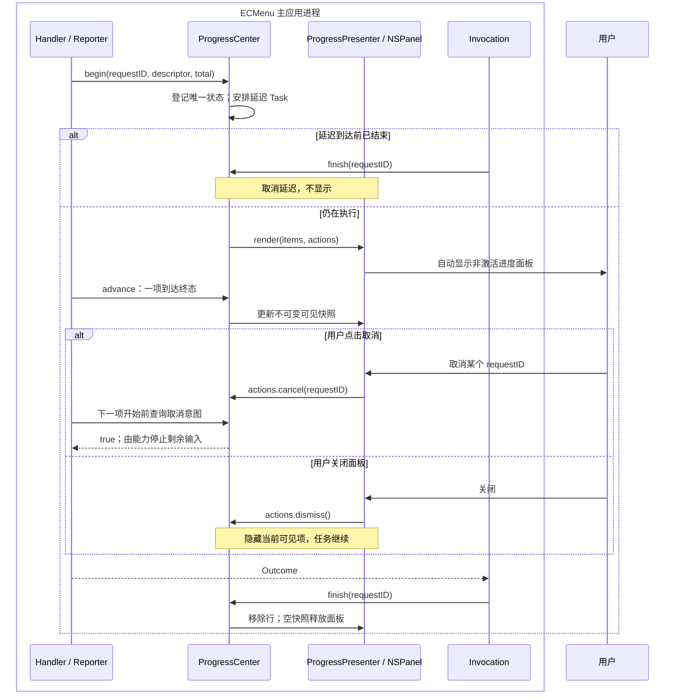

# 命令进度

进度能力在主应用内管理确定整数工作量、显示时机和用户取消意图。产品交互见[需求](../../Requirements/CommandProgress.md)，Task 生命周期见[命令执行](CommandExecution.md)。

## 事件与呈现流

Center 不持有 AppKit 窗口。装配层把它的 `render(items, actions)` 连接到 Presenter；窗口把动作交还 Center，Reporter 仅转发能力事件。关闭面板只隐藏当时可见的任务，后续新任务仍可显示。

## 模块、输入输出与状态

| 模块 / 源码入口 | 输入 → 输出 | 所有权与外部边界 |
|---|---|---|
| [ProgressState](../../../ECMenu/CommandRuntime/Progress/ContextCommandProgressState.swift) | begin / reveal / advance / cancel / finish → 进度事实 | 纯内存状态规则；正总量、单次 begin、不超额推进是实现约束 |
| [ProgressReporter](../../../ECMenu/CommandRuntime/Progress/ContextCommandProgressReporter.swift) | 业务事件 → Center 调用；取消查询 → Bool | 只绑定 requestID 与 descriptor，不复制进度状态 |
| [ProgressCenter](../../../ECMenu/CommandRuntime/Progress/ContextCommandProgressCenter.swift) | 事件、用户动作 → render(items, actions) | 唯一拥有进度、显示延迟任务、已隐藏 ID、上次渲染快照；MainActor；`Task.sleep` 与取消 |
| [ProgressActions](../../../ECMenu/CommandRuntime/Progress/ContextCommandProgressActions.swift) | 窗口事件 → 对应 Center 意图 | cancel/dismiss 闭包弱引用 Center，不提供复制状态的第二个所有者 |
| [ProgressPresenter](../../../ECMenu/Feedback/Progress/ContextCommandProgressPresenter.swift)、[WindowController](../../../ECMenu/Feedback/Progress/ContextCommandProgressWindowController.swift) | 可见快照与动作 → 共享面板 / 回调 | Presenter 保活当前窗口；空快照和关闭时释放，窗口管理行与布局 |
| [RowView](../../../ECMenu/Feedback/Progress/ContextCommandProgressRowView.swift)、[BarView](../../../ECMenu/Feedback/Progress/ContextCommandProgressBarView.swift)、[IconResolver](../../../ECMenu/Feedback/Progress/ContextCommandProgressIconResolver.swift) | 单项快照、焦点状态、descriptor → 原生呈现 | AppKit 视图、图标与按钮；不拥有业务计数 |

## API 契约与取消边界

| 调用者 / API | 输入 → 输出 | 约束与失败 |
|---|---|---|
| Center / `Task.sleep(for:)` | 显示延迟 → 返回 / CancellationError | 默认一秒；提前结束取消对应延迟 Task。仅仍在执行的任务变为可见 |
| 窗口 / `NSPanel`、`orderFrontRegardless`、NSButton target/action | 快照与动作 → 显示、单项取消、关闭事件 | 使用 nonactivatingPanel；自动出现不调用 NSApp.activate。关闭不是取消 |
| 图标 / `NSImage`、`NSWorkspace` | descriptor 视觉来源 / 应用路径 → 图像 | 图标解析和缓存属于呈现，无业务执行权限 |
| 进度视图 / NSView 绘制、NSBezierPath、NSColor、NotificationCenter | 当前计数与 key-window 通知 → 绘制与辅助技术值 | 焦点只影响呈现；处理计数不是成功输出数 |
| 能力 / 用户取消查询、`Task.isCancelled` | 当前边界 → 是否开始下一项 | 两种取消来源独立；ImageIO 当前项完整结束，用户取消保留结果并反馈，Task 取消由 Invocation 跳过反馈 |

进度对 Handler 是可选能力，只有主动 begin 才登记。图片压缩在确认参数后开始，每个输入的成功或失败都推进一次。多个请求共用面板，不改变批次之间的并发。

取消按钮只表达协作意图，具体能力选择不会破坏输出的响应点。Presenter 不持有业务 Task，不中断文件写入，也没有替代 Center 的可变进度模型。

## 平台边界

Xcode 26.6（17F113）附带的 macOS 26.5 SDK 将 Foundation `Progress` 定义为工作量与取消状态的可观察模型，并提供按文件 URL 发布和跨进程订阅的机制（`NSProgress.h:18–33, 109–121, 210–231`）。文件类型 Progress 的工作单位是字节，文件数量由独立计数表达（`NSProgress.h:81–86, 197–208, 261–288`）。

公开契约没有承诺 Finder 会订阅任意应用发布的任务，Finder Sync 也没有登记第三方文件任务进度的接口。因此产品不依赖 Finder 私有进度界面，而由主应用拥有共享的 AppKit 任务窗口。

`NSProgressIndicator` 没有公开的填充颜色属性，已废弃的 `controlTint` 在 macOS 10.15 之后不再生效。项目在 macOS 26.6.1（25G76）观察到，标准进度条位于未激活面板时呈系统非强调色；用户主动使窗口成为 key window 后才呈强调色。当前轻量进度槽只用于稳定尺寸并遵守这一焦点配色，不为显示进度主动激活应用。

同一环境中的 Finder“转换图像”快速操作采用带图标、名称、进度、取消和剩余时间的独立窗口。该观察只提供当前系统视觉参照，不证明 Finder 内部实现，也不是未来平台契约。

## 验证与实机证据

[执行与进度测试](../../../Tests/ECMenuTests/CommandRuntime/ContextCommandExecutionTests.swift)以注入 render 固化快任务不显示、多任务独立、取消与关闭的差别，以及 finish 后清理；[压缩测试](../../../Tests/ECMenuTests/Commands/ImageCompression/ImageCompressionTests.swift)验证一项结束后响应用户取消并保留输出。快照断言不替代真实面板焦点和 Space 验收。

平台观察环境与 SDK 证据见上节。实机复验使用足够长的压缩批次，分别观察面板自动出现、单项取消、关闭后继续及后续新任务再次显示；记录 macOS 版本与前台应用。运行结果归入统一[测试记录](CommandExecution.md#验证入口)，不把仅存在测试定义描述为已经执行通过。
