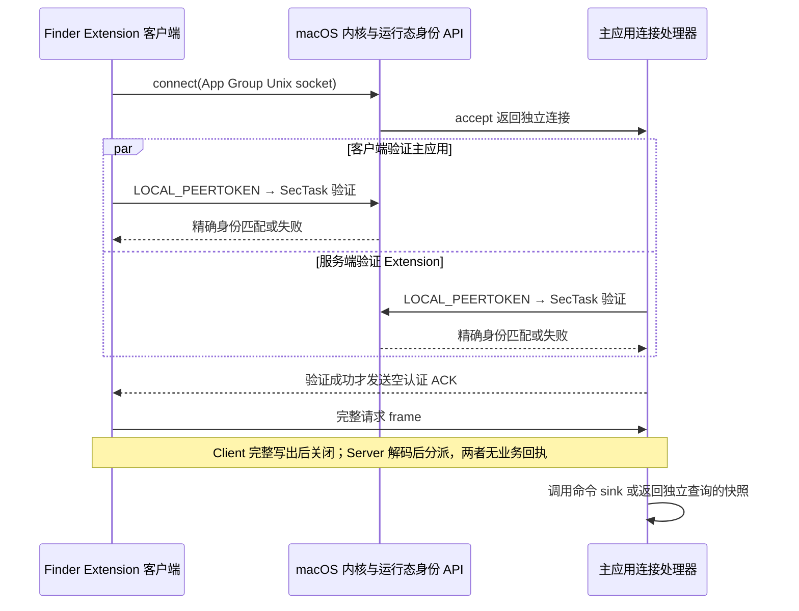

# IPC

Finder Extension 与主应用使用 App Group 容器中的 Unix-domain socket 进行定向通信。App Group、双方精确身份和环境隔离见[构建身份](../Delivery/BuildIdentity.md)；本文件只定义运行态认证与协议语义。

## 命令投递

Finder Extension 在菜单构建时冻结上下文并准备类型化命令；用户点击时为该命令建立一条独立连接，只发送一次。每个连接先完成双向身份验证，再使用八字节大端正文长度和 JSON 正文传输 frame。



主应用只有在验证 Extension 后才发送空的认证就绪 ACK。它保证 Client 不会在 Server 取得动态对端身份前写完并关闭，只确认认证阶段完成，不携带命令接管状态或业务结果。

命令完整写入后 Client 关闭连接，不等待接管或执行回执。协议不提供自动重试、去重、业务结果回传、提交状态查询或业务执行超时；每次点击都是独立请求。完整写入只证明本次点对点发送完成，不证明主应用已经解码、恢复或执行命令。

菜单配置查询使用自己的独立连接和同一认证、framing，发送查询后读取一份包含开关配置和模板菜单状态的[完整菜单快照](CommandMenuSettings.md#状态模型)。模板库读取失败由快照中的不可用状态表达，当前开关配置仍可正常传输。命令与配置查询不会共享响应，每个操作独占一条连接，因此都不需要请求编号。主应用收到命令后生成的本地任务 ID 只用于进程内生命周期和反馈，不进入 IPC。

Client 在连接、身份验证、认证就绪 ACK 或完整写入失败时记录错误并播放一次系统默认错误提示音。Server 对认证失败、无效 frame、无法解码的负载或未知命令只记录并关闭连接，不发送应用层错误响应。

## 等待与监听恢复

每条连接使用五秒的单调时钟传输预算，从队列开始处理连接时计时，不包含此前的排队等待。Client 的连接建立、认证就绪 ACK、请求写入及配置响应读取共用该预算；Server 开始处理已接收连接后，认证就绪 ACK、请求读取和配置响应也共用自己的预算。短读、短写和中断不会重置期限。预算只约束连接等待与传输，命令交给应用后的执行不受影响，也不会因投递超时自动重发。

五秒是项目为本机小消息和菜单快照读取预留的调度余量，不是业务耗时指标；测试使用可注入的短预算验证截止路径。到期的配置查询释放连接和单飞状态，副本保留最后有效快照，后续变更信号可再次发起查询。

监听使用非阻塞 socket 和 Dispatch read source。连接中止或系统调用被信号打断时继续接收；文件描述符或内存暂时不足时暂停 source，等待 100 毫秒后恢复，避免对持续可读端点忙循环。其他监听失败取消 source，由取消回调在最后一次 accept 回调结束后关闭 descriptor、删除自己拥有的 socket 文件，然后向应用报告失败。已接收连接由各自传输预算完成清理；已经接管的业务任务继续运行。

主应用统一持有监听资源及初始化、运行失败状态。用户普通打开、重新打开或显示设置时尝试恢复不可用的监听；成功后广播配置拉取信号。恢复只建立新的执行入口，不重放失败或状态未知的命令。

**平台契约与项目观察：** Apple 的 [accept(2)](https://developer.apple.com/library/archive/documentation/System/Conceptual/ManPages_iPhoneOS/man2/accept.2.html) 列出连接中止、描述符耗尽和内存不足等独立失败。项目于 2026-09-05 在 macOS 26.6.1（25G76）的隔离 Unix socket 探针中观察到，静默对端使阻塞读取持续等待，而 readiness 等待可按期限返回；对监听 socket 调用 `shutdown` 返回 `ENOTCONN`，没有唤醒阻塞的 `accept`。因此监听关闭采用 Dispatch source 取消完成边界，连接读写使用有期限的 readiness 等待。这些探针只验证系统调用行为，不替代 Finder 进程身份和真实菜单验收。

命令请求不持久化。主应用与 Extension 成对构建和交付，因此命令信封不携带独立协议版本，也不保留旧负载兼容分支；菜单配置使用自身的当前 schema 版本，升级规则见[菜单配置](CommandMenuSettings.md#状态模型)。

## 对端身份验证

macOS 26.5 SDK 为本地 socket 提供 `LOCAL_PEERTOKEN`，可从已连接端取得对端的完整 `audit_token_t`。两端在读取或发送任何业务正文前依次使用：

```text
LOCAL_PEERTOKEN
  → SecTaskCreateWithAuditToken
  → SecTaskValidateForRequirement
```

由 Lightweight Code Requirements 表达的运行态要求同时约束：

- 对端具有当前构建注入的精确 signing identifier；
- 对端 Team identifier 与验证方当前进程相同；
- 签名类别为项目使用的 Apple Development；
- 运行代码已签名且动态有效。

任一 API 失败或要求不匹配都关闭连接，不退化到 PID、进程路径、正文声明、可单独伪造的 entitlement 值或内置共享密钥。

项目在 macOS 26.6.1（25G76）、Xcode 26.6（17F113）中验证了沙箱 Extension 与非沙箱主应用之间的对称认证。`SecCodeCopyGuestWithAttributes` 路径需要读取对端磁盘代码；Extension 无权读取 `.derivedData` 中的主应用时会返回 `EPERM`，因此该路径不适合作为本项目的验证入口，也不应为开发目录增加临时权限例外。

App Group 只让沙箱 Extension 到达组容器；权限为当前用户读写的 socket 文件也不替代运行态身份验证。该通道不声称加密，也不把签名私钥泄露或系统级特权对手纳入授权保证。

## 配置变更信号

主应用通过 `DistributedNotificationCenter` 发送不携带配置正文的“可能变化”信号。任意本机进程都可以伪造该通知，但它只能促使 Extension 发起一次经过上述认证的配置拉取，不能直接改变配置或触发命令。

## 实现边界与源码入口

共享请求类型在 `ECMenuShared/Contracts/IPC`，操作所需的系统实现位于 `ECMenuShared/Platform/IPC`。这些文件由两个产品共同编译；它们不持有主应用配置或模板库。Finder 菜单到命令的完整调用关系见[菜单执行流](MenuExecution.md)。

| 模块与源码入口 | 输入 → 输出 | 实際外部 API、完成点与所有权 |
|---|---|---|
| [请求契约](../../../ECMenuShared/Contracts/IPC/ApplicationIPCRequest.swift)与[调用接口](../../../ECMenuShared/Contracts/IPC/ApplicationIPCTransport.swift) | 命令信封或配置查询 → `ApplicationIPCRequest`；发送/查询 → completion | `JSONEncoder/JSONDecoder` 是内存编解码，不执行文件 I/O。请求使用显式 kind 和字段；发送完成只代表完整写出，查询成功交付解码后的快照 |
| [端点与构建身份](../../../ECMenuShared/Platform/IPC/ApplicationIPC.swift) | 产品 Bundle 的身份值 → App Group 内 socket URL | `Bundle.object(forInfoDictionaryKey:)` 读取构建注入的值；`FileManager.containerURL(forSecurityApplicationGroupIdentifier:)` 返回容器或 nil。容器缺失是可报告错误，构建身份缺失/未展开是实现不变量失败 |
| [运行态认证](../../../ECMenuShared/Platform/IPC/LocalSocketPeerValidator.swift) | connected descriptor、预期 signing identifier → 验证成功或错误 | `getsockopt(SOL_LOCAL, LOCAL_PEERTOKEN)` 读取 `audit_token_t` 并核对长度；`SecTaskCreateWithAuditToken` 返回运行态任务或 nil；`ProcessCodeRequirement.allOf` 构造要求，`SecTaskValidateForRequirement` 返回 Bool 或抛错。两端在业务正文前各自执行，不读取正文声明来授予权限 |
| [认证就绪 ACK](../../../ECMenuShared/Platform/IPC/LocalSocketAuthenticationReadyAcknowledgment.swift) | 服务端身份验证成功 → 空 Data；客户端收到 frame → 确认空正文 | 纯协议规则，无额外系统调用；非空 ACK 被拒绝。这个消息不携带命令接管状态 |
| [连接期限](../../../ECMenuShared/Platform/IPC/LocalSocketDeadline.swift) | 有限正秒数 → 同一个单调截止时间及剩余毫秒 | `DispatchTime.now()`；期限到达抛错。剩余时间用于 `poll` 与配置响应等待，短读短写不会延长期限 |
| [连接与字节 I/O](../../../ECMenuShared/Platform/IPC/LocalSocketIO.swift) | 端点路径、descriptor、Data 或字节数、期限 → 已连接 descriptor / 完整字节 / Error | `socket(AF_UNIX, SOCK_STREAM)`、`setsockopt(SO_NOSIGPIPE)`、`fcntl(O_NONBLOCK)`、`connect`、`getsockopt(SO_ERROR)`；`poll`、`send/recv(MSG_DONTWAIT)`、`close`。连接失败时关闭新 descriptor；连接成功后由调用者唯一拥有。`EINTR/EAGAIN` 继续，EOF、系统错误或超时结束 |
| [frame 编解码](../../../ECMenuShared/Platform/IPC/ApplicationIPCFrame.swift) | 正文 Data ↔ 八字节 UInt64 大端长度加正文 | 通过上行精确读写完成 frame，使用 `Data` 与内存字节转换；长度不能表示为 `Int` 时拒绝。只增加协议边界，不创建或持有第二个 descriptor |
| [端点绑定与清理](../../../ECMenuShared/Platform/IPC/LocalSocketEndpoint.swift) | socket URL → descriptor 与 device/inode 身份；停止请求 → 关闭并清理自己的路径 | `FileManager.createDirectory`、`open/lockf` 路径锁、`bind/chmod/listen`、`accept`、`lstat/unlink`。锁序列化 stale 清理、bind 与 stop；只在连接明确报告 `ECONNREFUSED` 时认定 stale，路径消失可重试。非 socket 或其他占用失败不删除。退出检查 device/inode，避免删除新监听者端点 |
| [认证客户端](../../../ECMenuShared/Platform/IPC/AuthenticatedLocalSocketClient.swift) | send / fetch 请求 → 异步 completion，或测试用同步结果 | 并发 `DispatchQueue` 为每次操作建立独立连接；认证后等待空 ACK，再写请求；配置查询另外读取响应。`defer` 关闭该连接，不等待业务完成 |
| [监听器](../../../ECMenuShared/Platform/IPC/AuthenticatedLocalSocketServer.swift) | 生产身份、sink/provider 回调、创建/停止意图 → 正在监听或失败回调 | `DispatchSource.makeReadSource`、串行 accept queue、并发 connection queue、`NSLock` 与延迟 `DispatchWorkItem`。唯一持有监听 descriptor 与 source；只在取消回调关闭 descriptor，再报告失败；暂停状态下停止会先取消重试并平衡 source 的 suspend/resume |
| [单连接处理器](../../../ECMenuShared/Platform/IPC/AuthenticatedLocalSocketConnectionHandler.swift) | accepted descriptor → 一条已解码请求的 sink 调用或一份查询响应 | 上述认证/frame API、`JSONDecoder/JSONEncoder`、OSLog。handler 在 `defer` 唯一关闭传入连接；配置等待器使用 `NSLock`、`DispatchSemaphore.wait(timeout:)` 接受一次异步结果，重复 fulfill 是实现错误，等待期限失败释放连接 |
| [应用请求适配](../../../ECMenu/IPC/ApplicationIPCServer.swift) | 已认证请求、注入的命令/快照边界 → 主应用调用或查询回复 | 以 `Task @MainActor` 适配应用依赖；监听 `state` 唯一保存在此。业务快照由[菜单配置能力](CommandMenuSettings.md)投影；命令调用不向传输层返回业务完成状态 |
| [变化提示适配](../../../ECMenuShared/Platform/IPC/CommandMenuSettingsSignal.swift) | 状态可能已变化 → 无正文系统通知 | `DistributedNotificationCenter.postNotificationName`；无到达回执。Extension 持有自己的 observer 与缓存，具体状态机见[副本同步](MenuExecution.md#配置副本同步) |

传输预期失败由 [ApplicationIPCError](../../../ECMenuShared/Platform/IPC/ApplicationIPCError.swift) 表达，包括容器/路径不可用、身份验证失败、POSIX 错误、连接提前关闭、期限、长度溢出和无效 ACK。持久化数据升级、业务失败和界面交互状态不通过这个类型表达。

## 验证入口与证据范围

[ContextCommandTransportTests](../../../Tests/ECMenuTests/IPC/ContextCommandTransportTests.swift) 使用隔离端点验证 wire、双向签名身份、并发投递、无效 ACK、截断 frame、静默对端、提供者期限及监听资源故障。测试可注入短连接预算和 accept 结果；与生产共用同一认证和资源实现。[集成 Sender](../../../Tests/Integration/ContextCommandSender.swift) 是独立签名进程，可用于真实主应用通道的验收。

测试定义与执行记录是两类证据；入口存在不代表每个源码版本均已通过。系统调用与运行态身份的项目观察分别记在上文，适用版本为各段注明的 macOS/Xcode。Finder 的菜单与进程生命周期还需结合[菜单执行验证](MenuExecution.md#设计依据与验证)及[开发脚本](../../../scripts/Main.md)确认；传输测试不证明分布式通知可靠到达或业务操作成功。
