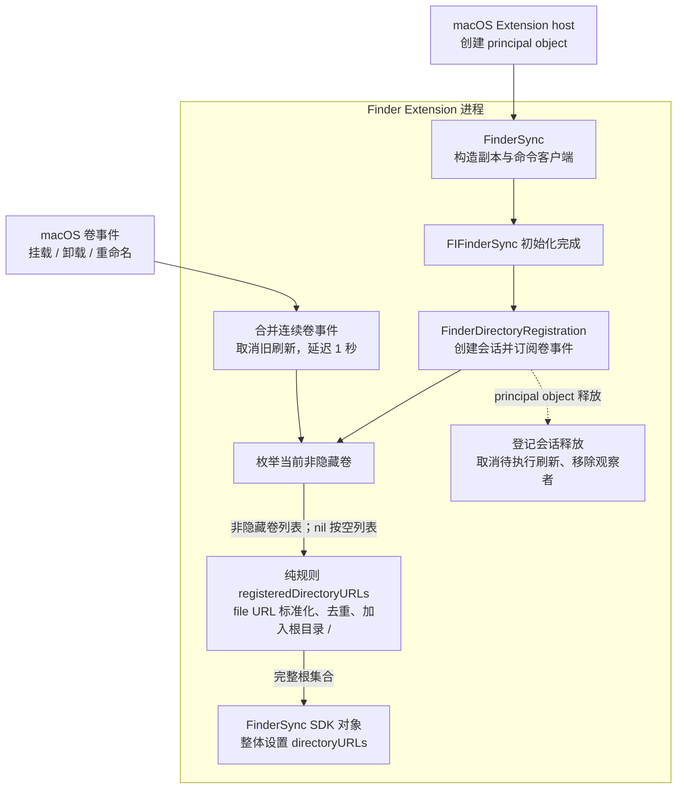
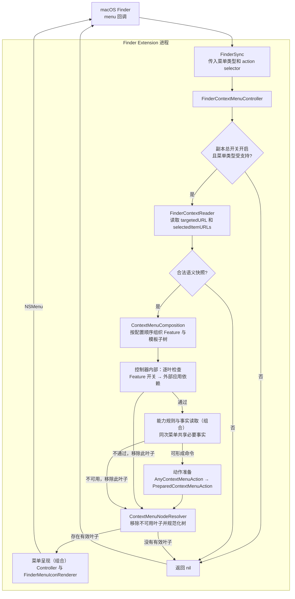
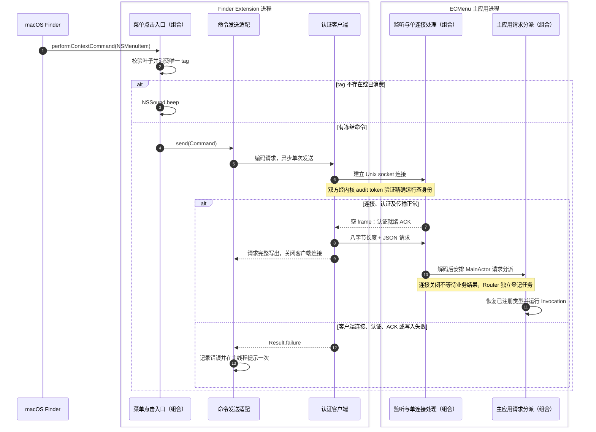
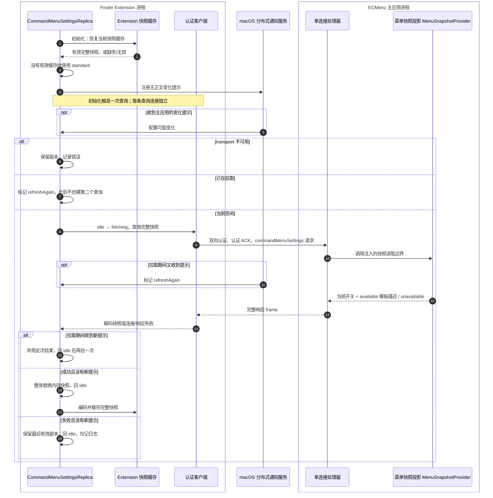

# Finder 菜单执行流

本说明覆盖 Extension 的管理范围登记、菜单构建、命令投递和配置副本。业务文件操作与结果反馈由主应用承担，见[命令执行](CommandExecution.md)及[各业务能力](../Features/Main.md)；产品菜单条件和验收边界见[Finder 菜单需求](../../Requirements/FinderMenu.md)。

流程图以明确的边框区分产品进程，macOS 行表示系统交互边界。AppKit、Foundation、FinderSync、Security 等 SDK 对象运行在调用进程内；`ECMenuShared` 是两端共同编译的源码，不是第三个进程。箭头文字说明调用、数据或事件，时序图虚线表示返回。

## 范围登记

| 职责模块 | 核心类型 | 源码入口 | 输入 → 输出 | 外部 API、失败和生命周期 |
|---|---|---|---|---|
| Extension 进程入口 | `FinderSync` | [FinderSync.swift](../../../ECMenuFinderExtension/App/FinderSync.swift) | host 创建 principal object → 副本、客户端、菜单 Controller 与范围登记会话 | `FIFinderSync.init` 完成后立即创建范围登记对象；各实例拥有自己的依赖，不假定系统只有一个实例 |
| Finder 范围登记会话 | `FinderDirectoryRegistration` | [FinderDirectoryRegistration.swift](../../../ECMenuFinderExtension/App/FinderDirectoryRegistration.swift) | 启动或卷事件 → 一次完整范围刷新 | `NSWorkspace.shared.notificationCenter.addObserver/removeObserver` 接收挂载、卸载、重命名事件；`DispatchQueue.main.asyncAfter` 延迟一秒；唯一持有待执行 `DispatchWorkItem`，释放时取消 |

范围登记图中的卷读取、根集合生成和 SDK 范围设置均属于 `FinderDirectoryRegistration` 的内部步骤，共用同一登记会话和文件：

| 内部步骤 / 方法 | 输入 → 输出 | 外部 API 与失败边界 |
|---|---|---|
| 读卷 / `refreshDirectoryURLs` | 当前挂载状态 → 非隐藏卷列表 | `FileManager.mountedVolumeURLs(..., options: [.skipHiddenVolumes])` 返回 `[URL]?`；nil 按空列表 |
| 根规则 / `registeredDirectoryURLs` | 非隐藏卷列表 → 至少含 `/` 的标准化根集合 | 纯 URL 标准化、过滤与去重，无外部 I/O |
| 设置范围 / `refreshDirectoryURLs` | 完整根集合 → SDK 的观察范围 | `FIFinderSyncController.default().directoryURLs` setter 无成功回执；OSLog 记录数量，详细路径保留私密级别。范围登记不授予文件读写权限 |

一秒延迟用于合并事件，不是系统挂载完成的确认。根范围与独立挂载卷的关系见[管理位置](../Platform/Finder/ManagedLocations.md)；启用、登记路径和运行进程是三个独立状态，见[Extension 生命周期](../Platform/Finder/ExtensionLifecycle.md)。

## 从右键回调到可执行菜单

图中标注“组合”的节点汇总协作模块；逐叶检查属于控制器内部步骤，动作准备和树规范化分别由 `AnyContextMenuAction` 与 `ContextMenuNodeResolver` 完成。具体类型和文件见下表。叶子过滤对每个动作独立执行。前置开关或应用依赖不满足时，该叶子不再读取文件事实；图标只在保留叶子渲染时获取。文件事实表示菜单构建时的观察，执行端仍处理之后发生的目标变化。

| 职责模块 | 核心类型 | 源码入口 | 输入 → 输出 | 外部 API、失败和状态归属 |
|---|---|---|---|---|
| 菜单构建与动作路由 | `FinderContextMenuController` | [FinderContextMenuController.swift](../../../ECMenuFinderExtension/Menu/FinderContextMenuController.swift) | `FIMenuKind` 或已冻结快照 → `NSMenu?` | 读取内存副本的总开关与 Feature 可见性；`NSMenu/NSMenuItem` 构造、每层 `autoenablesItems = false`、action 与 tag 绑定。总开关关闭、不支持的类型、无合法上下文或无有效叶子均返回 nil |
| Finder 上下文解释（组合） | `FinderContextReader`、`FinderMenuContext`、`FinderContextSnapshot` | [FinderContextReader.swift](../../../ECMenuFinderExtension/Menu/FinderContextReader.swift)、[FinderContextSnapshot.swift](../../../ECMenuFinderExtension/Menu/FinderContextSnapshot.swift) | 菜单类型、Finder 原始字段 → container / items / sidebar 或 nil | `FIFinderSyncController.targetedURL()` 返回 `URL?`，`selectedItemURLs()` 返回 `[URL]?`。container 取选择第一项、为空时取 target；items 取完整非空选择；sidebar 取 target；toolbar 不支持 |
| 路径与选择契约（组合） | `AbsoluteFilePath`、`FinderItemSelection` | [AbsoluteFilePath.swift](../../../ECMenuShared/Contracts/FileSystem/AbsoluteFilePath.swift)、[FinderItemSelection.swift](../../../ECMenuShared/Contracts/FileSystem/FinderItemSelection.swift) | 文件 URL / POSIX 路径 → 验证后的值 | 纯值规则，使用 `URL.standardizedFileURL`；拒绝无效路径或空选择。该验证不证明对象存在、类型或访问授权 |
| 产品菜单声明（组合） | `ContextMenuComposition`、`ContextMenuFeature`、`ContextMenuAction` | [ContextMenuComposition.swift](../../../ECMenuFinderExtension/Menu/ContextMenuComposition.swift)、[ContextMenuFeature.swift](../../../ECMenuFinderExtension/Menu/ContextMenuFeature.swift)、[ContextMenuAction.swift](../../../ECMenuFinderExtension/Menu/ContextMenuAction.swift) | 当前配置、有序模板描述、七个固定命令的 descriptor → 递归声明树 | 接收命令客户端与当前副本，按 `orderedFeatureIDs` 排列完整 Feature 子树，模板子树按描述数组排列；总开关与 Feature 可见性由菜单控制器读取和过滤。模板 unavailable 与有效空清单均不产生新建子菜单；排序是纯内存规则 |
| 单次菜单事实（组合） | `FinderContextMenuEvaluationContext`、`FinderTargetReader`、`FinderSingleTargetFacts`、`FinderTargetKind` | [FinderContextMenuEvaluationContext.swift](../../../ECMenuFinderExtension/Menu/FinderContextMenuEvaluationContext.swift)、[FinderTargetReader.swift](../../../ECMenuFinderExtension/Menu/FinderTargetReader.swift)、[FinderTargetFacts.swift](../../../ECMenuFinderExtension/Menu/FinderTargetFacts.swift) | 本次唯一目标 → directory / other / unavailable | `FileManager.fileExists(atPath:isDirectory:)` 跟随符号链接，失败返回不可用；多选不读取。上下文只在本次同步菜单构建中缓存事实，随后释放 |
| 单目标命令规则（组合） | `CreateNewFileFeature`、`OpenInVSCodeFeature`、`OpenInITerm2Feature` | [CreateNewFileFeature.swift](../../../ECMenuFinderExtension/Commands/NewFile/CreateNewFileFeature.swift)、[OpenInApplicationFeatures.swift](../../../ECMenuFinderExtension/Commands/OpenInApplication/OpenInApplicationFeatures.swift) | 菜单种类、单目标事实、模板 ID 或固定应用要求 → 类型化命令或 nil | 使用上行事实，无额外文件 I/O。新建以单文件父目录或目录自身为目标；背景/侧边栏要求目录。VS Code 接受存在的单目标，iTerm2 要求目录 |
| 复制路径菜单规则 | `CopyPathFeature` | [CopyPathFeature.swift](../../../ECMenuFinderExtension/Commands/CopyPath/CopyPathFeature.swift) | 非空有序路径 → `CopyPathCommand` | 纯规则；菜单阶段不查询对象是否存在，保持 Finder 返回的路径顺序 |
| 可见性菜单规则（组合） | `VisibilityMenuFactsReader`、`VisibilitySelectionMenuFacts`、`HideItemsFeature`、`ShowItemsFeature` | [VisibilityMenuFactsReader.swift](../../../ECMenuFinderExtension/Commands/Visibility/VisibilityMenuFactsReader.swift)、[VisibilityMenuFacts.swift](../../../ECMenuFinderExtension/Commands/Visibility/VisibilityMenuFacts.swift)、[VisibilityFeatures.swift](../../../ECMenuFinderExtension/Commands/Visibility/VisibilityFeatures.swift) | items 选择 → 隐藏/显示命令或 nil | `URL.resourceValues(forKeys: [.isHiddenKey])` 返回隐藏状态或错误；点号名称排除，无值/错误为未知。隐藏与显示共享一次汇总，已知两类状态后停止剩余读取 |
| 图片压缩菜单规则（组合） | `ImageCompressionMenuInput`、`CompressImagesFeature` | [ImageCompressionMenuInput.swift](../../../ECMenuFinderExtension/Commands/ImageCompression/ImageCompressionMenuInput.swift)、[CompressImagesFeature.swift](../../../ECMenuFinderExtension/Commands/ImageCompression/CompressImagesFeature.swift) | items 选择 → 压缩命令或 nil | `URL.resourceValues` 读取 `.isDirectoryKey/.contentTypeKey`；`CGImageSourceCopyTypeIdentifiers()` 与 `UTType.conforms(to:)` 提供支持集合。要求全部为非目录、非 PDF 且类型受支持；未知/读取失败隐藏菜单。支持集合进程内只读取一次，菜单阶段不解码图片 |
| 菜单控制器内部：应用依赖查询 | `FinderContextMenuController.isApplicationAvailable` | [FinderContextMenuController.swift](../../../ECMenuFinderExtension/Menu/FinderContextMenuController.swift) | 固定 bundle identifier → 可用或不可用 | `NSWorkspace.urlForApplication(withBundleIdentifier:)` 返回 `URL?`；nil 隐藏对应叶子。该结果不是执行时应用仍然存在的保证 |
| 动作树准备（组合） | `AnyContextMenuAction`、`PreparedContextMenuAction`、`FinderContextMenuDefinition`、`ContextMenuNode`、`ContextMenuNodeResolver` | [PreparedContextMenuAction.swift](../../../ECMenuFinderExtension/Menu/PreparedContextMenuAction.swift)、[FinderContextMenuDefinition.swift](../../../ECMenuFinderExtension/Menu/FinderContextMenuDefinition.swift)、[ContextMenuLayout.swift](../../../ECMenuFinderExtension/Menu/ContextMenuLayout.swift) | 声明树、冻结快照 → 可执行叶子与规范化树 | 无外部 I/O；准备闭包固定实际 Command，树规则保序并移除空子菜单和每层首尾/连续分隔线 |
| 菜单图标呈现（组合） | `FinderMenuIconRenderer`、`AppKitIconCanvasRenderer` | [FinderMenuIconRenderer.swift](../../../ECMenuFinderExtension/Menu/FinderMenuIconRenderer.swift)、[AppKitIconCanvasRenderer.swift](../../../ECMenuShared/Platform/Rendering/AppKitIconCanvasRenderer.swift) | 符号或应用图标声明 → Finder 可用 `NSImage?` | `NSFont.menuFont`、`NSImage(systemSymbolName:)`、Symbol configuration、`NSWorkspace.icon(forFile:)` 与画布绘制。Symbol 失败可无图标，应用图标缺失或适配失败用占位符；不改变已准备命令。适配器独占按符号名/应用路径缓存的图像 |

### 菜单生命周期与完成点

返回 `NSMenu` 只表示 Extension 已构造菜单，不表示 Finder 已显示或用户已选择。菜单 Controller 保留叶子对应的冻结命令与唯一 tag，点击消费一次；它不在点击时重新读取 Finder 当前选择或菜单开关。每次菜单注册后，按 `max(256, 本次菜单叶子数)` 保留最近动作，后续大量菜单可淘汰旧项。无效或重复 tag 只播放提示音。

一级入口顺序、模板显示名、模板顺序与 ID 在当前菜单中固定；模板内容和默认文件名由主应用执行时读取。配置副本更新只影响下一次菜单构建。图标缓存独立跨菜单保留，同一路径的应用图标变化不会主动清空缓存。

Finder 字段组合属于项目映射，API 顺序也不承诺等于可见排序；官方范围及项目观察见[菜单语义](../Platform/Finder/ContextMenus.md)。菜单主体尺度与图标裁切依据见[菜单图标](../Platform/Finder/MenuIcons.md)。

## 点击与已认证投递

Server 认证、framing 或请求解码失败只记录并关闭；Client 是否察觉，取决于它是否已经完整写出。**认证就绪、请求完整写出、主应用登记任务、业务产生结果是不同完成点。** Client 只报告请求完整写出的结果。协议无命令接管回执、业务结果回传、自动重试、去重或冷启动。

| 职责模块 | 核心类型 | 源码入口 | 输入 → 输出 | 外部 API、失败和资源边界 |
|---|---|---|---|---|
| 菜单点击入口（组合） | `FinderSync`、`FinderContextMenuController` | [FinderSync.swift](../../../ECMenuFinderExtension/App/FinderSync.swift)、[FinderContextMenuController.swift](../../../ECMenuFinderExtension/Menu/FinderContextMenuController.swift) | AppKit action、启用叶子与 tag → 冻结动作的一次调用 | principal object 提供 Objective-C selector；禁用/无 action 项直接返回，无绑定项 `NSSound.beep()` |
| 命令发送适配 | `ContextCommandClient` | [ContextCommandClient.swift](../../../ECMenuFinderExtension/IPC/ContextCommandClient.swift) | `ContextCommandPayload` → 一次发送 completion | `JSONEncoder` 构造[请求信封](../../../ECMenuShared/Contracts/Commands/ContextCommandTransport.swift)；通过 `ContextCommandSending` 发送。失败以 `Task @MainActor`、OSLog 与 `NSSound.beep()` 反馈；transport 初始化失败后该实例不重建 transport |
| 认证客户端 | `AuthenticatedLocalSocketClient` | [AuthenticatedLocalSocketClient.swift](../../../ECMenuShared/Platform/IPC/AuthenticatedLocalSocketClient.swift) | 请求与构建身份 → 完整写出或 Error | 后台并发 Dispatch queue；每次操作独立连接。端点解析、Security、socket 与 frame 的逐模块 API 输入输出见 [IPC 实现边界](IPC.md#实现边界与源码入口) |
| 监听与单连接处理（组合） | `AuthenticatedLocalSocketServer`、`AuthenticatedLocalSocketConnectionHandler` | [AuthenticatedLocalSocketServer.swift](../../../ECMenuShared/Platform/IPC/AuthenticatedLocalSocketServer.swift)、[AuthenticatedLocalSocketConnectionHandler.swift](../../../ECMenuShared/Platform/IPC/AuthenticatedLocalSocketConnectionHandler.swift) | accepted descriptor → 认证、请求解码与 sink 调用 | `DispatchSource` 负责监听；单连接处理器经 `JSONDecoder` 取得请求，出错只记录。监听 descriptor 在取消回调关闭，连接 descriptor 在处理结束的 `defer` 关闭 |
| 主应用请求分派（组合） | `ApplicationIPCServer`、`ContextCommandRouter` | [ApplicationIPCServer.swift](../../../ECMenu/IPC/ApplicationIPCServer.swift)、[ContextCommandRouter.swift](../../../ECMenu/CommandRuntime/ContextCommandRouter.swift) | 已验证请求 → 类型化 Invocation 与本地任务 | `Task @MainActor` 分派、`JSONDecoder` 恢复负载；未知 ID/坏负载只记录。Router 独占在途任务，以本地 `UUID` 标识；该 ID 不进入 IPC |

每端从自己的队列开始处理连接时计算五秒传输预算，不含此前排队，也不提供对同步 Security API 的抢占式超时。业务执行不占用连接预算。监听短缺的 100 毫秒重试、致命错误清理和应用恢复入口见[IPC](IPC.md#等待与监听恢复)。

## 配置副本同步

| 职责模块 | 核心类型 | 源码入口 | 输入 → 输出 | 外部 API、失败和状态归属 |
|---|---|---|---|---|
| Extension 菜单副本 | `CommandMenuSettingsReplica` | [CommandMenuSettingsReplica.swift](../../../ECMenuFinderExtension/CommandMenuSettings/Application/CommandMenuSettingsReplica.swift) | 初始化、无正文提示、查询结果 → 已应用快照 | 唯一持有内存快照与 `idle / fetching(refreshAgain)`。`DistributedNotificationCenter.addObserver/removeObserver` 管理通知；响应通过 `Task @MainActor` 应用。拉取期间的新提示会淘汰当前成功或失败结果，再查询一次 |
| Extension 快照缓存 | `CommandMenuSettingsCacheStore`、`CommandMenuSettingsSnapshotCache` | [CommandMenuSettingsCacheStore.swift](../../../ECMenuFinderExtension/CommandMenuSettings/Persistence/CommandMenuSettingsCacheStore.swift)、[CommandMenuSettingsSnapshotCache.swift](../../../ECMenuFinderExtension/CommandMenuSettings/Persistence/CommandMenuSettingsSnapshotCache.swift) | Extension 自身偏好 → 最后有效快照；已接受响应 → 缓存 | `UserDefaults.data/set`、`JSONEncoder/JSONDecoder`。从当前快照键读取；损坏/缺失缓存返回 nil，副本采用 standard。store 不另存一份内存快照；`set` 不提供同步落盘回执 |
| 菜单变化发布（组合） | `MenuChangePublisher`、`CommandMenuSettingsChannel` 的通知适配 | [MenuChangePublisher.swift](../../../ECMenu/CommandMenuSettings/Application/MenuChangePublisher.swift)、[CommandMenuSettingsSignal.swift](../../../ECMenuShared/Platform/IPC/CommandMenuSettingsSignal.swift) | 主应用已更新状态或恢复监听 → 可能到达的变化提示 | `DistributedNotificationCenter.postNotificationName(..., userInfo: nil, deliverImmediately: true)`；通知无权威数据、无到达回执。任意本机进程伪造提示至多触发一次经过认证的查询 |
| 认证查询通道（组合） | `AuthenticatedLocalSocketClient`、`AuthenticatedLocalSocketConnectionHandler` | [AuthenticatedLocalSocketClient.swift](../../../ECMenuShared/Platform/IPC/AuthenticatedLocalSocketClient.swift)、[AuthenticatedLocalSocketConnectionHandler.swift](../../../ECMenuShared/Platform/IPC/AuthenticatedLocalSocketConnectionHandler.swift) | `.commandMenuSettings` → 完整快照或 Error | 复用 [IPC API 与期限](IPC.md#实现边界与源码入口)；服务端以 `DispatchSemaphore` 等待异步提供者，响应等待与读写共用该连接期限 |
| 菜单快照投影 | `MenuSnapshotProvider` | [MenuSnapshotProvider.swift](../../../ECMenu/CommandMenuSettings/Application/MenuSnapshotProvider.swift) | 当前配置读取边界与模板菜单读取边界 → 完整快照 | `currentSnapshot()` 先等待模板读取边界，再读取当前开关；自身无文件 I/O，IPC 只调用注入的查询边界。模板不可用仍返回当前开关与 unavailable，不伪装成传输失败；各所有者没有共同修订号或跨存储事务 |
| 菜单快照契约 | `CommandMenuSettingsSnapshot`、`FileTemplateMenuState` | [CommandMenuSettingsSnapshot.swift](../../../ECMenuShared/Contracts/CommandMenuSettings/CommandMenuSettingsSnapshot.swift) | JSON → 有效 `CommandMenuSettingsSnapshot` | `JSONDecoder` 验证 schema、必需字段与模板 ID 唯一性，任一不合法拒绝整份响应；available 空清单和 unavailable 是不同有效值 |
| 菜单副本消费 | `FinderContextMenuController`、`ContextMenuComposition` | [FinderContextMenuController.swift](../../../ECMenuFinderExtension/Menu/FinderContextMenuController.swift)、[ContextMenuComposition.swift](../../../ECMenuFinderExtension/Menu/ContextMenuComposition.swift) | 已应用内存快照 → 开关及有序模板描述 | 无外部 I/O；不触发同步查询，不修改已返回的菜单或冻结动作 |

### 更新保证

刷新入口是 Extension 初始化与收到分布式提示；拉取期间的新提示会追加查询。不存在菜单打开时查询、周期刷新、超时自动重试或命令失败后刷新。查询失败后保留原快照，等待后续提示或新实例；transport 初始化失败后，该实例不自动创建新 transport。

模板 unavailable 是成功响应中的领域状态：它替换并缓存原快照，隐藏新建菜单，同时让其他开关继续同步。连接、认证或解码失败则保留整份原快照。通知不携带修订号，也不保证及时可靠到达，因此不能保证副本在有限时间内收敛；机制约束的权威说明见[菜单配置](CommandMenuSettings.md)。

## 设计依据与验证

三个可变生命周期分别拥有状态：Controller 持有菜单动作与 tag，Replica 持有已应用快照及单飞状态，主应用 Router 持有业务任务。它们通过不可变命令和快照交互；菜单失效、连接关闭和业务完成互不等同。系统事实读取从纯菜单规则分开，让测试可以固定文件事实，同时保留真实 API 失败路径。

### 自动化验证入口

- [范围登记测试](../../../Tests/ECMenuFinderExtensionTests/App/FinderDirectoryRegistrationTests.swift)：根目录回退、标准化和去重。
- [菜单组合](../../../Tests/ECMenuFinderExtensionTests/Menu/ContextMenuCompositionTests.swift)、[功能条件](../../../Tests/ECMenuFinderExtensionTests/Menu/ContextCommandFeatureTests.swift)、[布局](../../../Tests/ECMenuFinderExtensionTests/Menu/ContextMenuLayoutTests.swift)：字段映射、开关/依赖过滤、共享事实、旧 action 保留路径、模板更新只影响下一次构建、大模板菜单保留所有当前叶子及树规范化。
- [发送客户端](../../../Tests/ECMenuFinderExtensionTests/IPC/ContextCommandClientTests.swift)：单次发送、失败提示一次且不重试。
- [配置副本](../../../Tests/ECMenuFinderExtensionTests/CommandMenuSettings/CommandMenuSettingsReplicaTests.swift)：缓存恢复、失败保留、后续刷新、并发提示合并及过时结果淘汰。
- [IPC 测试](../../../Tests/ECMenuTests/IPC/ContextCommandTransportTests.swift)：wire 验证、对称认证、单向/并发投递、错误 ACK、截断 frame、静默对端期限、提供者期限及监听失败清理。

这些链接是验证定义，不代表任意源码版本均已执行通过。完整自动化入口为 [test.sh](../../../scripts/test.sh)；真实菜单驱动入口与限制见[菜单自动截图](../FinderMenuCapture.md)。

### 实机证据与适用范围

| 主题 | 官方契约 / 项目观察 | 证据限制与复核方式 |
|---|---|---|
| Finder 上下文字段与菜单覆盖 | [菜单语义](../Platform/Finder/ContextMenus.md)及[管理位置](../Platform/Finder/ManagedLocations.md)：SDK 定义字段有效范围；项目据 macOS 26.6.1（25G76）、Xcode 26.6（17F113）环境的观察采用 container 映射和显式卷根登记 | 早期回调原始日志未保留，具体源码提交未记录。升级后检查无选择、残余选择、多层替身、已有/新挂载卷、卷重命名及深层目录；不能将样本观察扩展为平台保证 |
| 动作与图标 | [菜单图标](../Platform/Finder/MenuIcons.md)记录 2026-08-21 的 Finder 人工对比及 2026-09-08 的 AppKit selector 探针 | 早期原图未保留；AppKit 对象探针未显示 Finder 菜单。需在真实 host 中复核非方形图标、badge 主体、层级和连续菜单的旧 action |
| 进程身份与传输资源 | [IPC](IPC.md#对端身份验证)记录 macOS 26.6.1 / Xcode 26.6 的真实对称认证；[监听证据](IPC.md#等待与监听恢复)记录 2026-09-05 的隔离 socket 探针 | 隔离探针不代替 Finder 身份验收；修改后需确认两个签名产物和运行路径，分别验证错误身份拒绝、真实菜单发送与静默对端截止 |
| 系统登记与恢复 | [Extension 生命周期](../Platform/Finder/ExtensionLifecycle.md)记录 2026-09-05 的 Debug 登记与当前构建产物进程验证 | 来自已有 Debug/Release 登记的账号，不代表首次安装。刷新后分别确认启用、登记路径、运行进程，再判断菜单代码是否返回空 |

自动化成功不证明分布式通知必定到达，也不覆盖任意 macOS 版本、外置卷与 Finder 生命周期组合。平台结论只在对应文档记载的版本、方法和证据范围内成立。
